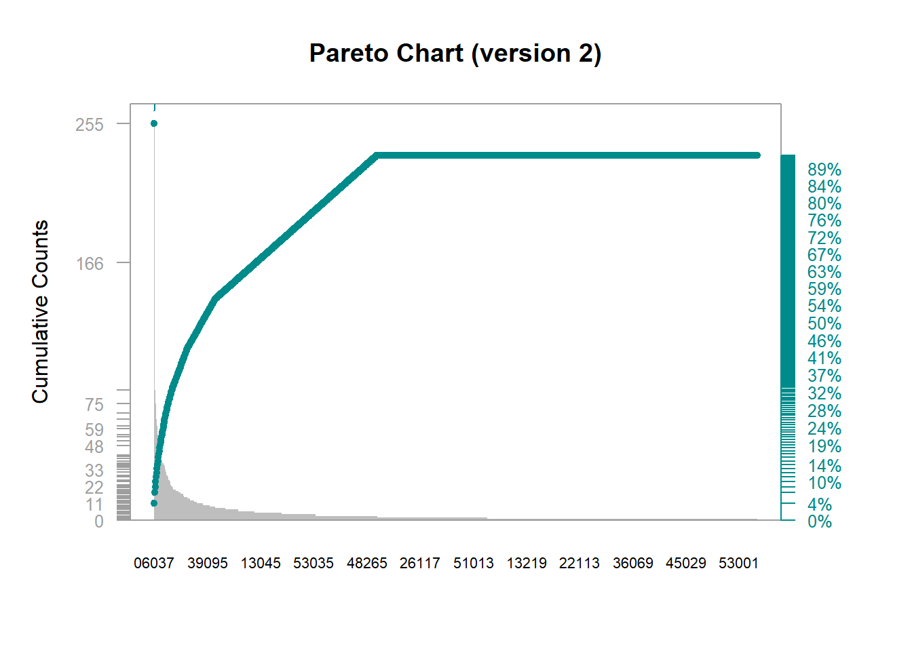
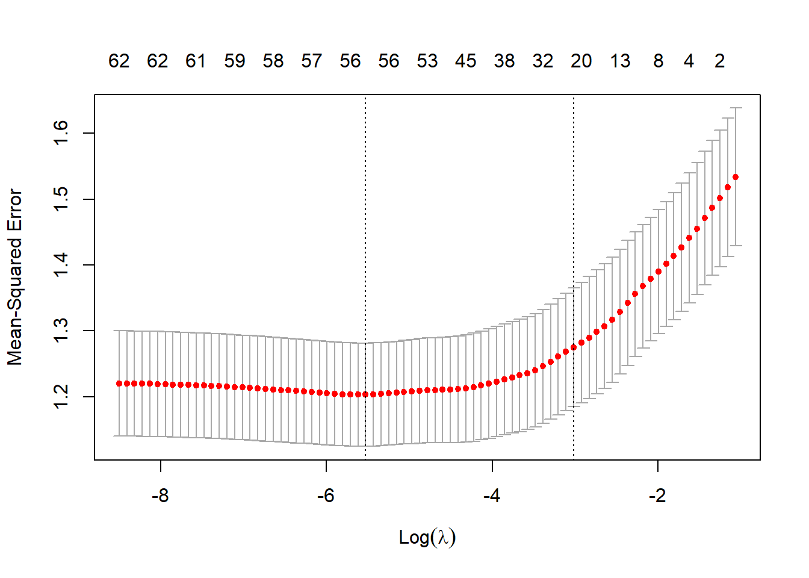
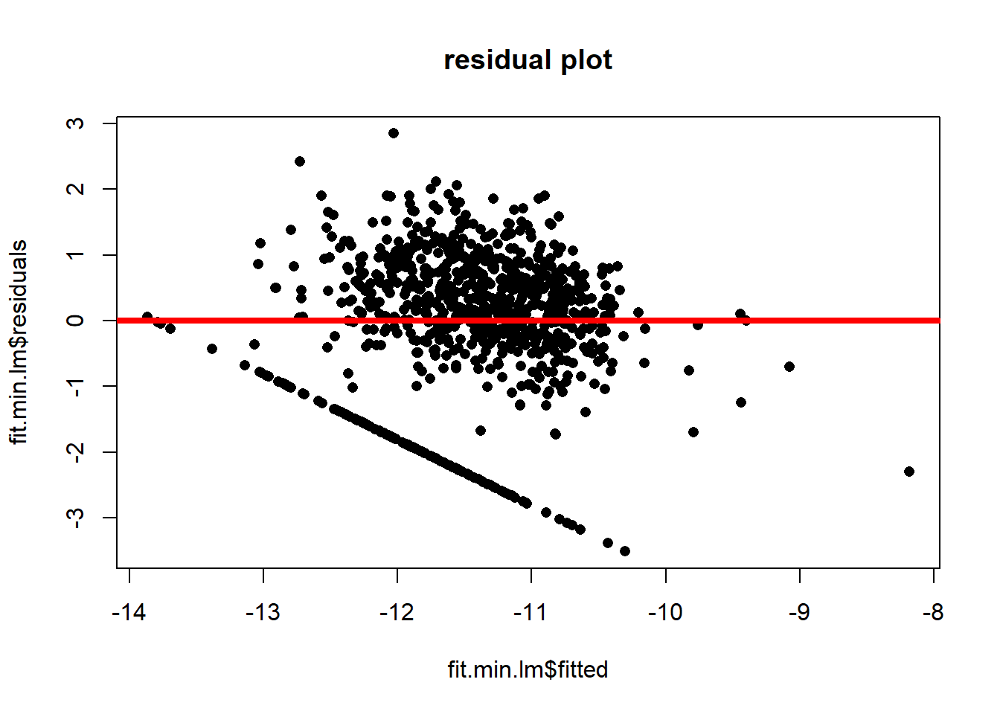
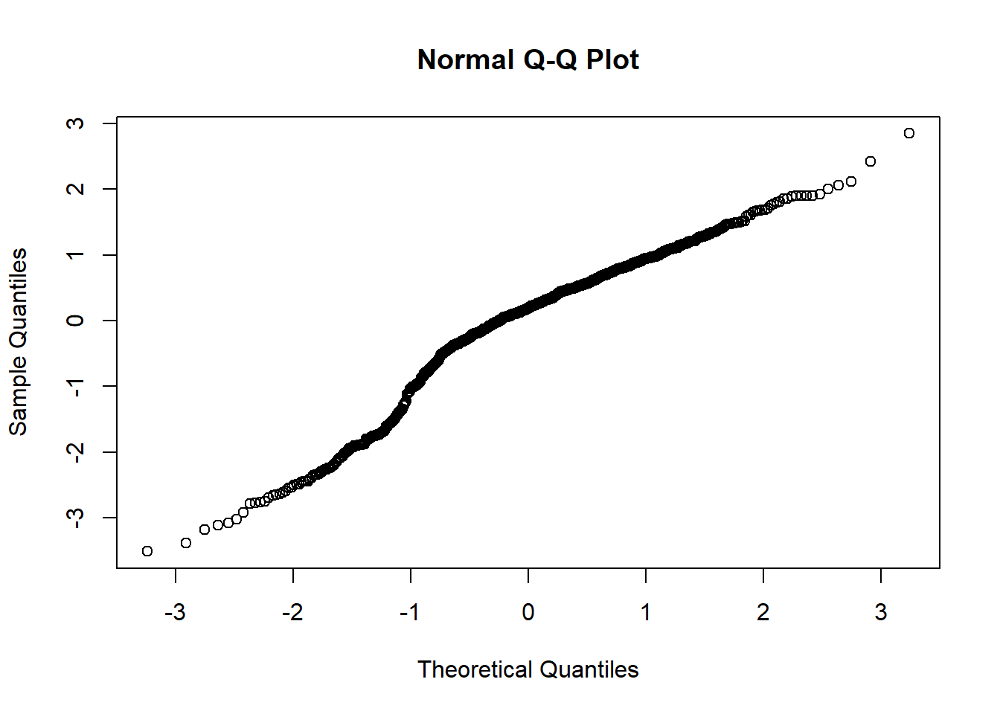
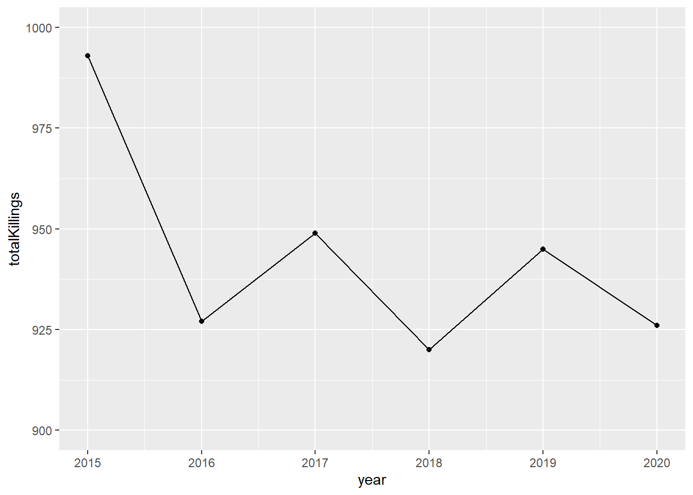
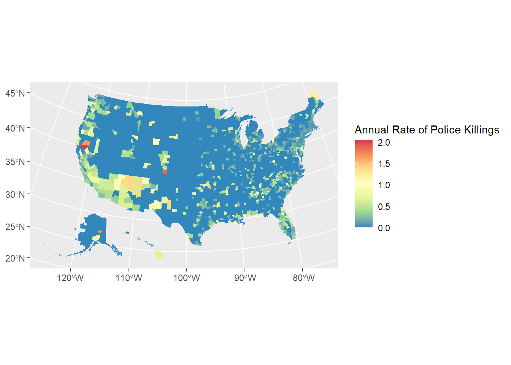

# What are the drivers of police killings in the US?

## Executive Summary

## Goal of the study
Police killings have been on the forefront of the news in the recent years and is a prominent issue the United States is facing today. Our objective in this study is to identify insights within this dataset that may illuminate drivers of killings and identify possible biases in how police use lethality in their techniques.

## Data sources
The primary data-set our study is based on is a police killings database maintained by the Washington Post. The data is comprehensive starting from January 1st, 2015 through early May 2021, compiled from local news reports, law enforcement websites, and mining independent databases dedicated to tracking police killings. See the source article here: https://www.washingtonpost.com/graphics/investigations/police-shootings-database/ and the available data here: https://github.com/washingtonpost/data-police-shootings

To supplement this data, we utilized the Census Bureau data tool to download demographic and economic information available at the county level and joined it with the killings data by county (or FIPS code). The Census Bureau has a data query tool that appears fairly comprehensive but is also a bit un-intuitive to use. Nonetheless, we pulled in five different county-level data-sets from the American Community Survey which was last taken in 2019. These reports include 1) Demographics and Housing, Educational Attainment, Financial Characteristics, Selected Economics Characteristics, Selected Housing Characteristics. 

#to do - list what we did. 

#conclusion

## Findings

#regression / lasso
#data vis, counties


## R Markdown

##EDA / Data Preparation


```r
# Read-in data

# These are census shape files which we need to map latitude and longitutde to FIPs codes
census_tracts <- st_read("CensusShapes2/cb_2018_us_county_within_cd116_500k.shp", quiet = TRUE)

# This is the police killing data from Kaggle
killdata <- read.csv("PoliceKillingsUS_MC.csv")

# This is a look-up table that maps FIPS code to County name and State (from: https://www.nrcs.usda.gov/wps/portal/nrcs/detail/national/home/?cid=nrcs143_013697)
fipsLookUp <- read.csv("FIPSCountyStateLookUp.csv", colClasses ='character') 
fipsLookUp$fips <- fipsLookUp[,1] # Import has made the FIPS column name weird so re-making column

# First-off, we need take our geo-coordinates of each police killing and map it to a county (uniquely identified by a FIPS code). This is because all the census data we plan to join in is readily available at the county level

# There are APIs that do this, but we couldn't figure out how to get them to work. Instead, we found a tutorial that relies on plotting lat/long within county boundaries as defined in the shape files. Tutorial here: https://shiandy.com/post/2020/11/02/mapping-lat-long-to-fips/

# Remove the lat/long from the killing data to feed into this algorithm
killdata_latlong <- data.frame(latitude = killdata$latitude, longitude = killdata$longitude)

# Remove observations without lat/long and convert them into a shape file
latlong_sf <- killdata_latlong %>%
  filter(!is.na(latitude), !is.na(longitude)) %>%
  st_as_sf(coords = c("longitude", "latitude"), crs = st_crs(census_tracts))

# Check the overlap between the lat/long and the census tracts
intersected <- st_intersects(latlong_sf, census_tracts) 
```

```
## although coordinates are longitude/latitude, st_intersects assumes that they are planar
## although coordinates are longitude/latitude, st_intersects assumes that they are planar
```

```r
# Indicate overlap and if there is overlap, bring in the GEOID
latlong_final <- latlong_sf %>%
  mutate(intersection = as.integer(intersected),
         fips = if_else(is.na(intersection), "",
                        census_tracts$GEOID[intersection]))

# GEOID does not seem to be FIPS exactly -- pull the first two and last three characters to get to the FIPS
latlong_final$mod_fips <- paste(str_sub(latlong_final$fips, 1, 2), str_sub(latlong_final$fips, -3, -1), sep = "") 

# We remove all killings that don't have a latitude/longitude. We go from 6268 observations to 5963 observations which is not a terrible fall-out.
killdata_clean <- killdata %>%
  filter(!is.na(latitude), !is.na(longitude)) # Remove all killings that don't have latitude/longitude

# We take the FIPs code that we have generated from the lat/long and append it onto the data
killdata_clean$mod_fips <- latlong_final$mod_fips  
```


```r
# Read-in census data. All data was sourced from the American Community Survey in 2019 and pulled at the FIPS level for all counties

# Skip the first row, as it is a redundant header row
demoData <- read.csv("Data (County-Level)/Demographics and Housing/ACSDP1Y2019.DP05_data_with_overlays_2021-04-29T104649.csv", skip = 1, header = T)
# ACS DEMOGRAPHIC AND HOUSING ESTIMATES

eduData <- read.csv("Data (County-Level)/Educational Attainment/ACSST1Y2019.S1501_data_with_overlays_2021-05-07T192056.csv", skip = 1, header = T)
# ACS EDUCATIONAL ATTAINMENT

financeData <- read.csv("Data (County-Level)/Financial Characteristics/ACSST1Y2019.S2503_data_with_overlays_2021-05-07T193752.csv", skip = 1, header = T)
# ACS FINANCIAL CHARACTERISTICS

econData <- read.csv("Data (County-Level)/Selected Economic Characteristics/ACSDP1Y2019.DP03_data_with_overlays_2021-05-07T193216.csv", skip = 1, header = T)
# ACS SELECTED ECONOMIC CHARACTERISTICS

housingData <- read.csv("Data (County-Level)/Selected Housing Characteristics/ACSDP1Y2019.DP04_data_with_overlays_2021-04-29T141348.csv", skip = 1, header = T)
# ACS SELECTED HOUSING CHARACTERISTICS
```


```r
# Join together all the demo data by ID (in this case the FIPS)
masterCensus <- demoData %>%
  left_join(econData, by="id") %>%
  left_join(eduData, by="id") %>%
  left_join(housingData, by="id") %>%
  left_join(financeData, by="id")

# Half of the columns are columns which estimate how much error they may have been in the measurement. These are a bit too complex to work with, so let's just remove them
# There are also overlapping columns across each set. These get a '.y'. or '.x' added to them so can be identified and removed.  
masterCensus_s2 <- masterCensus %>%
  select(-contains("Error")) %>% # Removes columns that indicator the error
  select(-contains(".y")) %>% # Indicates a duplicated variable
  select(-contains(".x"))
```


```r
# Let's look at the killings data to understand what data we have, and what sort of dependent variable we want to create. 

killdata_clean %>%
  group_by(manner_of_death, signs_of_mental_illness, threat_level, flee, body_camera) %>%
  summarise(count = n())
```

```
## `summarise()` has grouped output by 'manner_of_death', 'signs_of_mental_illness', 'threat_level', 'flee'. You can override using the `.groups` argument.
```

```
## # A tibble: 88 x 6
## # Groups:   manner_of_death, signs_of_mental_illness, threat_level, flee [49]
##    manner_of_death signs_of_mental_ill~ threat_level flee      body_camera count
##    <chr>           <lgl>                <chr>        <chr>     <lgl>       <int>
##  1 shot            FALSE                attack       ""        FALSE         135
##  2 shot            FALSE                attack       ""        TRUE           18
##  3 shot            FALSE                attack       "Car"     FALSE         500
##  4 shot            FALSE                attack       "Car"     TRUE           44
##  5 shot            FALSE                attack       "Foot"    FALSE         366
##  6 shot            FALSE                attack       "Foot"    TRUE           62
##  7 shot            FALSE                attack       "Not fle~ FALSE        1469
##  8 shot            FALSE                attack       "Not fle~ TRUE          171
##  9 shot            FALSE                attack       "Other"   FALSE         100
## 10 shot            FALSE                attack       "Other"   TRUE           16
## # ... with 78 more rows
```

```r
killdata_clean %>%
  group_by(manner_of_death) %>%
  summarise(count = n()) # Two options: 'shot' and 'shot and Tasered' (low freq.) can roll-up
```

```
## # A tibble: 2 x 2
##   manner_of_death  count
## * <chr>            <int>
## 1 shot              5654
## 2 shot and Tasered   309
```

```r
killdata_clean %>%
  group_by(signs_of_mental_illness) %>%
  summarise(count = n()) # Roughly 25% of victims had signs of mental illness (Y or N)
```

```
## # A tibble: 2 x 2
##   signs_of_mental_illness count
## * <lgl>                   <int>
## 1 FALSE                    4575
## 2 TRUE                     1388
```

```r
killdata_clean %>%
  group_by(threat_level) %>%
  summarise(count = n()) # Three categories, 'attack', 'other' and 'undetermined' (low freq)
```

```
## # A tibble: 3 x 2
##   threat_level count
## * <chr>        <int>
## 1 attack        3847
## 2 other         1938
## 3 undetermined   178
```

```r
killdata_clean %>%
  group_by(flee) %>%
  summarise(count = n()) # Five options: a blank, 'Car', 'Foot', 'Not fleeing' and 'Other'; potentially roll-up to fleeing and not fleeing
```

```
## # A tibble: 5 x 2
##   flee          count
## * <chr>         <int>
## 1 ""              374
## 2 "Car"           941
## 3 "Foot"          789
## 4 "Not fleeing"  3649
## 5 "Other"         210
```

```r
killdata_clean %>%
  group_by(body_camera) %>%
  summarise(count = n()) # Options FALSE or TRUE. Only ~14% of deaths had body cameras
```

```
## # A tibble: 2 x 2
##   body_camera count
## * <lgl>       <int>
## 1 FALSE        5176
## 2 TRUE          787
```

```r
# Given that there is not much data is it is -- it may not make sense to differentiate different types of killings (e.g. those where there was a threat or signs of mental illness). It may not make much sense to differentiate by year either. 
```


```r
# Curious to see how the killing is disseminated across counties represented in the data. Below is code to construct a pareto chart of killings by FIPS. 

killdata_FIPS <- killdata_clean %>% # Create a county-level data-set with # of killings
  group_by(mod_fips) %>%
  summarise(totalKillings = n()) %>%
  rename(fips = mod_fips)

paretoData <- arrange(killdata_FIPS, desc(totalKillings)) %>%
  mutate(cumsum = cumsum(totalKillings),
         freq = round(totalKillings/sum(totalKillings), 3), 
         cum_freq = cumsum(freq))

## Saving Parameters 
def_par <- par()

# New margins
par(mar=c(5,5,4,5))

## plot bars, pc will hold x values for bars
pc = barplot(paretoData$totalKillings,  
             width = 1, space = 0.2, border = NA, axes = F,
             ylim = c(0, 1.05 * max(paretoData$totalKillings, na.rm = T)), 
             ylab = "Cumulative Counts" , cex.names = 0.7, 
             names.arg = paretoData$fips,
             main = "Pareto Chart (version 2)")

## anotate left axis
axis(side = 2, at = c(0, paretoData$totalKillings), las = 1, col.axis = "grey62", col = "grey62", tick = T, cex.axis = 0.8)

## frame plot
box( col = "grey62")

## Cumulative Frequency Lines 
lines(pc, paretoData$cumsum, type = "b", cex = 0.7, pch = 19, col="cyan4")

## Annotate Right Axis
px <- paretoData$cum_freq * max(paretoData$totalKillings, na.rm = T)
lines(pc, px, type = "b", cex = 0.7, pch = 19, col="cyan4")

## restoring default parameter
axis(side = 4, at = c(0, px), labels = paste(c(0, round(paretoData$cum_freq * 100)) ,"%",sep=""), 
     las = 1, col.axis = "grey62", col = "cyan4", cex.axis = 0.8, col.axis = "cyan4")
```



```r
# One FIPs has a staggeringly high killing number (255), but we have to scale this by population. There is a very long right tail and from the pareto shape it does seem like certain counties are over-represented.
```


```r
# The maximum number of total killings is in Los Angeles County at 255. 
killdata_FIPS$fips[which.max(killdata_FIPS$totalKillings)]
```

```
## [1] "06037"
```

```r
killdata_FIPS$totalKillings[which.max(killdata_FIPS$totalKillings)]
```

```
## [1] 255
```


```r
# install.packages('skimr')
library(skimr)
```

```
## Warning: package 'skimr' was built under R version 4.0.5
```

```r
# summary(killdata_clean)

# Evaluate data across time
killdata_fips_year <- killdata_clean %>%
  mutate(date = as.Date(killdata_clean$date, format = "%m/%d/%Y")) %>%
  mutate(year = lubridate::year(date)) %>%
  group_by(year) %>%
  summarise(totalKillings = n())

# There is not much difference year over year; might not make sense to separate this by years

# Pull out the FIPS code out of the ID identified in the census data
masterCensus_s2$fips <- str_sub(masterCensus_s2$id, -5, -1)
```


```r
# Join the killings data to the census data. Create the killing rate response variable as well as transformed version because the rates are very low. 
sdl1 <- masterCensus_s2 %>%
    left_join(killdata_FIPS, by="fips") %>%
    mutate(killingRate =  totalKillings/Estimate..SEX.AND.AGE..Total.population) %>%
    mutate(killingRateEff = coalesce(killingRate, 0.000001)) %>%
    mutate(killingRateLog = log(killingRateEff)) %>%
    select(fips,totalKillings,killingRate,killingRateLog,everything())
```


```r
# We will do some variable/column cleaning

# Step 1 cleaning; only keep columns that have 'percentage' data. Countries differ greatly by size, so the nominal data could push results one way or another. By using percentage data, each variable in each county receives equal weight
sdl2 <- sdl1 %>%
    select(contains("Percent"))

# Step 2 cleaning; identify non-numeric values within census data
table(unlist(sdl2, use.names = FALSE)[(!grepl('^[0-9]',unlist(sdl2, use.names = FALSE)))])
```

```
## 
##   (X)     N 
## 52922 45757
```

```r
# It looks like things are coded (X) or N if they are missing; let's look at which columns have a high percentage of (X) or N and are thus worth dropping

# Flag any column where more than half the values are '(X)'
library(plyr)
```

```
## ------------------------------------------------------------------------------
```

```
## You have loaded plyr after dplyr - this is likely to cause problems.
## If you need functions from both plyr and dplyr, please load plyr first, then dplyr:
## library(plyr); library(dplyr)
```

```
## ------------------------------------------------------------------------------
```

```
## 
## Attaching package: 'plyr'
```

```
## The following object is masked from 'package:gtsummary':
## 
##     mutate
```

```
## The following object is masked from 'package:ggpubr':
## 
##     mutate
```

```
## The following objects are masked from 'package:plotly':
## 
##     arrange, mutate, rename, summarise
```

```
## The following objects are masked from 'package:dplyr':
## 
##     arrange, count, desc, failwith, id, mutate, rename, summarise,
##     summarize
```

```
## The following object is masked from 'package:purrr':
## 
##     compact
```

```r
count.X.per.column <- ldply(sdl2, function(c) sum(c=="(X)"))
columnsToExclude1 <- count.X.per.column$.id[count.X.per.column$V1 > 420]

# Flag any column where more than half of the values are 'N'
count.N.per.column <- ldply(sdl2, function(c) sum(c=="N"))
columnsToExclude2 <- count.N.per.column$.id[count.N.per.column$V1 > 420]

# Drop columns with too many NULL values
sdl3 <- sdl2 %>%
  select(-columnsToExclude1)
```

```
## Note: Using an external vector in selections is ambiguous.
## i Use `all_of(columnsToExclude1)` instead of `columnsToExclude1` to silence this message.
## i See <https://tidyselect.r-lib.org/reference/faq-external-vector.html>.
## This message is displayed once per session.
```

```r
sdl4 <- sdl3 %>%
  select(-columnsToExclude2)
```

```
## Note: Using an external vector in selections is ambiguous.
## i Use `all_of(columnsToExclude2)` instead of `columnsToExclude2` to silence this message.
## i See <https://tidyselect.r-lib.org/reference/faq-external-vector.html>.
## This message is displayed once per session.
```

```r
# Convert remaining data frame into numeric columns (will force some values to NA)
sdl5 <- mutate_all(sdl4, function(x) as.numeric(as.character(x)))
```

```
## Warning: Problem with `mutate()` input `Percent..RACE..Total.population..One.race`.
## i NAs introduced by coercion
## i Input `Percent..RACE..Total.population..One.race` is `(function (x) ...`.
```

```
## Warning: Problem with `mutate()` input `Percent..RACE..Total.population..Two.or.more.races`.
## i NAs introduced by coercion
## i Input `Percent..RACE..Total.population..Two.or.more.races` is `(function (x) ...`.
```

```
## Warning: Problem with `mutate()` input `Percent..RACE..Total.population..One.race.1`.
## i NAs introduced by coercion
## i Input `Percent..RACE..Total.population..One.race.1` is `(function (x) ...`.
```

```
## Warning: Problem with `mutate()` input `Percent..RACE..Total.population..One.race..White`.
## i NAs introduced by coercion
## i Input `Percent..RACE..Total.population..One.race..White` is `(function (x) ...`.
```

```
## Warning: Problem with `mutate()` input `Percent..RACE..Total.population..One.race..Black.or.African.American`.
## i NAs introduced by coercion
## i Input `Percent..RACE..Total.population..One.race..Black.or.African.American` is `(function (x) ...`.
```

```
## Warning: Problem with `mutate()` input `Percent..RACE..Total.population..One.race..American.Indian.and.Alaska.Native`.
## i NAs introduced by coercion
## i Input `Percent..RACE..Total.population..One.race..American.Indian.and.Alaska.Native` is `(function (x) ...`.
```

```
## Warning: Problem with `mutate()` input `Percent..RACE..Total.population..One.race..Asian`.
## i NAs introduced by coercion
## i Input `Percent..RACE..Total.population..One.race..Asian` is `(function (x) ...`.
```

```
## Warning: Problem with `mutate()` input `Percent..RACE..Total.population..One.race..Native.Hawaiian.and.Other.Pacific.Islander`.
## i NAs introduced by coercion
## i Input `Percent..RACE..Total.population..One.race..Native.Hawaiian.and.Other.Pacific.Islander` is `(function (x) ...`.
```

```
## Warning: Problem with `mutate()` input `Percent..RACE..Total.population..One.race..Some.other.race`.
## i NAs introduced by coercion
## i Input `Percent..RACE..Total.population..One.race..Some.other.race` is `(function (x) ...`.
```

```
## Warning: Problem with `mutate()` input `Percent..RACE..Total.population..Two.or.more.races.1`.
## i NAs introduced by coercion
## i Input `Percent..RACE..Total.population..Two.or.more.races.1` is `(function (x) ...`.
```

```
## Warning: Problem with `mutate()` input `Percent..RACE..Total.population..Two.or.more.races..White.and.Black.or.African.American`.
## i NAs introduced by coercion
## i Input `Percent..RACE..Total.population..Two.or.more.races..White.and.Black.or.African.American` is `(function (x) ...`.
```

```
## Warning: Problem with `mutate()` input `Percent..RACE..Total.population..Two.or.more.races..White.and.American.Indian.and.Alaska.Native`.
## i NAs introduced by coercion
## i Input `Percent..RACE..Total.population..Two.or.more.races..White.and.American.Indian.and.Alaska.Native` is `(function (x) ...`.
```

```
## Warning: Problem with `mutate()` input `Percent..RACE..Total.population..Two.or.more.races..White.and.Asian`.
## i NAs introduced by coercion
## i Input `Percent..RACE..Total.population..Two.or.more.races..White.and.Asian` is `(function (x) ...`.
```

```
## Warning: Problem with `mutate()` input `Percent..RACE..Total.population..Two.or.more.races..Black.or.African.American.and.American.Indian.and.Alaska.Native`.
## i NAs introduced by coercion
## i Input `Percent..RACE..Total.population..Two.or.more.races..Black.or.African.American.and.American.Indian.and.Alaska.Native` is `(function (x) ...`.
```

```
## Warning: Problem with `mutate()` input `Percent..Race.alone.or.in.combination.with.one.or.more.other.races..Total.population..Black.or.African.American`.
## i NAs introduced by coercion
## i Input `Percent..Race.alone.or.in.combination.with.one.or.more.other.races..Total.population..Black.or.African.American` is `(function (x) ...`.
```

```
## Warning: Problem with `mutate()` input `Percent..Race.alone.or.in.combination.with.one.or.more.other.races..Total.population..American.Indian.and.Alaska.Native`.
## i NAs introduced by coercion
## i Input `Percent..Race.alone.or.in.combination.with.one.or.more.other.races..Total.population..American.Indian.and.Alaska.Native` is `(function (x) ...`.
```

```
## Warning: Problem with `mutate()` input `Percent..Race.alone.or.in.combination.with.one.or.more.other.races..Total.population..Asian`.
## i NAs introduced by coercion
## i Input `Percent..Race.alone.or.in.combination.with.one.or.more.other.races..Total.population..Asian` is `(function (x) ...`.
```

```
## Warning: Problem with `mutate()` input `Percent..Race.alone.or.in.combination.with.one.or.more.other.races..Total.population..Some.other.race`.
## i NAs introduced by coercion
## i Input `Percent..Race.alone.or.in.combination.with.one.or.more.other.races..Total.population..Some.other.race` is `(function (x) ...`.
```

```
## Warning: Problem with `mutate()` input `Percent..HISPANIC.OR.LATINO.AND.RACE..Total.population..Hispanic.or.Latino..of.any.race...Mexican`.
## i NAs introduced by coercion
## i Input `Percent..HISPANIC.OR.LATINO.AND.RACE..Total.population..Hispanic.or.Latino..of.any.race...Mexican` is `(function (x) ...`.
```

```
## Warning: Problem with `mutate()` input `Percent..HISPANIC.OR.LATINO.AND.RACE..Total.population..Hispanic.or.Latino..of.any.race...Puerto.Rican`.
## i NAs introduced by coercion
## i Input `Percent..HISPANIC.OR.LATINO.AND.RACE..Total.population..Hispanic.or.Latino..of.any.race...Puerto.Rican` is `(function (x) ...`.
```

```
## Warning: Problem with `mutate()` input `Percent..HISPANIC.OR.LATINO.AND.RACE..Total.population..Hispanic.or.Latino..of.any.race...Cuban`.
## i NAs introduced by coercion
## i Input `Percent..HISPANIC.OR.LATINO.AND.RACE..Total.population..Hispanic.or.Latino..of.any.race...Cuban` is `(function (x) ...`.
```

```
## Warning: Problem with `mutate()` input `Percent..HISPANIC.OR.LATINO.AND.RACE..Total.population..Hispanic.or.Latino..of.any.race...Other.Hispanic.or.Latino`.
## i NAs introduced by coercion
## i Input `Percent..HISPANIC.OR.LATINO.AND.RACE..Total.population..Hispanic.or.Latino..of.any.race...Other.Hispanic.or.Latino` is `(function (x) ...`.
```

```
## Warning: Problem with `mutate()` input `Percent..HISPANIC.OR.LATINO.AND.RACE..Total.population..Not.Hispanic.or.Latino..White.alone`.
## i NAs introduced by coercion
## i Input `Percent..HISPANIC.OR.LATINO.AND.RACE..Total.population..Not.Hispanic.or.Latino..White.alone` is `(function (x) ...`.
```

```
## Warning: Problem with `mutate()` input `Percent..HISPANIC.OR.LATINO.AND.RACE..Total.population..Not.Hispanic.or.Latino..Black.or.African.American.alone`.
## i NAs introduced by coercion
## i Input `Percent..HISPANIC.OR.LATINO.AND.RACE..Total.population..Not.Hispanic.or.Latino..Black.or.African.American.alone` is `(function (x) ...`.
```

```
## Warning: Problem with `mutate()` input `Percent..HISPANIC.OR.LATINO.AND.RACE..Total.population..Not.Hispanic.or.Latino..American.Indian.and.Alaska.Native.alone`.
## i NAs introduced by coercion
## i Input `Percent..HISPANIC.OR.LATINO.AND.RACE..Total.population..Not.Hispanic.or.Latino..American.Indian.and.Alaska.Native.alone` is `(function (x) ...`.
```

```
## Warning: Problem with `mutate()` input `Percent..HISPANIC.OR.LATINO.AND.RACE..Total.population..Not.Hispanic.or.Latino..Asian.alone`.
## i NAs introduced by coercion
## i Input `Percent..HISPANIC.OR.LATINO.AND.RACE..Total.population..Not.Hispanic.or.Latino..Asian.alone` is `(function (x) ...`.
```

```
## Warning: Problem with `mutate()` input `Percent..HISPANIC.OR.LATINO.AND.RACE..Total.population..Not.Hispanic.or.Latino..Native.Hawaiian.and.Other.Pacific.Islander.alone`.
## i NAs introduced by coercion
## i Input `Percent..HISPANIC.OR.LATINO.AND.RACE..Total.population..Not.Hispanic.or.Latino..Native.Hawaiian.and.Other.Pacific.Islander.alone` is `(function (x) ...`.
```

```
## Warning: Problem with `mutate()` input `Percent..HISPANIC.OR.LATINO.AND.RACE..Total.population..Not.Hispanic.or.Latino..Some.other.race.alone`.
## i NAs introduced by coercion
## i Input `Percent..HISPANIC.OR.LATINO.AND.RACE..Total.population..Not.Hispanic.or.Latino..Some.other.race.alone` is `(function (x) ...`.
```

```
## Warning: Problem with `mutate()` input `Percent..HISPANIC.OR.LATINO.AND.RACE..Total.population..Not.Hispanic.or.Latino..Two.or.more.races`.
## i NAs introduced by coercion
## i Input `Percent..HISPANIC.OR.LATINO.AND.RACE..Total.population..Not.Hispanic.or.Latino..Two.or.more.races` is `(function (x) ...`.
```

```
## Warning: Problem with `mutate()` input `Percent..HISPANIC.OR.LATINO.AND.RACE..Total.population..Not.Hispanic.or.Latino..Two.or.more.races..Two.races.including.Some.other.race`.
## i NAs introduced by coercion
## i Input `Percent..HISPANIC.OR.LATINO.AND.RACE..Total.population..Not.Hispanic.or.Latino..Two.or.more.races..Two.races.including.Some.other.race` is `(function (x) ...`.
```

```
## Warning: Problem with `mutate()` input `Percent..HISPANIC.OR.LATINO.AND.RACE..Total.population..Not.Hispanic.or.Latino..Two.or.more.races..Two.races.excluding.Some.other.race..and.Three.or.more.races`.
## i NAs introduced by coercion
## i Input `Percent..HISPANIC.OR.LATINO.AND.RACE..Total.population..Not.Hispanic.or.Latino..Two.or.more.races..Two.races.excluding.Some.other.race..and.Three.or.more.races` is `(function (x) ...`.
```

```
## Warning: Problem with `mutate()` input `Percent..INCOME.AND.BENEFITS..IN.2019.INFLATION.ADJUSTED.DOLLARS...Nonfamily.households`.
## i NAs introduced by coercion
## i Input `Percent..INCOME.AND.BENEFITS..IN.2019.INFLATION.ADJUSTED.DOLLARS...Nonfamily.households` is `(function (x) ...`.
```

```
## Warning: Problem with `mutate()` input `Estimate..Percent..RACE.AND.HISPANIC.OR.LATINO.ORIGIN.BY.EDUCATIONAL.ATTAINMENT..White.alone..not.Hispanic.or.Latino..High.school.graduate.or.higher`.
## i NAs introduced by coercion
## i Input `Estimate..Percent..RACE.AND.HISPANIC.OR.LATINO.ORIGIN.BY.EDUCATIONAL.ATTAINMENT..White.alone..not.Hispanic.or.Latino..High.school.graduate.or.higher` is `(function (x) ...`.
```

```
## Warning: Problem with `mutate()` input `Estimate..Percent..RACE.AND.HISPANIC.OR.LATINO.ORIGIN.BY.EDUCATIONAL.ATTAINMENT..White.alone..not.Hispanic.or.Latino..Bachelor.s.degree.or.higher`.
## i NAs introduced by coercion
## i Input `Estimate..Percent..RACE.AND.HISPANIC.OR.LATINO.ORIGIN.BY.EDUCATIONAL.ATTAINMENT..White.alone..not.Hispanic.or.Latino..Bachelor.s.degree.or.higher` is `(function (x) ...`.
```

```
## Warning: Problem with `mutate()` input `Estimate..Percent..RACE.AND.HISPANIC.OR.LATINO.ORIGIN.BY.EDUCATIONAL.ATTAINMENT..Black.alone..High.school.graduate.or.higher`.
## i NAs introduced by coercion
## i Input `Estimate..Percent..RACE.AND.HISPANIC.OR.LATINO.ORIGIN.BY.EDUCATIONAL.ATTAINMENT..Black.alone..High.school.graduate.or.higher` is `(function (x) ...`.
```

```
## Warning: Problem with `mutate()` input `Estimate..Percent..RACE.AND.HISPANIC.OR.LATINO.ORIGIN.BY.EDUCATIONAL.ATTAINMENT..Black.alone..Bachelor.s.degree.or.higher`.
## i NAs introduced by coercion
## i Input `Estimate..Percent..RACE.AND.HISPANIC.OR.LATINO.ORIGIN.BY.EDUCATIONAL.ATTAINMENT..Black.alone..Bachelor.s.degree.or.higher` is `(function (x) ...`.
```

```
## Warning: Problem with `mutate()` input `Estimate..Percent..RACE.AND.HISPANIC.OR.LATINO.ORIGIN.BY.EDUCATIONAL.ATTAINMENT..Hispanic.or.Latino.Origin..High.school.graduate.or.higher`.
## i NAs introduced by coercion
## i Input `Estimate..Percent..RACE.AND.HISPANIC.OR.LATINO.ORIGIN.BY.EDUCATIONAL.ATTAINMENT..Hispanic.or.Latino.Origin..High.school.graduate.or.higher` is `(function (x) ...`.
```

```
## Warning: Problem with `mutate()` input `Estimate..Percent..RACE.AND.HISPANIC.OR.LATINO.ORIGIN.BY.EDUCATIONAL.ATTAINMENT..Hispanic.or.Latino.Origin..Bachelor.s.degree.or.higher`.
## i NAs introduced by coercion
## i Input `Estimate..Percent..RACE.AND.HISPANIC.OR.LATINO.ORIGIN.BY.EDUCATIONAL.ATTAINMENT..Hispanic.or.Latino.Origin..Bachelor.s.degree.or.higher` is `(function (x) ...`.
```

```
## Warning: Problem with `mutate()` input `Estimate..Percent.Male..RACE.AND.HISPANIC.OR.LATINO.ORIGIN.BY.EDUCATIONAL.ATTAINMENT..White.alone..not.Hispanic.or.Latino..High.school.graduate.or.higher`.
## i NAs introduced by coercion
## i Input `Estimate..Percent.Male..RACE.AND.HISPANIC.OR.LATINO.ORIGIN.BY.EDUCATIONAL.ATTAINMENT..White.alone..not.Hispanic.or.Latino..High.school.graduate.or.higher` is `(function (x) ...`.
```

```
## Warning: Problem with `mutate()` input `Estimate..Percent.Male..RACE.AND.HISPANIC.OR.LATINO.ORIGIN.BY.EDUCATIONAL.ATTAINMENT..White.alone..not.Hispanic.or.Latino..Bachelor.s.degree.or.higher`.
## i NAs introduced by coercion
## i Input `Estimate..Percent.Male..RACE.AND.HISPANIC.OR.LATINO.ORIGIN.BY.EDUCATIONAL.ATTAINMENT..White.alone..not.Hispanic.or.Latino..Bachelor.s.degree.or.higher` is `(function (x) ...`.
```

```
## Warning: Problem with `mutate()` input `Estimate..Percent.Male..RACE.AND.HISPANIC.OR.LATINO.ORIGIN.BY.EDUCATIONAL.ATTAINMENT..Black.alone..High.school.graduate.or.higher`.
## i NAs introduced by coercion
## i Input `Estimate..Percent.Male..RACE.AND.HISPANIC.OR.LATINO.ORIGIN.BY.EDUCATIONAL.ATTAINMENT..Black.alone..High.school.graduate.or.higher` is `(function (x) ...`.
```

```
## Warning: Problem with `mutate()` input `Estimate..Percent.Male..RACE.AND.HISPANIC.OR.LATINO.ORIGIN.BY.EDUCATIONAL.ATTAINMENT..Black.alone..Bachelor.s.degree.or.higher`.
## i NAs introduced by coercion
## i Input `Estimate..Percent.Male..RACE.AND.HISPANIC.OR.LATINO.ORIGIN.BY.EDUCATIONAL.ATTAINMENT..Black.alone..Bachelor.s.degree.or.higher` is `(function (x) ...`.
```

```
## Warning: Problem with `mutate()` input `Estimate..Percent.Male..RACE.AND.HISPANIC.OR.LATINO.ORIGIN.BY.EDUCATIONAL.ATTAINMENT..Hispanic.or.Latino.Origin..High.school.graduate.or.higher`.
## i NAs introduced by coercion
## i Input `Estimate..Percent.Male..RACE.AND.HISPANIC.OR.LATINO.ORIGIN.BY.EDUCATIONAL.ATTAINMENT..Hispanic.or.Latino.Origin..High.school.graduate.or.higher` is `(function (x) ...`.
```

```
## Warning: Problem with `mutate()` input `Estimate..Percent.Male..RACE.AND.HISPANIC.OR.LATINO.ORIGIN.BY.EDUCATIONAL.ATTAINMENT..Hispanic.or.Latino.Origin..Bachelor.s.degree.or.higher`.
## i NAs introduced by coercion
## i Input `Estimate..Percent.Male..RACE.AND.HISPANIC.OR.LATINO.ORIGIN.BY.EDUCATIONAL.ATTAINMENT..Hispanic.or.Latino.Origin..Bachelor.s.degree.or.higher` is `(function (x) ...`.
```

```
## Warning: Problem with `mutate()` input `Estimate..Percent.Female..RACE.AND.HISPANIC.OR.LATINO.ORIGIN.BY.EDUCATIONAL.ATTAINMENT..White.alone..not.Hispanic.or.Latino..High.school.graduate.or.higher`.
## i NAs introduced by coercion
## i Input `Estimate..Percent.Female..RACE.AND.HISPANIC.OR.LATINO.ORIGIN.BY.EDUCATIONAL.ATTAINMENT..White.alone..not.Hispanic.or.Latino..High.school.graduate.or.higher` is `(function (x) ...`.
```

```
## Warning: Problem with `mutate()` input `Estimate..Percent.Female..RACE.AND.HISPANIC.OR.LATINO.ORIGIN.BY.EDUCATIONAL.ATTAINMENT..White.alone..not.Hispanic.or.Latino..Bachelor.s.degree.or.higher`.
## i NAs introduced by coercion
## i Input `Estimate..Percent.Female..RACE.AND.HISPANIC.OR.LATINO.ORIGIN.BY.EDUCATIONAL.ATTAINMENT..White.alone..not.Hispanic.or.Latino..Bachelor.s.degree.or.higher` is `(function (x) ...`.
```

```
## Warning: Problem with `mutate()` input `Estimate..Percent.Female..RACE.AND.HISPANIC.OR.LATINO.ORIGIN.BY.EDUCATIONAL.ATTAINMENT..Black.alone..High.school.graduate.or.higher`.
## i NAs introduced by coercion
## i Input `Estimate..Percent.Female..RACE.AND.HISPANIC.OR.LATINO.ORIGIN.BY.EDUCATIONAL.ATTAINMENT..Black.alone..High.school.graduate.or.higher` is `(function (x) ...`.
```

```
## Warning: Problem with `mutate()` input `Estimate..Percent.Female..RACE.AND.HISPANIC.OR.LATINO.ORIGIN.BY.EDUCATIONAL.ATTAINMENT..Black.alone..Bachelor.s.degree.or.higher`.
## i NAs introduced by coercion
## i Input `Estimate..Percent.Female..RACE.AND.HISPANIC.OR.LATINO.ORIGIN.BY.EDUCATIONAL.ATTAINMENT..Black.alone..Bachelor.s.degree.or.higher` is `(function (x) ...`.
```

```
## Warning: Problem with `mutate()` input `Estimate..Percent.Female..RACE.AND.HISPANIC.OR.LATINO.ORIGIN.BY.EDUCATIONAL.ATTAINMENT..Hispanic.or.Latino.Origin..High.school.graduate.or.higher`.
## i NAs introduced by coercion
## i Input `Estimate..Percent.Female..RACE.AND.HISPANIC.OR.LATINO.ORIGIN.BY.EDUCATIONAL.ATTAINMENT..Hispanic.or.Latino.Origin..High.school.graduate.or.higher` is `(function (x) ...`.
```

```
## Warning: Problem with `mutate()` input `Estimate..Percent.Female..RACE.AND.HISPANIC.OR.LATINO.ORIGIN.BY.EDUCATIONAL.ATTAINMENT..Hispanic.or.Latino.Origin..Bachelor.s.degree.or.higher`.
## i NAs introduced by coercion
## i Input `Estimate..Percent.Female..RACE.AND.HISPANIC.OR.LATINO.ORIGIN.BY.EDUCATIONAL.ATTAINMENT..Hispanic.or.Latino.Origin..Bachelor.s.degree.or.higher` is `(function (x) ...`.
```

```
## Warning: Problem with `mutate()` input `Percent..UNITS.IN.STRUCTURE..Total.housing.units..1.unit..detached`.
## i NAs introduced by coercion
## i Input `Percent..UNITS.IN.STRUCTURE..Total.housing.units..1.unit..detached` is `(function (x) ...`.
```

```
## Warning: Problem with `mutate()` input `Percent..UNITS.IN.STRUCTURE..Total.housing.units..1.unit..attached`.
## i NAs introduced by coercion
## i Input `Percent..UNITS.IN.STRUCTURE..Total.housing.units..1.unit..attached` is `(function (x) ...`.
```

```
## Warning: Problem with `mutate()` input `Percent..UNITS.IN.STRUCTURE..Total.housing.units..2.units`.
## i NAs introduced by coercion
## i Input `Percent..UNITS.IN.STRUCTURE..Total.housing.units..2.units` is `(function (x) ...`.
```

```
## Warning: Problem with `mutate()` input `Percent..UNITS.IN.STRUCTURE..Total.housing.units..3.or.4.units`.
## i NAs introduced by coercion
## i Input `Percent..UNITS.IN.STRUCTURE..Total.housing.units..3.or.4.units` is `(function (x) ...`.
```

```
## Warning: Problem with `mutate()` input `Percent..UNITS.IN.STRUCTURE..Total.housing.units..5.to.9.units`.
## i NAs introduced by coercion
## i Input `Percent..UNITS.IN.STRUCTURE..Total.housing.units..5.to.9.units` is `(function (x) ...`.
```

```
## Warning: Problem with `mutate()` input `Percent..UNITS.IN.STRUCTURE..Total.housing.units..10.to.19.units`.
## i NAs introduced by coercion
## i Input `Percent..UNITS.IN.STRUCTURE..Total.housing.units..10.to.19.units` is `(function (x) ...`.
```

```
## Warning: Problem with `mutate()` input `Percent..UNITS.IN.STRUCTURE..Total.housing.units..20.or.more.units`.
## i NAs introduced by coercion
## i Input `Percent..UNITS.IN.STRUCTURE..Total.housing.units..20.or.more.units` is `(function (x) ...`.
```

```
## Warning: Problem with `mutate()` input `Percent..UNITS.IN.STRUCTURE..Total.housing.units..Mobile.home`.
## i NAs introduced by coercion
## i Input `Percent..UNITS.IN.STRUCTURE..Total.housing.units..Mobile.home` is `(function (x) ...`.
```

```
## Warning: Problem with `mutate()` input `Percent..UNITS.IN.STRUCTURE..Total.housing.units..Boat..RV..van..etc.`.
## i NAs introduced by coercion
## i Input `Percent..UNITS.IN.STRUCTURE..Total.housing.units..Boat..RV..van..etc.` is `(function (x) ...`.
```

```
## Warning: Problem with `mutate()` input `Percent..HOUSE.HEATING.FUEL..Occupied.housing.units`.
## i NAs introduced by coercion
## i Input `Percent..HOUSE.HEATING.FUEL..Occupied.housing.units` is `(function (x) ...`.
```

```
## Warning: Problem with `mutate()` input `Percent..HOUSE.HEATING.FUEL..Occupied.housing.units..Utility.gas`.
## i NAs introduced by coercion
## i Input `Percent..HOUSE.HEATING.FUEL..Occupied.housing.units..Utility.gas` is `(function (x) ...`.
```

```
## Warning: Problem with `mutate()` input `Percent..HOUSE.HEATING.FUEL..Occupied.housing.units..Bottled..tank..or.LP.gas`.
## i NAs introduced by coercion
## i Input `Percent..HOUSE.HEATING.FUEL..Occupied.housing.units..Bottled..tank..or.LP.gas` is `(function (x) ...`.
```

```
## Warning: Problem with `mutate()` input `Percent..HOUSE.HEATING.FUEL..Occupied.housing.units..Electricity`.
## i NAs introduced by coercion
## i Input `Percent..HOUSE.HEATING.FUEL..Occupied.housing.units..Electricity` is `(function (x) ...`.
```

```
## Warning: Problem with `mutate()` input `Percent..HOUSE.HEATING.FUEL..Occupied.housing.units..Fuel.oil..kerosene..etc.`.
## i NAs introduced by coercion
## i Input `Percent..HOUSE.HEATING.FUEL..Occupied.housing.units..Fuel.oil..kerosene..etc.` is `(function (x) ...`.
```

```
## Warning: Problem with `mutate()` input `Percent..HOUSE.HEATING.FUEL..Occupied.housing.units..Coal.or.coke`.
## i NAs introduced by coercion
## i Input `Percent..HOUSE.HEATING.FUEL..Occupied.housing.units..Coal.or.coke` is `(function (x) ...`.
```

```
## Warning: Problem with `mutate()` input `Percent..HOUSE.HEATING.FUEL..Occupied.housing.units..Wood`.
## i NAs introduced by coercion
## i Input `Percent..HOUSE.HEATING.FUEL..Occupied.housing.units..Wood` is `(function (x) ...`.
```

```
## Warning: Problem with `mutate()` input `Percent..HOUSE.HEATING.FUEL..Occupied.housing.units..Solar.energy`.
## i NAs introduced by coercion
## i Input `Percent..HOUSE.HEATING.FUEL..Occupied.housing.units..Solar.energy` is `(function (x) ...`.
```

```
## Warning: Problem with `mutate()` input `Percent..HOUSE.HEATING.FUEL..Occupied.housing.units..Other.fuel`.
## i NAs introduced by coercion
## i Input `Percent..HOUSE.HEATING.FUEL..Occupied.housing.units..Other.fuel` is `(function (x) ...`.
```

```
## Warning: Problem with `mutate()` input `Percent..HOUSE.HEATING.FUEL..Occupied.housing.units..No.fuel.used`.
## i NAs introduced by coercion
## i Input `Percent..HOUSE.HEATING.FUEL..Occupied.housing.units..No.fuel.used` is `(function (x) ...`.
```

```
## Warning: Problem with `mutate()` input `Percent..SELECTED.CHARACTERISTICS..Occupied.housing.units..Lacking.complete.plumbing.facilities`.
## i NAs introduced by coercion
## i Input `Percent..SELECTED.CHARACTERISTICS..Occupied.housing.units..Lacking.complete.plumbing.facilities` is `(function (x) ...`.
```

```
## Warning: Problem with `mutate()` input `Percent..SELECTED.CHARACTERISTICS..Occupied.housing.units..No.telephone.service.available`.
## i NAs introduced by coercion
## i Input `Percent..SELECTED.CHARACTERISTICS..Occupied.housing.units..No.telephone.service.available` is `(function (x) ...`.
```

```
## Warning: Problem with `mutate()` input `Percent..OCCUPANTS.PER.ROOM..Occupied.housing.units`.
## i NAs introduced by coercion
## i Input `Percent..OCCUPANTS.PER.ROOM..Occupied.housing.units` is `(function (x) ...`.
```

```
## Warning: Problem with `mutate()` input `Percent..OCCUPANTS.PER.ROOM..Occupied.housing.units..1.00.or.less`.
## i NAs introduced by coercion
## i Input `Percent..OCCUPANTS.PER.ROOM..Occupied.housing.units..1.00.or.less` is `(function (x) ...`.
```

```
## Warning: Problem with `mutate()` input `Percent..OCCUPANTS.PER.ROOM..Occupied.housing.units..1.01.to.1.50`.
## i NAs introduced by coercion
## i Input `Percent..OCCUPANTS.PER.ROOM..Occupied.housing.units..1.01.to.1.50` is `(function (x) ...`.
```

```
## Warning: Problem with `mutate()` input `Percent..OCCUPANTS.PER.ROOM..Occupied.housing.units..1.51.or.more`.
## i NAs introduced by coercion
## i Input `Percent..OCCUPANTS.PER.ROOM..Occupied.housing.units..1.51.or.more` is `(function (x) ...`.
```

```
## Warning: Problem with `mutate()` input `Percent..MORTGAGE.STATUS..Owner.occupied.units..Housing.units.with.a.mortgage`.
## i NAs introduced by coercion
## i Input `Percent..MORTGAGE.STATUS..Owner.occupied.units..Housing.units.with.a.mortgage` is `(function (x) ...`.
```

```
## Warning: Problem with `mutate()` input `Percent..MORTGAGE.STATUS..Owner.occupied.units..Housing.units.without.a.mortgage`.
## i NAs introduced by coercion
## i Input `Percent..MORTGAGE.STATUS..Owner.occupied.units..Housing.units.without.a.mortgage` is `(function (x) ...`.
```

```
## Warning: Problem with `mutate()` input `Percent..SELECTED.MONTHLY.OWNER.COSTS..SMOC...Housing.units.with.a.mortgage`.
## i NAs introduced by coercion
## i Input `Percent..SELECTED.MONTHLY.OWNER.COSTS..SMOC...Housing.units.with.a.mortgage` is `(function (x) ...`.
```

```
## Warning: Problem with `mutate()` input `Percent..SELECTED.MONTHLY.OWNER.COSTS..SMOC...Housing.units.with.a.mortgage..Less.than..500`.
## i NAs introduced by coercion
## i Input `Percent..SELECTED.MONTHLY.OWNER.COSTS..SMOC...Housing.units.with.a.mortgage..Less.than..500` is `(function (x) ...`.
```

```
## Warning: Problem with `mutate()` input `Percent..SELECTED.MONTHLY.OWNER.COSTS..SMOC...Housing.units.with.a.mortgage...500.to..999`.
## i NAs introduced by coercion
## i Input `Percent..SELECTED.MONTHLY.OWNER.COSTS..SMOC...Housing.units.with.a.mortgage...500.to..999` is `(function (x) ...`.
```

```
## Warning: Problem with `mutate()` input `Percent..SELECTED.MONTHLY.OWNER.COSTS..SMOC...Housing.units.with.a.mortgage...1.000.to..1.499`.
## i NAs introduced by coercion
## i Input `Percent..SELECTED.MONTHLY.OWNER.COSTS..SMOC...Housing.units.with.a.mortgage...1.000.to..1.499` is `(function (x) ...`.
```

```
## Warning: Problem with `mutate()` input `Percent..SELECTED.MONTHLY.OWNER.COSTS..SMOC...Housing.units.with.a.mortgage...1.500.to..1.999`.
## i NAs introduced by coercion
## i Input `Percent..SELECTED.MONTHLY.OWNER.COSTS..SMOC...Housing.units.with.a.mortgage...1.500.to..1.999` is `(function (x) ...`.
```

```
## Warning: Problem with `mutate()` input `Percent..SELECTED.MONTHLY.OWNER.COSTS..SMOC...Housing.units.with.a.mortgage...2.000.to..2.499`.
## i NAs introduced by coercion
## i Input `Percent..SELECTED.MONTHLY.OWNER.COSTS..SMOC...Housing.units.with.a.mortgage...2.000.to..2.499` is `(function (x) ...`.
```

```
## Warning: Problem with `mutate()` input `Percent..SELECTED.MONTHLY.OWNER.COSTS..SMOC...Housing.units.with.a.mortgage...2.500.to..2.999`.
## i NAs introduced by coercion
## i Input `Percent..SELECTED.MONTHLY.OWNER.COSTS..SMOC...Housing.units.with.a.mortgage...2.500.to..2.999` is `(function (x) ...`.
```

```
## Warning: Problem with `mutate()` input `Percent..SELECTED.MONTHLY.OWNER.COSTS..SMOC...Housing.units.with.a.mortgage...3.000.or.more`.
## i NAs introduced by coercion
## i Input `Percent..SELECTED.MONTHLY.OWNER.COSTS..SMOC...Housing.units.with.a.mortgage...3.000.or.more` is `(function (x) ...`.
```

```
## Warning: Problem with `mutate()` input `Percent..SELECTED.MONTHLY.OWNER.COSTS..SMOC...Housing.units.without.a.mortgage`.
## i NAs introduced by coercion
## i Input `Percent..SELECTED.MONTHLY.OWNER.COSTS..SMOC...Housing.units.without.a.mortgage` is `(function (x) ...`.
```

```
## Warning: Problem with `mutate()` input `Percent..SELECTED.MONTHLY.OWNER.COSTS..SMOC...Housing.units.without.a.mortgage..Less.than..250`.
## i NAs introduced by coercion
## i Input `Percent..SELECTED.MONTHLY.OWNER.COSTS..SMOC...Housing.units.without.a.mortgage..Less.than..250` is `(function (x) ...`.
```

```
## Warning: Problem with `mutate()` input `Percent..SELECTED.MONTHLY.OWNER.COSTS..SMOC...Housing.units.without.a.mortgage...250.to..399`.
## i NAs introduced by coercion
## i Input `Percent..SELECTED.MONTHLY.OWNER.COSTS..SMOC...Housing.units.without.a.mortgage...250.to..399` is `(function (x) ...`.
```

```
## Warning: Problem with `mutate()` input `Percent..SELECTED.MONTHLY.OWNER.COSTS..SMOC...Housing.units.without.a.mortgage...400.to..599`.
## i NAs introduced by coercion
## i Input `Percent..SELECTED.MONTHLY.OWNER.COSTS..SMOC...Housing.units.without.a.mortgage...400.to..599` is `(function (x) ...`.
```

```
## Warning: Problem with `mutate()` input `Percent..SELECTED.MONTHLY.OWNER.COSTS..SMOC...Housing.units.without.a.mortgage...600.to..799`.
## i NAs introduced by coercion
## i Input `Percent..SELECTED.MONTHLY.OWNER.COSTS..SMOC...Housing.units.without.a.mortgage...600.to..799` is `(function (x) ...`.
```

```
## Warning: Problem with `mutate()` input `Percent..SELECTED.MONTHLY.OWNER.COSTS..SMOC...Housing.units.without.a.mortgage...800.to..999`.
## i NAs introduced by coercion
## i Input `Percent..SELECTED.MONTHLY.OWNER.COSTS..SMOC...Housing.units.without.a.mortgage...800.to..999` is `(function (x) ...`.
```

```
## Warning: Problem with `mutate()` input `Percent..SELECTED.MONTHLY.OWNER.COSTS..SMOC...Housing.units.without.a.mortgage...1.000.or.more`.
## i NAs introduced by coercion
## i Input `Percent..SELECTED.MONTHLY.OWNER.COSTS..SMOC...Housing.units.without.a.mortgage...1.000.or.more` is `(function (x) ...`.
```

```
## Warning: Problem with `mutate()` input `Percent..GROSS.RENT..Occupied.units.paying.rent`.
## i NAs introduced by coercion
## i Input `Percent..GROSS.RENT..Occupied.units.paying.rent` is `(function (x) ...`.
```

```
## Warning: Problem with `mutate()` input `Percent..GROSS.RENT..Occupied.units.paying.rent..Less.than..500`.
## i NAs introduced by coercion
## i Input `Percent..GROSS.RENT..Occupied.units.paying.rent..Less.than..500` is `(function (x) ...`.
```

```
## Warning: Problem with `mutate()` input `Percent..GROSS.RENT..Occupied.units.paying.rent...500.to..999`.
## i NAs introduced by coercion
## i Input `Percent..GROSS.RENT..Occupied.units.paying.rent...500.to..999` is `(function (x) ...`.
```

```
## Warning: Problem with `mutate()` input `Percent..GROSS.RENT..Occupied.units.paying.rent...1.000.to..1.499`.
## i NAs introduced by coercion
## i Input `Percent..GROSS.RENT..Occupied.units.paying.rent...1.000.to..1.499` is `(function (x) ...`.
```

```
## Warning: Problem with `mutate()` input `Percent..GROSS.RENT..Occupied.units.paying.rent...1.500.to..1.999`.
## i NAs introduced by coercion
## i Input `Percent..GROSS.RENT..Occupied.units.paying.rent...1.500.to..1.999` is `(function (x) ...`.
```

```
## Warning: Problem with `mutate()` input `Percent..GROSS.RENT..Occupied.units.paying.rent...2.000.to..2.499`.
## i NAs introduced by coercion
## i Input `Percent..GROSS.RENT..Occupied.units.paying.rent...2.000.to..2.499` is `(function (x) ...`.
```

```
## Warning: Problem with `mutate()` input `Percent..GROSS.RENT..Occupied.units.paying.rent...2.500.to..2.999`.
## i NAs introduced by coercion
## i Input `Percent..GROSS.RENT..Occupied.units.paying.rent...2.500.to..2.999` is `(function (x) ...`.
```

```
## Warning: Problem with `mutate()` input `Percent..GROSS.RENT..Occupied.units.paying.rent...3.000.or.more`.
## i NAs introduced by coercion
## i Input `Percent..GROSS.RENT..Occupied.units.paying.rent...3.000.or.more` is `(function (x) ...`.
```

```
## Warning: Problem with `mutate()` input `Estimate..GROSS.RENT.AS.A.PERCENTAGE.OF.HOUSEHOLD.INCOME..GRAPI...Occupied.units.paying.rent..excluding.units.where.GRAPI.cannot.be.computed.`.
## i NAs introduced by coercion
## i Input `Estimate..GROSS.RENT.AS.A.PERCENTAGE.OF.HOUSEHOLD.INCOME..GRAPI...Occupied.units.paying.rent..excluding.units.where.GRAPI.cannot.be.computed.` is `(function (x) ...`.
```

```
## Warning: Problem with `mutate()` input `Percent..GROSS.RENT.AS.A.PERCENTAGE.OF.HOUSEHOLD.INCOME..GRAPI...Occupied.units.paying.rent..excluding.units.where.GRAPI.cannot.be.computed.`.
## i NAs introduced by coercion
## i Input `Percent..GROSS.RENT.AS.A.PERCENTAGE.OF.HOUSEHOLD.INCOME..GRAPI...Occupied.units.paying.rent..excluding.units.where.GRAPI.cannot.be.computed.` is `(function (x) ...`.
```

```
## Warning: Problem with `mutate()` input `Estimate..GROSS.RENT.AS.A.PERCENTAGE.OF.HOUSEHOLD.INCOME..GRAPI...Occupied.units.paying.rent..excluding.units.where.GRAPI.cannot.be.computed...Less.than.15.0.percent`.
## i NAs introduced by coercion
## i Input `Estimate..GROSS.RENT.AS.A.PERCENTAGE.OF.HOUSEHOLD.INCOME..GRAPI...Occupied.units.paying.rent..excluding.units.where.GRAPI.cannot.be.computed...Less.than.15.0.percent` is `(function (x) ...`.
```

```
## Warning: Problem with `mutate()` input `Percent..GROSS.RENT.AS.A.PERCENTAGE.OF.HOUSEHOLD.INCOME..GRAPI...Occupied.units.paying.rent..excluding.units.where.GRAPI.cannot.be.computed...Less.than.15.0.percent`.
## i NAs introduced by coercion
## i Input `Percent..GROSS.RENT.AS.A.PERCENTAGE.OF.HOUSEHOLD.INCOME..GRAPI...Occupied.units.paying.rent..excluding.units.where.GRAPI.cannot.be.computed...Less.than.15.0.percent` is `(function (x) ...`.
```

```
## Warning: Problem with `mutate()` input `Estimate..GROSS.RENT.AS.A.PERCENTAGE.OF.HOUSEHOLD.INCOME..GRAPI...Occupied.units.paying.rent..excluding.units.where.GRAPI.cannot.be.computed...15.0.to.19.9.percent`.
## i NAs introduced by coercion
## i Input `Estimate..GROSS.RENT.AS.A.PERCENTAGE.OF.HOUSEHOLD.INCOME..GRAPI...Occupied.units.paying.rent..excluding.units.where.GRAPI.cannot.be.computed...15.0.to.19.9.percent` is `(function (x) ...`.
```

```
## Warning: Problem with `mutate()` input `Percent..GROSS.RENT.AS.A.PERCENTAGE.OF.HOUSEHOLD.INCOME..GRAPI...Occupied.units.paying.rent..excluding.units.where.GRAPI.cannot.be.computed...15.0.to.19.9.percent`.
## i NAs introduced by coercion
## i Input `Percent..GROSS.RENT.AS.A.PERCENTAGE.OF.HOUSEHOLD.INCOME..GRAPI...Occupied.units.paying.rent..excluding.units.where.GRAPI.cannot.be.computed...15.0.to.19.9.percent` is `(function (x) ...`.
```

```
## Warning: Problem with `mutate()` input `Estimate..GROSS.RENT.AS.A.PERCENTAGE.OF.HOUSEHOLD.INCOME..GRAPI...Occupied.units.paying.rent..excluding.units.where.GRAPI.cannot.be.computed...20.0.to.24.9.percent`.
## i NAs introduced by coercion
## i Input `Estimate..GROSS.RENT.AS.A.PERCENTAGE.OF.HOUSEHOLD.INCOME..GRAPI...Occupied.units.paying.rent..excluding.units.where.GRAPI.cannot.be.computed...20.0.to.24.9.percent` is `(function (x) ...`.
```

```
## Warning: Problem with `mutate()` input `Percent..GROSS.RENT.AS.A.PERCENTAGE.OF.HOUSEHOLD.INCOME..GRAPI...Occupied.units.paying.rent..excluding.units.where.GRAPI.cannot.be.computed...20.0.to.24.9.percent`.
## i NAs introduced by coercion
## i Input `Percent..GROSS.RENT.AS.A.PERCENTAGE.OF.HOUSEHOLD.INCOME..GRAPI...Occupied.units.paying.rent..excluding.units.where.GRAPI.cannot.be.computed...20.0.to.24.9.percent` is `(function (x) ...`.
```

```
## Warning: Problem with `mutate()` input `Estimate..GROSS.RENT.AS.A.PERCENTAGE.OF.HOUSEHOLD.INCOME..GRAPI...Occupied.units.paying.rent..excluding.units.where.GRAPI.cannot.be.computed...25.0.to.29.9.percent`.
## i NAs introduced by coercion
## i Input `Estimate..GROSS.RENT.AS.A.PERCENTAGE.OF.HOUSEHOLD.INCOME..GRAPI...Occupied.units.paying.rent..excluding.units.where.GRAPI.cannot.be.computed...25.0.to.29.9.percent` is `(function (x) ...`.
```

```
## Warning: Problem with `mutate()` input `Percent..GROSS.RENT.AS.A.PERCENTAGE.OF.HOUSEHOLD.INCOME..GRAPI...Occupied.units.paying.rent..excluding.units.where.GRAPI.cannot.be.computed...25.0.to.29.9.percent`.
## i NAs introduced by coercion
## i Input `Percent..GROSS.RENT.AS.A.PERCENTAGE.OF.HOUSEHOLD.INCOME..GRAPI...Occupied.units.paying.rent..excluding.units.where.GRAPI.cannot.be.computed...25.0.to.29.9.percent` is `(function (x) ...`.
```

```
## Warning: Problem with `mutate()` input `Estimate..GROSS.RENT.AS.A.PERCENTAGE.OF.HOUSEHOLD.INCOME..GRAPI...Occupied.units.paying.rent..excluding.units.where.GRAPI.cannot.be.computed...30.0.to.34.9.percent`.
## i NAs introduced by coercion
## i Input `Estimate..GROSS.RENT.AS.A.PERCENTAGE.OF.HOUSEHOLD.INCOME..GRAPI...Occupied.units.paying.rent..excluding.units.where.GRAPI.cannot.be.computed...30.0.to.34.9.percent` is `(function (x) ...`.
```

```
## Warning: Problem with `mutate()` input `Percent..GROSS.RENT.AS.A.PERCENTAGE.OF.HOUSEHOLD.INCOME..GRAPI...Occupied.units.paying.rent..excluding.units.where.GRAPI.cannot.be.computed...30.0.to.34.9.percent`.
## i NAs introduced by coercion
## i Input `Percent..GROSS.RENT.AS.A.PERCENTAGE.OF.HOUSEHOLD.INCOME..GRAPI...Occupied.units.paying.rent..excluding.units.where.GRAPI.cannot.be.computed...30.0.to.34.9.percent` is `(function (x) ...`.
```

```
## Warning: Problem with `mutate()` input `Estimate..GROSS.RENT.AS.A.PERCENTAGE.OF.HOUSEHOLD.INCOME..GRAPI...Occupied.units.paying.rent..excluding.units.where.GRAPI.cannot.be.computed...35.0.percent.or.more`.
## i NAs introduced by coercion
## i Input `Estimate..GROSS.RENT.AS.A.PERCENTAGE.OF.HOUSEHOLD.INCOME..GRAPI...Occupied.units.paying.rent..excluding.units.where.GRAPI.cannot.be.computed...35.0.percent.or.more` is `(function (x) ...`.
```

```
## Warning: Problem with `mutate()` input `Percent..GROSS.RENT.AS.A.PERCENTAGE.OF.HOUSEHOLD.INCOME..GRAPI...Occupied.units.paying.rent..excluding.units.where.GRAPI.cannot.be.computed...35.0.percent.or.more`.
## i NAs introduced by coercion
## i Input `Percent..GROSS.RENT.AS.A.PERCENTAGE.OF.HOUSEHOLD.INCOME..GRAPI...Occupied.units.paying.rent..excluding.units.where.GRAPI.cannot.be.computed...35.0.percent.or.more` is `(function (x) ...`.
```

```
## Warning: Problem with `mutate()` input `Estimate..GROSS.RENT.AS.A.PERCENTAGE.OF.HOUSEHOLD.INCOME..GRAPI...Occupied.units.paying.rent..excluding.units.where.GRAPI.cannot.be.computed...Not.computed`.
## i NAs introduced by coercion
## i Input `Estimate..GROSS.RENT.AS.A.PERCENTAGE.OF.HOUSEHOLD.INCOME..GRAPI...Occupied.units.paying.rent..excluding.units.where.GRAPI.cannot.be.computed...Not.computed` is `(function (x) ...`.
```

```
## Warning: Problem with `mutate()` input `Estimate..Occupied.housing.units..Occupied.housing.units..MONTHLY.HOUSING.COSTS.AS.A.PERCENTAGE.OF.HOUSEHOLD.INCOME.IN.THE.PAST.12.MONTHS..Less.than..20.000`.
## i NAs introduced by coercion
## i Input `Estimate..Occupied.housing.units..Occupied.housing.units..MONTHLY.HOUSING.COSTS.AS.A.PERCENTAGE.OF.HOUSEHOLD.INCOME.IN.THE.PAST.12.MONTHS..Less.than..20.000` is `(function (x) ...`.
```

```
## Warning: Problem with `mutate()` input `Estimate..Occupied.housing.units..Occupied.housing.units..MONTHLY.HOUSING.COSTS.AS.A.PERCENTAGE.OF.HOUSEHOLD.INCOME.IN.THE.PAST.12.MONTHS..Less.than..20.000..Less.than.20.percent`.
## i NAs introduced by coercion
## i Input `Estimate..Occupied.housing.units..Occupied.housing.units..MONTHLY.HOUSING.COSTS.AS.A.PERCENTAGE.OF.HOUSEHOLD.INCOME.IN.THE.PAST.12.MONTHS..Less.than..20.000..Less.than.20.percent` is `(function (x) ...`.
```

```
## Warning: Problem with `mutate()` input `Estimate..Occupied.housing.units..Occupied.housing.units..MONTHLY.HOUSING.COSTS.AS.A.PERCENTAGE.OF.HOUSEHOLD.INCOME.IN.THE.PAST.12.MONTHS..Less.than..20.000..20.to.29.percent`.
## i NAs introduced by coercion
## i Input `Estimate..Occupied.housing.units..Occupied.housing.units..MONTHLY.HOUSING.COSTS.AS.A.PERCENTAGE.OF.HOUSEHOLD.INCOME.IN.THE.PAST.12.MONTHS..Less.than..20.000..20.to.29.percent` is `(function (x) ...`.
```

```
## Warning: Problem with `mutate()` input `Estimate..Occupied.housing.units..Occupied.housing.units..MONTHLY.HOUSING.COSTS.AS.A.PERCENTAGE.OF.HOUSEHOLD.INCOME.IN.THE.PAST.12.MONTHS..Less.than..20.000..30.percent.or.more`.
## i NAs introduced by coercion
## i Input `Estimate..Occupied.housing.units..Occupied.housing.units..MONTHLY.HOUSING.COSTS.AS.A.PERCENTAGE.OF.HOUSEHOLD.INCOME.IN.THE.PAST.12.MONTHS..Less.than..20.000..30.percent.or.more` is `(function (x) ...`.
```

```
## Warning: Problem with `mutate()` input `Estimate..Occupied.housing.units..Occupied.housing.units..MONTHLY.HOUSING.COSTS.AS.A.PERCENTAGE.OF.HOUSEHOLD.INCOME.IN.THE.PAST.12.MONTHS...20.000.to..34.999`.
## i NAs introduced by coercion
## i Input `Estimate..Occupied.housing.units..Occupied.housing.units..MONTHLY.HOUSING.COSTS.AS.A.PERCENTAGE.OF.HOUSEHOLD.INCOME.IN.THE.PAST.12.MONTHS...20.000.to..34.999` is `(function (x) ...`.
```

```
## Warning: Problem with `mutate()` input `Estimate..Occupied.housing.units..Occupied.housing.units..MONTHLY.HOUSING.COSTS.AS.A.PERCENTAGE.OF.HOUSEHOLD.INCOME.IN.THE.PAST.12.MONTHS...20.000.to..34.999..Less.than.20.percent`.
## i NAs introduced by coercion
## i Input `Estimate..Occupied.housing.units..Occupied.housing.units..MONTHLY.HOUSING.COSTS.AS.A.PERCENTAGE.OF.HOUSEHOLD.INCOME.IN.THE.PAST.12.MONTHS...20.000.to..34.999..Less.than.20.percent` is `(function (x) ...`.
```

```
## Warning: Problem with `mutate()` input `Estimate..Occupied.housing.units..Occupied.housing.units..MONTHLY.HOUSING.COSTS.AS.A.PERCENTAGE.OF.HOUSEHOLD.INCOME.IN.THE.PAST.12.MONTHS...20.000.to..34.999..20.to.29.percent`.
## i NAs introduced by coercion
## i Input `Estimate..Occupied.housing.units..Occupied.housing.units..MONTHLY.HOUSING.COSTS.AS.A.PERCENTAGE.OF.HOUSEHOLD.INCOME.IN.THE.PAST.12.MONTHS...20.000.to..34.999..20.to.29.percent` is `(function (x) ...`.
```

```
## Warning: Problem with `mutate()` input `Estimate..Occupied.housing.units..Occupied.housing.units..MONTHLY.HOUSING.COSTS.AS.A.PERCENTAGE.OF.HOUSEHOLD.INCOME.IN.THE.PAST.12.MONTHS...20.000.to..34.999..30.percent.or.more`.
## i NAs introduced by coercion
## i Input `Estimate..Occupied.housing.units..Occupied.housing.units..MONTHLY.HOUSING.COSTS.AS.A.PERCENTAGE.OF.HOUSEHOLD.INCOME.IN.THE.PAST.12.MONTHS...20.000.to..34.999..30.percent.or.more` is `(function (x) ...`.
```

```
## Warning: Problem with `mutate()` input `Estimate..Occupied.housing.units..Occupied.housing.units..MONTHLY.HOUSING.COSTS.AS.A.PERCENTAGE.OF.HOUSEHOLD.INCOME.IN.THE.PAST.12.MONTHS...35.000.to..49.999`.
## i NAs introduced by coercion
## i Input `Estimate..Occupied.housing.units..Occupied.housing.units..MONTHLY.HOUSING.COSTS.AS.A.PERCENTAGE.OF.HOUSEHOLD.INCOME.IN.THE.PAST.12.MONTHS...35.000.to..49.999` is `(function (x) ...`.
```

```
## Warning: Problem with `mutate()` input `Estimate..Occupied.housing.units..Occupied.housing.units..MONTHLY.HOUSING.COSTS.AS.A.PERCENTAGE.OF.HOUSEHOLD.INCOME.IN.THE.PAST.12.MONTHS...35.000.to..49.999..Less.than.20.percent`.
## i NAs introduced by coercion
## i Input `Estimate..Occupied.housing.units..Occupied.housing.units..MONTHLY.HOUSING.COSTS.AS.A.PERCENTAGE.OF.HOUSEHOLD.INCOME.IN.THE.PAST.12.MONTHS...35.000.to..49.999..Less.than.20.percent` is `(function (x) ...`.
```

```
## Warning: Problem with `mutate()` input `Estimate..Occupied.housing.units..Occupied.housing.units..MONTHLY.HOUSING.COSTS.AS.A.PERCENTAGE.OF.HOUSEHOLD.INCOME.IN.THE.PAST.12.MONTHS...35.000.to..49.999..20.to.29.percent`.
## i NAs introduced by coercion
## i Input `Estimate..Occupied.housing.units..Occupied.housing.units..MONTHLY.HOUSING.COSTS.AS.A.PERCENTAGE.OF.HOUSEHOLD.INCOME.IN.THE.PAST.12.MONTHS...35.000.to..49.999..20.to.29.percent` is `(function (x) ...`.
```

```
## Warning: Problem with `mutate()` input `Estimate..Occupied.housing.units..Occupied.housing.units..MONTHLY.HOUSING.COSTS.AS.A.PERCENTAGE.OF.HOUSEHOLD.INCOME.IN.THE.PAST.12.MONTHS...35.000.to..49.999..30.percent.or.more`.
## i NAs introduced by coercion
## i Input `Estimate..Occupied.housing.units..Occupied.housing.units..MONTHLY.HOUSING.COSTS.AS.A.PERCENTAGE.OF.HOUSEHOLD.INCOME.IN.THE.PAST.12.MONTHS...35.000.to..49.999..30.percent.or.more` is `(function (x) ...`.
```

```
## Warning: Problem with `mutate()` input `Estimate..Occupied.housing.units..Occupied.housing.units..MONTHLY.HOUSING.COSTS.AS.A.PERCENTAGE.OF.HOUSEHOLD.INCOME.IN.THE.PAST.12.MONTHS...50.000.to..74.999`.
## i NAs introduced by coercion
## i Input `Estimate..Occupied.housing.units..Occupied.housing.units..MONTHLY.HOUSING.COSTS.AS.A.PERCENTAGE.OF.HOUSEHOLD.INCOME.IN.THE.PAST.12.MONTHS...50.000.to..74.999` is `(function (x) ...`.
```

```
## Warning: Problem with `mutate()` input `Estimate..Occupied.housing.units..Occupied.housing.units..MONTHLY.HOUSING.COSTS.AS.A.PERCENTAGE.OF.HOUSEHOLD.INCOME.IN.THE.PAST.12.MONTHS...50.000.to..74.999..Less.than.20.percent`.
## i NAs introduced by coercion
## i Input `Estimate..Occupied.housing.units..Occupied.housing.units..MONTHLY.HOUSING.COSTS.AS.A.PERCENTAGE.OF.HOUSEHOLD.INCOME.IN.THE.PAST.12.MONTHS...50.000.to..74.999..Less.than.20.percent` is `(function (x) ...`.
```

```
## Warning: Problem with `mutate()` input `Estimate..Occupied.housing.units..Occupied.housing.units..MONTHLY.HOUSING.COSTS.AS.A.PERCENTAGE.OF.HOUSEHOLD.INCOME.IN.THE.PAST.12.MONTHS...50.000.to..74.999..20.to.29.percent`.
## i NAs introduced by coercion
## i Input `Estimate..Occupied.housing.units..Occupied.housing.units..MONTHLY.HOUSING.COSTS.AS.A.PERCENTAGE.OF.HOUSEHOLD.INCOME.IN.THE.PAST.12.MONTHS...50.000.to..74.999..20.to.29.percent` is `(function (x) ...`.
```

```
## Warning: Problem with `mutate()` input `Estimate..Occupied.housing.units..Occupied.housing.units..MONTHLY.HOUSING.COSTS.AS.A.PERCENTAGE.OF.HOUSEHOLD.INCOME.IN.THE.PAST.12.MONTHS...50.000.to..74.999..30.percent.or.more`.
## i NAs introduced by coercion
## i Input `Estimate..Occupied.housing.units..Occupied.housing.units..MONTHLY.HOUSING.COSTS.AS.A.PERCENTAGE.OF.HOUSEHOLD.INCOME.IN.THE.PAST.12.MONTHS...50.000.to..74.999..30.percent.or.more` is `(function (x) ...`.
```

```
## Warning: Problem with `mutate()` input `Estimate..Occupied.housing.units..Occupied.housing.units..MONTHLY.HOUSING.COSTS.AS.A.PERCENTAGE.OF.HOUSEHOLD.INCOME.IN.THE.PAST.12.MONTHS...75.000.or.more`.
## i NAs introduced by coercion
## i Input `Estimate..Occupied.housing.units..Occupied.housing.units..MONTHLY.HOUSING.COSTS.AS.A.PERCENTAGE.OF.HOUSEHOLD.INCOME.IN.THE.PAST.12.MONTHS...75.000.or.more` is `(function (x) ...`.
```

```
## Warning: Problem with `mutate()` input `Estimate..Occupied.housing.units..Occupied.housing.units..MONTHLY.HOUSING.COSTS.AS.A.PERCENTAGE.OF.HOUSEHOLD.INCOME.IN.THE.PAST.12.MONTHS...75.000.or.more..Less.than.20.percent`.
## i NAs introduced by coercion
## i Input `Estimate..Occupied.housing.units..Occupied.housing.units..MONTHLY.HOUSING.COSTS.AS.A.PERCENTAGE.OF.HOUSEHOLD.INCOME.IN.THE.PAST.12.MONTHS...75.000.or.more..Less.than.20.percent` is `(function (x) ...`.
```

```
## Warning: Problem with `mutate()` input `Estimate..Occupied.housing.units..Occupied.housing.units..MONTHLY.HOUSING.COSTS.AS.A.PERCENTAGE.OF.HOUSEHOLD.INCOME.IN.THE.PAST.12.MONTHS...75.000.or.more..20.to.29.percent`.
## i NAs introduced by coercion
## i Input `Estimate..Occupied.housing.units..Occupied.housing.units..MONTHLY.HOUSING.COSTS.AS.A.PERCENTAGE.OF.HOUSEHOLD.INCOME.IN.THE.PAST.12.MONTHS...75.000.or.more..20.to.29.percent` is `(function (x) ...`.
```

```
## Warning: Problem with `mutate()` input `Estimate..Occupied.housing.units..Occupied.housing.units..MONTHLY.HOUSING.COSTS.AS.A.PERCENTAGE.OF.HOUSEHOLD.INCOME.IN.THE.PAST.12.MONTHS...75.000.or.more..30.percent.or.more`.
## i NAs introduced by coercion
## i Input `Estimate..Occupied.housing.units..Occupied.housing.units..MONTHLY.HOUSING.COSTS.AS.A.PERCENTAGE.OF.HOUSEHOLD.INCOME.IN.THE.PAST.12.MONTHS...75.000.or.more..30.percent.or.more` is `(function (x) ...`.
```

```
## Warning: Problem with `mutate()` input `Estimate..Occupied.housing.units..Occupied.housing.units..MONTHLY.HOUSING.COSTS.AS.A.PERCENTAGE.OF.HOUSEHOLD.INCOME.IN.THE.PAST.12.MONTHS..Zero.or.negative.income`.
## i NAs introduced by coercion
## i Input `Estimate..Occupied.housing.units..Occupied.housing.units..MONTHLY.HOUSING.COSTS.AS.A.PERCENTAGE.OF.HOUSEHOLD.INCOME.IN.THE.PAST.12.MONTHS..Zero.or.negative.income` is `(function (x) ...`.
```

```
## Warning: Problem with `mutate()` input `Estimate..Occupied.housing.units..Occupied.housing.units..MONTHLY.HOUSING.COSTS.AS.A.PERCENTAGE.OF.HOUSEHOLD.INCOME.IN.THE.PAST.12.MONTHS..No.cash.rent`.
## i NAs introduced by coercion
## i Input `Estimate..Occupied.housing.units..Occupied.housing.units..MONTHLY.HOUSING.COSTS.AS.A.PERCENTAGE.OF.HOUSEHOLD.INCOME.IN.THE.PAST.12.MONTHS..No.cash.rent` is `(function (x) ...`.
```

```
## Warning: Problem with `mutate()` input `Estimate..Percent.occupied.housing.units..Occupied.housing.units..MONTHLY.HOUSING.COSTS.AS.A.PERCENTAGE.OF.HOUSEHOLD.INCOME.IN.THE.PAST.12.MONTHS..Less.than..20.000`.
## i NAs introduced by coercion
## i Input `Estimate..Percent.occupied.housing.units..Occupied.housing.units..MONTHLY.HOUSING.COSTS.AS.A.PERCENTAGE.OF.HOUSEHOLD.INCOME.IN.THE.PAST.12.MONTHS..Less.than..20.000` is `(function (x) ...`.
```

```
## Warning: Problem with `mutate()` input `Estimate..Percent.occupied.housing.units..Occupied.housing.units..MONTHLY.HOUSING.COSTS.AS.A.PERCENTAGE.OF.HOUSEHOLD.INCOME.IN.THE.PAST.12.MONTHS..Less.than..20.000..Less.than.20.percent`.
## i NAs introduced by coercion
## i Input `Estimate..Percent.occupied.housing.units..Occupied.housing.units..MONTHLY.HOUSING.COSTS.AS.A.PERCENTAGE.OF.HOUSEHOLD.INCOME.IN.THE.PAST.12.MONTHS..Less.than..20.000..Less.than.20.percent` is `(function (x) ...`.
```

```
## Warning: Problem with `mutate()` input `Estimate..Percent.occupied.housing.units..Occupied.housing.units..MONTHLY.HOUSING.COSTS.AS.A.PERCENTAGE.OF.HOUSEHOLD.INCOME.IN.THE.PAST.12.MONTHS..Less.than..20.000..20.to.29.percent`.
## i NAs introduced by coercion
## i Input `Estimate..Percent.occupied.housing.units..Occupied.housing.units..MONTHLY.HOUSING.COSTS.AS.A.PERCENTAGE.OF.HOUSEHOLD.INCOME.IN.THE.PAST.12.MONTHS..Less.than..20.000..20.to.29.percent` is `(function (x) ...`.
```

```
## Warning: Problem with `mutate()` input `Estimate..Percent.occupied.housing.units..Occupied.housing.units..MONTHLY.HOUSING.COSTS.AS.A.PERCENTAGE.OF.HOUSEHOLD.INCOME.IN.THE.PAST.12.MONTHS..Less.than..20.000..30.percent.or.more`.
## i NAs introduced by coercion
## i Input `Estimate..Percent.occupied.housing.units..Occupied.housing.units..MONTHLY.HOUSING.COSTS.AS.A.PERCENTAGE.OF.HOUSEHOLD.INCOME.IN.THE.PAST.12.MONTHS..Less.than..20.000..30.percent.or.more` is `(function (x) ...`.
```

```
## Warning: Problem with `mutate()` input `Estimate..Percent.occupied.housing.units..Occupied.housing.units..MONTHLY.HOUSING.COSTS.AS.A.PERCENTAGE.OF.HOUSEHOLD.INCOME.IN.THE.PAST.12.MONTHS...20.000.to..34.999`.
## i NAs introduced by coercion
## i Input `Estimate..Percent.occupied.housing.units..Occupied.housing.units..MONTHLY.HOUSING.COSTS.AS.A.PERCENTAGE.OF.HOUSEHOLD.INCOME.IN.THE.PAST.12.MONTHS...20.000.to..34.999` is `(function (x) ...`.
```

```
## Warning: Problem with `mutate()` input `Estimate..Percent.occupied.housing.units..Occupied.housing.units..MONTHLY.HOUSING.COSTS.AS.A.PERCENTAGE.OF.HOUSEHOLD.INCOME.IN.THE.PAST.12.MONTHS...20.000.to..34.999..Less.than.20.percent`.
## i NAs introduced by coercion
## i Input `Estimate..Percent.occupied.housing.units..Occupied.housing.units..MONTHLY.HOUSING.COSTS.AS.A.PERCENTAGE.OF.HOUSEHOLD.INCOME.IN.THE.PAST.12.MONTHS...20.000.to..34.999..Less.than.20.percent` is `(function (x) ...`.
```

```
## Warning: Problem with `mutate()` input `Estimate..Percent.occupied.housing.units..Occupied.housing.units..MONTHLY.HOUSING.COSTS.AS.A.PERCENTAGE.OF.HOUSEHOLD.INCOME.IN.THE.PAST.12.MONTHS...20.000.to..34.999..20.to.29.percent`.
## i NAs introduced by coercion
## i Input `Estimate..Percent.occupied.housing.units..Occupied.housing.units..MONTHLY.HOUSING.COSTS.AS.A.PERCENTAGE.OF.HOUSEHOLD.INCOME.IN.THE.PAST.12.MONTHS...20.000.to..34.999..20.to.29.percent` is `(function (x) ...`.
```

```
## Warning: Problem with `mutate()` input `Estimate..Percent.occupied.housing.units..Occupied.housing.units..MONTHLY.HOUSING.COSTS.AS.A.PERCENTAGE.OF.HOUSEHOLD.INCOME.IN.THE.PAST.12.MONTHS...20.000.to..34.999..30.percent.or.more`.
## i NAs introduced by coercion
## i Input `Estimate..Percent.occupied.housing.units..Occupied.housing.units..MONTHLY.HOUSING.COSTS.AS.A.PERCENTAGE.OF.HOUSEHOLD.INCOME.IN.THE.PAST.12.MONTHS...20.000.to..34.999..30.percent.or.more` is `(function (x) ...`.
```

```
## Warning: Problem with `mutate()` input `Estimate..Percent.occupied.housing.units..Occupied.housing.units..MONTHLY.HOUSING.COSTS.AS.A.PERCENTAGE.OF.HOUSEHOLD.INCOME.IN.THE.PAST.12.MONTHS...35.000.to..49.999`.
## i NAs introduced by coercion
## i Input `Estimate..Percent.occupied.housing.units..Occupied.housing.units..MONTHLY.HOUSING.COSTS.AS.A.PERCENTAGE.OF.HOUSEHOLD.INCOME.IN.THE.PAST.12.MONTHS...35.000.to..49.999` is `(function (x) ...`.
```

```
## Warning: Problem with `mutate()` input `Estimate..Percent.occupied.housing.units..Occupied.housing.units..MONTHLY.HOUSING.COSTS.AS.A.PERCENTAGE.OF.HOUSEHOLD.INCOME.IN.THE.PAST.12.MONTHS...35.000.to..49.999..Less.than.20.percent`.
## i NAs introduced by coercion
## i Input `Estimate..Percent.occupied.housing.units..Occupied.housing.units..MONTHLY.HOUSING.COSTS.AS.A.PERCENTAGE.OF.HOUSEHOLD.INCOME.IN.THE.PAST.12.MONTHS...35.000.to..49.999..Less.than.20.percent` is `(function (x) ...`.
```

```
## Warning: Problem with `mutate()` input `Estimate..Percent.occupied.housing.units..Occupied.housing.units..MONTHLY.HOUSING.COSTS.AS.A.PERCENTAGE.OF.HOUSEHOLD.INCOME.IN.THE.PAST.12.MONTHS...35.000.to..49.999..20.to.29.percent`.
## i NAs introduced by coercion
## i Input `Estimate..Percent.occupied.housing.units..Occupied.housing.units..MONTHLY.HOUSING.COSTS.AS.A.PERCENTAGE.OF.HOUSEHOLD.INCOME.IN.THE.PAST.12.MONTHS...35.000.to..49.999..20.to.29.percent` is `(function (x) ...`.
```

```
## Warning: Problem with `mutate()` input `Estimate..Percent.occupied.housing.units..Occupied.housing.units..MONTHLY.HOUSING.COSTS.AS.A.PERCENTAGE.OF.HOUSEHOLD.INCOME.IN.THE.PAST.12.MONTHS...35.000.to..49.999..30.percent.or.more`.
## i NAs introduced by coercion
## i Input `Estimate..Percent.occupied.housing.units..Occupied.housing.units..MONTHLY.HOUSING.COSTS.AS.A.PERCENTAGE.OF.HOUSEHOLD.INCOME.IN.THE.PAST.12.MONTHS...35.000.to..49.999..30.percent.or.more` is `(function (x) ...`.
```

```
## Warning: Problem with `mutate()` input `Estimate..Percent.occupied.housing.units..Occupied.housing.units..MONTHLY.HOUSING.COSTS.AS.A.PERCENTAGE.OF.HOUSEHOLD.INCOME.IN.THE.PAST.12.MONTHS...50.000.to..74.999`.
## i NAs introduced by coercion
## i Input `Estimate..Percent.occupied.housing.units..Occupied.housing.units..MONTHLY.HOUSING.COSTS.AS.A.PERCENTAGE.OF.HOUSEHOLD.INCOME.IN.THE.PAST.12.MONTHS...50.000.to..74.999` is `(function (x) ...`.
```

```
## Warning: Problem with `mutate()` input `Estimate..Percent.occupied.housing.units..Occupied.housing.units..MONTHLY.HOUSING.COSTS.AS.A.PERCENTAGE.OF.HOUSEHOLD.INCOME.IN.THE.PAST.12.MONTHS...50.000.to..74.999..Less.than.20.percent`.
## i NAs introduced by coercion
## i Input `Estimate..Percent.occupied.housing.units..Occupied.housing.units..MONTHLY.HOUSING.COSTS.AS.A.PERCENTAGE.OF.HOUSEHOLD.INCOME.IN.THE.PAST.12.MONTHS...50.000.to..74.999..Less.than.20.percent` is `(function (x) ...`.
```

```
## Warning: Problem with `mutate()` input `Estimate..Percent.occupied.housing.units..Occupied.housing.units..MONTHLY.HOUSING.COSTS.AS.A.PERCENTAGE.OF.HOUSEHOLD.INCOME.IN.THE.PAST.12.MONTHS...50.000.to..74.999..20.to.29.percent`.
## i NAs introduced by coercion
## i Input `Estimate..Percent.occupied.housing.units..Occupied.housing.units..MONTHLY.HOUSING.COSTS.AS.A.PERCENTAGE.OF.HOUSEHOLD.INCOME.IN.THE.PAST.12.MONTHS...50.000.to..74.999..20.to.29.percent` is `(function (x) ...`.
```

```
## Warning: Problem with `mutate()` input `Estimate..Percent.occupied.housing.units..Occupied.housing.units..MONTHLY.HOUSING.COSTS.AS.A.PERCENTAGE.OF.HOUSEHOLD.INCOME.IN.THE.PAST.12.MONTHS...50.000.to..74.999..30.percent.or.more`.
## i NAs introduced by coercion
## i Input `Estimate..Percent.occupied.housing.units..Occupied.housing.units..MONTHLY.HOUSING.COSTS.AS.A.PERCENTAGE.OF.HOUSEHOLD.INCOME.IN.THE.PAST.12.MONTHS...50.000.to..74.999..30.percent.or.more` is `(function (x) ...`.
```

```
## Warning: Problem with `mutate()` input `Estimate..Percent.occupied.housing.units..Occupied.housing.units..MONTHLY.HOUSING.COSTS.AS.A.PERCENTAGE.OF.HOUSEHOLD.INCOME.IN.THE.PAST.12.MONTHS...75.000.or.more`.
## i NAs introduced by coercion
## i Input `Estimate..Percent.occupied.housing.units..Occupied.housing.units..MONTHLY.HOUSING.COSTS.AS.A.PERCENTAGE.OF.HOUSEHOLD.INCOME.IN.THE.PAST.12.MONTHS...75.000.or.more` is `(function (x) ...`.
```

```
## Warning: Problem with `mutate()` input `Estimate..Percent.occupied.housing.units..Occupied.housing.units..MONTHLY.HOUSING.COSTS.AS.A.PERCENTAGE.OF.HOUSEHOLD.INCOME.IN.THE.PAST.12.MONTHS...75.000.or.more..Less.than.20.percent`.
## i NAs introduced by coercion
## i Input `Estimate..Percent.occupied.housing.units..Occupied.housing.units..MONTHLY.HOUSING.COSTS.AS.A.PERCENTAGE.OF.HOUSEHOLD.INCOME.IN.THE.PAST.12.MONTHS...75.000.or.more..Less.than.20.percent` is `(function (x) ...`.
```

```
## Warning: Problem with `mutate()` input `Estimate..Percent.occupied.housing.units..Occupied.housing.units..MONTHLY.HOUSING.COSTS.AS.A.PERCENTAGE.OF.HOUSEHOLD.INCOME.IN.THE.PAST.12.MONTHS...75.000.or.more..20.to.29.percent`.
## i NAs introduced by coercion
## i Input `Estimate..Percent.occupied.housing.units..Occupied.housing.units..MONTHLY.HOUSING.COSTS.AS.A.PERCENTAGE.OF.HOUSEHOLD.INCOME.IN.THE.PAST.12.MONTHS...75.000.or.more..20.to.29.percent` is `(function (x) ...`.
```

```
## Warning: Problem with `mutate()` input `Estimate..Percent.occupied.housing.units..Occupied.housing.units..MONTHLY.HOUSING.COSTS.AS.A.PERCENTAGE.OF.HOUSEHOLD.INCOME.IN.THE.PAST.12.MONTHS...75.000.or.more..30.percent.or.more`.
## i NAs introduced by coercion
## i Input `Estimate..Percent.occupied.housing.units..Occupied.housing.units..MONTHLY.HOUSING.COSTS.AS.A.PERCENTAGE.OF.HOUSEHOLD.INCOME.IN.THE.PAST.12.MONTHS...75.000.or.more..30.percent.or.more` is `(function (x) ...`.
```

```
## Warning: Problem with `mutate()` input `Estimate..Percent.occupied.housing.units..Occupied.housing.units..MONTHLY.HOUSING.COSTS.AS.A.PERCENTAGE.OF.HOUSEHOLD.INCOME.IN.THE.PAST.12.MONTHS..Zero.or.negative.income`.
## i NAs introduced by coercion
## i Input `Estimate..Percent.occupied.housing.units..Occupied.housing.units..MONTHLY.HOUSING.COSTS.AS.A.PERCENTAGE.OF.HOUSEHOLD.INCOME.IN.THE.PAST.12.MONTHS..Zero.or.negative.income` is `(function (x) ...`.
```

```
## Warning: Problem with `mutate()` input `Estimate..Percent.occupied.housing.units..Occupied.housing.units..MONTHLY.HOUSING.COSTS.AS.A.PERCENTAGE.OF.HOUSEHOLD.INCOME.IN.THE.PAST.12.MONTHS..No.cash.rent`.
## i NAs introduced by coercion
## i Input `Estimate..Percent.occupied.housing.units..Occupied.housing.units..MONTHLY.HOUSING.COSTS.AS.A.PERCENTAGE.OF.HOUSEHOLD.INCOME.IN.THE.PAST.12.MONTHS..No.cash.rent` is `(function (x) ...`.
```

```
## Warning: Problem with `mutate()` input `Estimate..Owner.occupied.housing.units..Occupied.housing.units..MONTHLY.HOUSING.COSTS.AS.A.PERCENTAGE.OF.HOUSEHOLD.INCOME.IN.THE.PAST.12.MONTHS..Less.than..20.000`.
## i NAs introduced by coercion
## i Input `Estimate..Owner.occupied.housing.units..Occupied.housing.units..MONTHLY.HOUSING.COSTS.AS.A.PERCENTAGE.OF.HOUSEHOLD.INCOME.IN.THE.PAST.12.MONTHS..Less.than..20.000` is `(function (x) ...`.
```

```
## Warning: Problem with `mutate()` input `Estimate..Owner.occupied.housing.units..Occupied.housing.units..MONTHLY.HOUSING.COSTS.AS.A.PERCENTAGE.OF.HOUSEHOLD.INCOME.IN.THE.PAST.12.MONTHS..Less.than..20.000..Less.than.20.percent`.
## i NAs introduced by coercion
## i Input `Estimate..Owner.occupied.housing.units..Occupied.housing.units..MONTHLY.HOUSING.COSTS.AS.A.PERCENTAGE.OF.HOUSEHOLD.INCOME.IN.THE.PAST.12.MONTHS..Less.than..20.000..Less.than.20.percent` is `(function (x) ...`.
```

```
## Warning: Problem with `mutate()` input `Estimate..Owner.occupied.housing.units..Occupied.housing.units..MONTHLY.HOUSING.COSTS.AS.A.PERCENTAGE.OF.HOUSEHOLD.INCOME.IN.THE.PAST.12.MONTHS..Less.than..20.000..20.to.29.percent`.
## i NAs introduced by coercion
## i Input `Estimate..Owner.occupied.housing.units..Occupied.housing.units..MONTHLY.HOUSING.COSTS.AS.A.PERCENTAGE.OF.HOUSEHOLD.INCOME.IN.THE.PAST.12.MONTHS..Less.than..20.000..20.to.29.percent` is `(function (x) ...`.
```

```
## Warning: Problem with `mutate()` input `Estimate..Owner.occupied.housing.units..Occupied.housing.units..MONTHLY.HOUSING.COSTS.AS.A.PERCENTAGE.OF.HOUSEHOLD.INCOME.IN.THE.PAST.12.MONTHS..Less.than..20.000..30.percent.or.more`.
## i NAs introduced by coercion
## i Input `Estimate..Owner.occupied.housing.units..Occupied.housing.units..MONTHLY.HOUSING.COSTS.AS.A.PERCENTAGE.OF.HOUSEHOLD.INCOME.IN.THE.PAST.12.MONTHS..Less.than..20.000..30.percent.or.more` is `(function (x) ...`.
```

```
## Warning: Problem with `mutate()` input `Estimate..Owner.occupied.housing.units..Occupied.housing.units..MONTHLY.HOUSING.COSTS.AS.A.PERCENTAGE.OF.HOUSEHOLD.INCOME.IN.THE.PAST.12.MONTHS...20.000.to..34.999`.
## i NAs introduced by coercion
## i Input `Estimate..Owner.occupied.housing.units..Occupied.housing.units..MONTHLY.HOUSING.COSTS.AS.A.PERCENTAGE.OF.HOUSEHOLD.INCOME.IN.THE.PAST.12.MONTHS...20.000.to..34.999` is `(function (x) ...`.
```

```
## Warning: Problem with `mutate()` input `Estimate..Owner.occupied.housing.units..Occupied.housing.units..MONTHLY.HOUSING.COSTS.AS.A.PERCENTAGE.OF.HOUSEHOLD.INCOME.IN.THE.PAST.12.MONTHS...20.000.to..34.999..Less.than.20.percent`.
## i NAs introduced by coercion
## i Input `Estimate..Owner.occupied.housing.units..Occupied.housing.units..MONTHLY.HOUSING.COSTS.AS.A.PERCENTAGE.OF.HOUSEHOLD.INCOME.IN.THE.PAST.12.MONTHS...20.000.to..34.999..Less.than.20.percent` is `(function (x) ...`.
```

```
## Warning: Problem with `mutate()` input `Estimate..Owner.occupied.housing.units..Occupied.housing.units..MONTHLY.HOUSING.COSTS.AS.A.PERCENTAGE.OF.HOUSEHOLD.INCOME.IN.THE.PAST.12.MONTHS...20.000.to..34.999..20.to.29.percent`.
## i NAs introduced by coercion
## i Input `Estimate..Owner.occupied.housing.units..Occupied.housing.units..MONTHLY.HOUSING.COSTS.AS.A.PERCENTAGE.OF.HOUSEHOLD.INCOME.IN.THE.PAST.12.MONTHS...20.000.to..34.999..20.to.29.percent` is `(function (x) ...`.
```

```
## Warning: Problem with `mutate()` input `Estimate..Owner.occupied.housing.units..Occupied.housing.units..MONTHLY.HOUSING.COSTS.AS.A.PERCENTAGE.OF.HOUSEHOLD.INCOME.IN.THE.PAST.12.MONTHS...20.000.to..34.999..30.percent.or.more`.
## i NAs introduced by coercion
## i Input `Estimate..Owner.occupied.housing.units..Occupied.housing.units..MONTHLY.HOUSING.COSTS.AS.A.PERCENTAGE.OF.HOUSEHOLD.INCOME.IN.THE.PAST.12.MONTHS...20.000.to..34.999..30.percent.or.more` is `(function (x) ...`.
```

```
## Warning: Problem with `mutate()` input `Estimate..Owner.occupied.housing.units..Occupied.housing.units..MONTHLY.HOUSING.COSTS.AS.A.PERCENTAGE.OF.HOUSEHOLD.INCOME.IN.THE.PAST.12.MONTHS...35.000.to..49.999`.
## i NAs introduced by coercion
## i Input `Estimate..Owner.occupied.housing.units..Occupied.housing.units..MONTHLY.HOUSING.COSTS.AS.A.PERCENTAGE.OF.HOUSEHOLD.INCOME.IN.THE.PAST.12.MONTHS...35.000.to..49.999` is `(function (x) ...`.
```

```
## Warning: Problem with `mutate()` input `Estimate..Owner.occupied.housing.units..Occupied.housing.units..MONTHLY.HOUSING.COSTS.AS.A.PERCENTAGE.OF.HOUSEHOLD.INCOME.IN.THE.PAST.12.MONTHS...35.000.to..49.999..Less.than.20.percent`.
## i NAs introduced by coercion
## i Input `Estimate..Owner.occupied.housing.units..Occupied.housing.units..MONTHLY.HOUSING.COSTS.AS.A.PERCENTAGE.OF.HOUSEHOLD.INCOME.IN.THE.PAST.12.MONTHS...35.000.to..49.999..Less.than.20.percent` is `(function (x) ...`.
```

```
## Warning: Problem with `mutate()` input `Estimate..Owner.occupied.housing.units..Occupied.housing.units..MONTHLY.HOUSING.COSTS.AS.A.PERCENTAGE.OF.HOUSEHOLD.INCOME.IN.THE.PAST.12.MONTHS...35.000.to..49.999..20.to.29.percent`.
## i NAs introduced by coercion
## i Input `Estimate..Owner.occupied.housing.units..Occupied.housing.units..MONTHLY.HOUSING.COSTS.AS.A.PERCENTAGE.OF.HOUSEHOLD.INCOME.IN.THE.PAST.12.MONTHS...35.000.to..49.999..20.to.29.percent` is `(function (x) ...`.
```

```
## Warning: Problem with `mutate()` input `Estimate..Owner.occupied.housing.units..Occupied.housing.units..MONTHLY.HOUSING.COSTS.AS.A.PERCENTAGE.OF.HOUSEHOLD.INCOME.IN.THE.PAST.12.MONTHS...35.000.to..49.999..30.percent.or.more`.
## i NAs introduced by coercion
## i Input `Estimate..Owner.occupied.housing.units..Occupied.housing.units..MONTHLY.HOUSING.COSTS.AS.A.PERCENTAGE.OF.HOUSEHOLD.INCOME.IN.THE.PAST.12.MONTHS...35.000.to..49.999..30.percent.or.more` is `(function (x) ...`.
```

```
## Warning: Problem with `mutate()` input `Estimate..Owner.occupied.housing.units..Occupied.housing.units..MONTHLY.HOUSING.COSTS.AS.A.PERCENTAGE.OF.HOUSEHOLD.INCOME.IN.THE.PAST.12.MONTHS...50.000.to..74.999`.
## i NAs introduced by coercion
## i Input `Estimate..Owner.occupied.housing.units..Occupied.housing.units..MONTHLY.HOUSING.COSTS.AS.A.PERCENTAGE.OF.HOUSEHOLD.INCOME.IN.THE.PAST.12.MONTHS...50.000.to..74.999` is `(function (x) ...`.
```

```
## Warning: Problem with `mutate()` input `Estimate..Owner.occupied.housing.units..Occupied.housing.units..MONTHLY.HOUSING.COSTS.AS.A.PERCENTAGE.OF.HOUSEHOLD.INCOME.IN.THE.PAST.12.MONTHS...50.000.to..74.999..Less.than.20.percent`.
## i NAs introduced by coercion
## i Input `Estimate..Owner.occupied.housing.units..Occupied.housing.units..MONTHLY.HOUSING.COSTS.AS.A.PERCENTAGE.OF.HOUSEHOLD.INCOME.IN.THE.PAST.12.MONTHS...50.000.to..74.999..Less.than.20.percent` is `(function (x) ...`.
```

```
## Warning: Problem with `mutate()` input `Estimate..Owner.occupied.housing.units..Occupied.housing.units..MONTHLY.HOUSING.COSTS.AS.A.PERCENTAGE.OF.HOUSEHOLD.INCOME.IN.THE.PAST.12.MONTHS...50.000.to..74.999..20.to.29.percent`.
## i NAs introduced by coercion
## i Input `Estimate..Owner.occupied.housing.units..Occupied.housing.units..MONTHLY.HOUSING.COSTS.AS.A.PERCENTAGE.OF.HOUSEHOLD.INCOME.IN.THE.PAST.12.MONTHS...50.000.to..74.999..20.to.29.percent` is `(function (x) ...`.
```

```
## Warning: Problem with `mutate()` input `Estimate..Owner.occupied.housing.units..Occupied.housing.units..MONTHLY.HOUSING.COSTS.AS.A.PERCENTAGE.OF.HOUSEHOLD.INCOME.IN.THE.PAST.12.MONTHS...50.000.to..74.999..30.percent.or.more`.
## i NAs introduced by coercion
## i Input `Estimate..Owner.occupied.housing.units..Occupied.housing.units..MONTHLY.HOUSING.COSTS.AS.A.PERCENTAGE.OF.HOUSEHOLD.INCOME.IN.THE.PAST.12.MONTHS...50.000.to..74.999..30.percent.or.more` is `(function (x) ...`.
```

```
## Warning: Problem with `mutate()` input `Estimate..Owner.occupied.housing.units..Occupied.housing.units..MONTHLY.HOUSING.COSTS.AS.A.PERCENTAGE.OF.HOUSEHOLD.INCOME.IN.THE.PAST.12.MONTHS...75.000.or.more`.
## i NAs introduced by coercion
## i Input `Estimate..Owner.occupied.housing.units..Occupied.housing.units..MONTHLY.HOUSING.COSTS.AS.A.PERCENTAGE.OF.HOUSEHOLD.INCOME.IN.THE.PAST.12.MONTHS...75.000.or.more` is `(function (x) ...`.
```

```
## Warning: Problem with `mutate()` input `Estimate..Owner.occupied.housing.units..Occupied.housing.units..MONTHLY.HOUSING.COSTS.AS.A.PERCENTAGE.OF.HOUSEHOLD.INCOME.IN.THE.PAST.12.MONTHS...75.000.or.more..Less.than.20.percent`.
## i NAs introduced by coercion
## i Input `Estimate..Owner.occupied.housing.units..Occupied.housing.units..MONTHLY.HOUSING.COSTS.AS.A.PERCENTAGE.OF.HOUSEHOLD.INCOME.IN.THE.PAST.12.MONTHS...75.000.or.more..Less.than.20.percent` is `(function (x) ...`.
```

```
## Warning: Problem with `mutate()` input `Estimate..Owner.occupied.housing.units..Occupied.housing.units..MONTHLY.HOUSING.COSTS.AS.A.PERCENTAGE.OF.HOUSEHOLD.INCOME.IN.THE.PAST.12.MONTHS...75.000.or.more..20.to.29.percent`.
## i NAs introduced by coercion
## i Input `Estimate..Owner.occupied.housing.units..Occupied.housing.units..MONTHLY.HOUSING.COSTS.AS.A.PERCENTAGE.OF.HOUSEHOLD.INCOME.IN.THE.PAST.12.MONTHS...75.000.or.more..20.to.29.percent` is `(function (x) ...`.
```

```
## Warning: Problem with `mutate()` input `Estimate..Owner.occupied.housing.units..Occupied.housing.units..MONTHLY.HOUSING.COSTS.AS.A.PERCENTAGE.OF.HOUSEHOLD.INCOME.IN.THE.PAST.12.MONTHS...75.000.or.more..30.percent.or.more`.
## i NAs introduced by coercion
## i Input `Estimate..Owner.occupied.housing.units..Occupied.housing.units..MONTHLY.HOUSING.COSTS.AS.A.PERCENTAGE.OF.HOUSEHOLD.INCOME.IN.THE.PAST.12.MONTHS...75.000.or.more..30.percent.or.more` is `(function (x) ...`.
```

```
## Warning: Problem with `mutate()` input `Estimate..Owner.occupied.housing.units..Occupied.housing.units..MONTHLY.HOUSING.COSTS.AS.A.PERCENTAGE.OF.HOUSEHOLD.INCOME.IN.THE.PAST.12.MONTHS..Zero.or.negative.income`.
## i NAs introduced by coercion
## i Input `Estimate..Owner.occupied.housing.units..Occupied.housing.units..MONTHLY.HOUSING.COSTS.AS.A.PERCENTAGE.OF.HOUSEHOLD.INCOME.IN.THE.PAST.12.MONTHS..Zero.or.negative.income` is `(function (x) ...`.
```

```
## Warning: Problem with `mutate()` input `Estimate..Percent.owner.occupied.housing.units..Occupied.housing.units..MONTHLY.HOUSING.COSTS.AS.A.PERCENTAGE.OF.HOUSEHOLD.INCOME.IN.THE.PAST.12.MONTHS..Less.than..20.000`.
## i NAs introduced by coercion
## i Input `Estimate..Percent.owner.occupied.housing.units..Occupied.housing.units..MONTHLY.HOUSING.COSTS.AS.A.PERCENTAGE.OF.HOUSEHOLD.INCOME.IN.THE.PAST.12.MONTHS..Less.than..20.000` is `(function (x) ...`.
```

```
## Warning: Problem with `mutate()` input `Estimate..Percent.owner.occupied.housing.units..Occupied.housing.units..MONTHLY.HOUSING.COSTS.AS.A.PERCENTAGE.OF.HOUSEHOLD.INCOME.IN.THE.PAST.12.MONTHS..Less.than..20.000..Less.than.20.percent`.
## i NAs introduced by coercion
## i Input `Estimate..Percent.owner.occupied.housing.units..Occupied.housing.units..MONTHLY.HOUSING.COSTS.AS.A.PERCENTAGE.OF.HOUSEHOLD.INCOME.IN.THE.PAST.12.MONTHS..Less.than..20.000..Less.than.20.percent` is `(function (x) ...`.
```

```
## Warning: Problem with `mutate()` input `Estimate..Percent.owner.occupied.housing.units..Occupied.housing.units..MONTHLY.HOUSING.COSTS.AS.A.PERCENTAGE.OF.HOUSEHOLD.INCOME.IN.THE.PAST.12.MONTHS..Less.than..20.000..20.to.29.percent`.
## i NAs introduced by coercion
## i Input `Estimate..Percent.owner.occupied.housing.units..Occupied.housing.units..MONTHLY.HOUSING.COSTS.AS.A.PERCENTAGE.OF.HOUSEHOLD.INCOME.IN.THE.PAST.12.MONTHS..Less.than..20.000..20.to.29.percent` is `(function (x) ...`.
```

```
## Warning: Problem with `mutate()` input `Estimate..Percent.owner.occupied.housing.units..Occupied.housing.units..MONTHLY.HOUSING.COSTS.AS.A.PERCENTAGE.OF.HOUSEHOLD.INCOME.IN.THE.PAST.12.MONTHS..Less.than..20.000..30.percent.or.more`.
## i NAs introduced by coercion
## i Input `Estimate..Percent.owner.occupied.housing.units..Occupied.housing.units..MONTHLY.HOUSING.COSTS.AS.A.PERCENTAGE.OF.HOUSEHOLD.INCOME.IN.THE.PAST.12.MONTHS..Less.than..20.000..30.percent.or.more` is `(function (x) ...`.
```

```
## Warning: Problem with `mutate()` input `Estimate..Percent.owner.occupied.housing.units..Occupied.housing.units..MONTHLY.HOUSING.COSTS.AS.A.PERCENTAGE.OF.HOUSEHOLD.INCOME.IN.THE.PAST.12.MONTHS...20.000.to..34.999`.
## i NAs introduced by coercion
## i Input `Estimate..Percent.owner.occupied.housing.units..Occupied.housing.units..MONTHLY.HOUSING.COSTS.AS.A.PERCENTAGE.OF.HOUSEHOLD.INCOME.IN.THE.PAST.12.MONTHS...20.000.to..34.999` is `(function (x) ...`.
```

```
## Warning: Problem with `mutate()` input `Estimate..Percent.owner.occupied.housing.units..Occupied.housing.units..MONTHLY.HOUSING.COSTS.AS.A.PERCENTAGE.OF.HOUSEHOLD.INCOME.IN.THE.PAST.12.MONTHS...20.000.to..34.999..Less.than.20.percent`.
## i NAs introduced by coercion
## i Input `Estimate..Percent.owner.occupied.housing.units..Occupied.housing.units..MONTHLY.HOUSING.COSTS.AS.A.PERCENTAGE.OF.HOUSEHOLD.INCOME.IN.THE.PAST.12.MONTHS...20.000.to..34.999..Less.than.20.percent` is `(function (x) ...`.
```

```
## Warning: Problem with `mutate()` input `Estimate..Percent.owner.occupied.housing.units..Occupied.housing.units..MONTHLY.HOUSING.COSTS.AS.A.PERCENTAGE.OF.HOUSEHOLD.INCOME.IN.THE.PAST.12.MONTHS...20.000.to..34.999..20.to.29.percent`.
## i NAs introduced by coercion
## i Input `Estimate..Percent.owner.occupied.housing.units..Occupied.housing.units..MONTHLY.HOUSING.COSTS.AS.A.PERCENTAGE.OF.HOUSEHOLD.INCOME.IN.THE.PAST.12.MONTHS...20.000.to..34.999..20.to.29.percent` is `(function (x) ...`.
```

```
## Warning: Problem with `mutate()` input `Estimate..Percent.owner.occupied.housing.units..Occupied.housing.units..MONTHLY.HOUSING.COSTS.AS.A.PERCENTAGE.OF.HOUSEHOLD.INCOME.IN.THE.PAST.12.MONTHS...20.000.to..34.999..30.percent.or.more`.
## i NAs introduced by coercion
## i Input `Estimate..Percent.owner.occupied.housing.units..Occupied.housing.units..MONTHLY.HOUSING.COSTS.AS.A.PERCENTAGE.OF.HOUSEHOLD.INCOME.IN.THE.PAST.12.MONTHS...20.000.to..34.999..30.percent.or.more` is `(function (x) ...`.
```

```
## Warning: Problem with `mutate()` input `Estimate..Percent.owner.occupied.housing.units..Occupied.housing.units..MONTHLY.HOUSING.COSTS.AS.A.PERCENTAGE.OF.HOUSEHOLD.INCOME.IN.THE.PAST.12.MONTHS...35.000.to..49.999`.
## i NAs introduced by coercion
## i Input `Estimate..Percent.owner.occupied.housing.units..Occupied.housing.units..MONTHLY.HOUSING.COSTS.AS.A.PERCENTAGE.OF.HOUSEHOLD.INCOME.IN.THE.PAST.12.MONTHS...35.000.to..49.999` is `(function (x) ...`.
```

```
## Warning: Problem with `mutate()` input `Estimate..Percent.owner.occupied.housing.units..Occupied.housing.units..MONTHLY.HOUSING.COSTS.AS.A.PERCENTAGE.OF.HOUSEHOLD.INCOME.IN.THE.PAST.12.MONTHS...35.000.to..49.999..Less.than.20.percent`.
## i NAs introduced by coercion
## i Input `Estimate..Percent.owner.occupied.housing.units..Occupied.housing.units..MONTHLY.HOUSING.COSTS.AS.A.PERCENTAGE.OF.HOUSEHOLD.INCOME.IN.THE.PAST.12.MONTHS...35.000.to..49.999..Less.than.20.percent` is `(function (x) ...`.
```

```
## Warning: Problem with `mutate()` input `Estimate..Percent.owner.occupied.housing.units..Occupied.housing.units..MONTHLY.HOUSING.COSTS.AS.A.PERCENTAGE.OF.HOUSEHOLD.INCOME.IN.THE.PAST.12.MONTHS...35.000.to..49.999..20.to.29.percent`.
## i NAs introduced by coercion
## i Input `Estimate..Percent.owner.occupied.housing.units..Occupied.housing.units..MONTHLY.HOUSING.COSTS.AS.A.PERCENTAGE.OF.HOUSEHOLD.INCOME.IN.THE.PAST.12.MONTHS...35.000.to..49.999..20.to.29.percent` is `(function (x) ...`.
```

```
## Warning: Problem with `mutate()` input `Estimate..Percent.owner.occupied.housing.units..Occupied.housing.units..MONTHLY.HOUSING.COSTS.AS.A.PERCENTAGE.OF.HOUSEHOLD.INCOME.IN.THE.PAST.12.MONTHS...35.000.to..49.999..30.percent.or.more`.
## i NAs introduced by coercion
## i Input `Estimate..Percent.owner.occupied.housing.units..Occupied.housing.units..MONTHLY.HOUSING.COSTS.AS.A.PERCENTAGE.OF.HOUSEHOLD.INCOME.IN.THE.PAST.12.MONTHS...35.000.to..49.999..30.percent.or.more` is `(function (x) ...`.
```

```
## Warning: Problem with `mutate()` input `Estimate..Percent.owner.occupied.housing.units..Occupied.housing.units..MONTHLY.HOUSING.COSTS.AS.A.PERCENTAGE.OF.HOUSEHOLD.INCOME.IN.THE.PAST.12.MONTHS...50.000.to..74.999`.
## i NAs introduced by coercion
## i Input `Estimate..Percent.owner.occupied.housing.units..Occupied.housing.units..MONTHLY.HOUSING.COSTS.AS.A.PERCENTAGE.OF.HOUSEHOLD.INCOME.IN.THE.PAST.12.MONTHS...50.000.to..74.999` is `(function (x) ...`.
```

```
## Warning: Problem with `mutate()` input `Estimate..Percent.owner.occupied.housing.units..Occupied.housing.units..MONTHLY.HOUSING.COSTS.AS.A.PERCENTAGE.OF.HOUSEHOLD.INCOME.IN.THE.PAST.12.MONTHS...50.000.to..74.999..Less.than.20.percent`.
## i NAs introduced by coercion
## i Input `Estimate..Percent.owner.occupied.housing.units..Occupied.housing.units..MONTHLY.HOUSING.COSTS.AS.A.PERCENTAGE.OF.HOUSEHOLD.INCOME.IN.THE.PAST.12.MONTHS...50.000.to..74.999..Less.than.20.percent` is `(function (x) ...`.
```

```
## Warning: Problem with `mutate()` input `Estimate..Percent.owner.occupied.housing.units..Occupied.housing.units..MONTHLY.HOUSING.COSTS.AS.A.PERCENTAGE.OF.HOUSEHOLD.INCOME.IN.THE.PAST.12.MONTHS...50.000.to..74.999..20.to.29.percent`.
## i NAs introduced by coercion
## i Input `Estimate..Percent.owner.occupied.housing.units..Occupied.housing.units..MONTHLY.HOUSING.COSTS.AS.A.PERCENTAGE.OF.HOUSEHOLD.INCOME.IN.THE.PAST.12.MONTHS...50.000.to..74.999..20.to.29.percent` is `(function (x) ...`.
```

```
## Warning: Problem with `mutate()` input `Estimate..Percent.owner.occupied.housing.units..Occupied.housing.units..MONTHLY.HOUSING.COSTS.AS.A.PERCENTAGE.OF.HOUSEHOLD.INCOME.IN.THE.PAST.12.MONTHS...50.000.to..74.999..30.percent.or.more`.
## i NAs introduced by coercion
## i Input `Estimate..Percent.owner.occupied.housing.units..Occupied.housing.units..MONTHLY.HOUSING.COSTS.AS.A.PERCENTAGE.OF.HOUSEHOLD.INCOME.IN.THE.PAST.12.MONTHS...50.000.to..74.999..30.percent.or.more` is `(function (x) ...`.
```

```
## Warning: Problem with `mutate()` input `Estimate..Percent.owner.occupied.housing.units..Occupied.housing.units..MONTHLY.HOUSING.COSTS.AS.A.PERCENTAGE.OF.HOUSEHOLD.INCOME.IN.THE.PAST.12.MONTHS...75.000.or.more`.
## i NAs introduced by coercion
## i Input `Estimate..Percent.owner.occupied.housing.units..Occupied.housing.units..MONTHLY.HOUSING.COSTS.AS.A.PERCENTAGE.OF.HOUSEHOLD.INCOME.IN.THE.PAST.12.MONTHS...75.000.or.more` is `(function (x) ...`.
```

```
## Warning: Problem with `mutate()` input `Estimate..Percent.owner.occupied.housing.units..Occupied.housing.units..MONTHLY.HOUSING.COSTS.AS.A.PERCENTAGE.OF.HOUSEHOLD.INCOME.IN.THE.PAST.12.MONTHS...75.000.or.more..Less.than.20.percent`.
## i NAs introduced by coercion
## i Input `Estimate..Percent.owner.occupied.housing.units..Occupied.housing.units..MONTHLY.HOUSING.COSTS.AS.A.PERCENTAGE.OF.HOUSEHOLD.INCOME.IN.THE.PAST.12.MONTHS...75.000.or.more..Less.than.20.percent` is `(function (x) ...`.
```

```
## Warning: Problem with `mutate()` input `Estimate..Percent.owner.occupied.housing.units..Occupied.housing.units..MONTHLY.HOUSING.COSTS.AS.A.PERCENTAGE.OF.HOUSEHOLD.INCOME.IN.THE.PAST.12.MONTHS...75.000.or.more..20.to.29.percent`.
## i NAs introduced by coercion
## i Input `Estimate..Percent.owner.occupied.housing.units..Occupied.housing.units..MONTHLY.HOUSING.COSTS.AS.A.PERCENTAGE.OF.HOUSEHOLD.INCOME.IN.THE.PAST.12.MONTHS...75.000.or.more..20.to.29.percent` is `(function (x) ...`.
```

```
## Warning: Problem with `mutate()` input `Estimate..Percent.owner.occupied.housing.units..Occupied.housing.units..MONTHLY.HOUSING.COSTS.AS.A.PERCENTAGE.OF.HOUSEHOLD.INCOME.IN.THE.PAST.12.MONTHS...75.000.or.more..30.percent.or.more`.
## i NAs introduced by coercion
## i Input `Estimate..Percent.owner.occupied.housing.units..Occupied.housing.units..MONTHLY.HOUSING.COSTS.AS.A.PERCENTAGE.OF.HOUSEHOLD.INCOME.IN.THE.PAST.12.MONTHS...75.000.or.more..30.percent.or.more` is `(function (x) ...`.
```

```
## Warning: Problem with `mutate()` input `Estimate..Percent.owner.occupied.housing.units..Occupied.housing.units..MONTHLY.HOUSING.COSTS.AS.A.PERCENTAGE.OF.HOUSEHOLD.INCOME.IN.THE.PAST.12.MONTHS..Zero.or.negative.income`.
## i NAs introduced by coercion
## i Input `Estimate..Percent.owner.occupied.housing.units..Occupied.housing.units..MONTHLY.HOUSING.COSTS.AS.A.PERCENTAGE.OF.HOUSEHOLD.INCOME.IN.THE.PAST.12.MONTHS..Zero.or.negative.income` is `(function (x) ...`.
```

```
## Warning: Problem with `mutate()` input `Estimate..Renter.occupied.housing.units..Occupied.housing.units..MONTHLY.HOUSING.COSTS.AS.A.PERCENTAGE.OF.HOUSEHOLD.INCOME.IN.THE.PAST.12.MONTHS..Less.than..20.000`.
## i NAs introduced by coercion
## i Input `Estimate..Renter.occupied.housing.units..Occupied.housing.units..MONTHLY.HOUSING.COSTS.AS.A.PERCENTAGE.OF.HOUSEHOLD.INCOME.IN.THE.PAST.12.MONTHS..Less.than..20.000` is `(function (x) ...`.
```

```
## Warning: Problem with `mutate()` input `Estimate..Renter.occupied.housing.units..Occupied.housing.units..MONTHLY.HOUSING.COSTS.AS.A.PERCENTAGE.OF.HOUSEHOLD.INCOME.IN.THE.PAST.12.MONTHS..Less.than..20.000..Less.than.20.percent`.
## i NAs introduced by coercion
## i Input `Estimate..Renter.occupied.housing.units..Occupied.housing.units..MONTHLY.HOUSING.COSTS.AS.A.PERCENTAGE.OF.HOUSEHOLD.INCOME.IN.THE.PAST.12.MONTHS..Less.than..20.000..Less.than.20.percent` is `(function (x) ...`.
```

```
## Warning: Problem with `mutate()` input `Estimate..Renter.occupied.housing.units..Occupied.housing.units..MONTHLY.HOUSING.COSTS.AS.A.PERCENTAGE.OF.HOUSEHOLD.INCOME.IN.THE.PAST.12.MONTHS..Less.than..20.000..20.to.29.percent`.
## i NAs introduced by coercion
## i Input `Estimate..Renter.occupied.housing.units..Occupied.housing.units..MONTHLY.HOUSING.COSTS.AS.A.PERCENTAGE.OF.HOUSEHOLD.INCOME.IN.THE.PAST.12.MONTHS..Less.than..20.000..20.to.29.percent` is `(function (x) ...`.
```

```
## Warning: Problem with `mutate()` input `Estimate..Renter.occupied.housing.units..Occupied.housing.units..MONTHLY.HOUSING.COSTS.AS.A.PERCENTAGE.OF.HOUSEHOLD.INCOME.IN.THE.PAST.12.MONTHS..Less.than..20.000..30.percent.or.more`.
## i NAs introduced by coercion
## i Input `Estimate..Renter.occupied.housing.units..Occupied.housing.units..MONTHLY.HOUSING.COSTS.AS.A.PERCENTAGE.OF.HOUSEHOLD.INCOME.IN.THE.PAST.12.MONTHS..Less.than..20.000..30.percent.or.more` is `(function (x) ...`.
```

```
## Warning: Problem with `mutate()` input `Estimate..Renter.occupied.housing.units..Occupied.housing.units..MONTHLY.HOUSING.COSTS.AS.A.PERCENTAGE.OF.HOUSEHOLD.INCOME.IN.THE.PAST.12.MONTHS...20.000.to..34.999`.
## i NAs introduced by coercion
## i Input `Estimate..Renter.occupied.housing.units..Occupied.housing.units..MONTHLY.HOUSING.COSTS.AS.A.PERCENTAGE.OF.HOUSEHOLD.INCOME.IN.THE.PAST.12.MONTHS...20.000.to..34.999` is `(function (x) ...`.
```

```
## Warning: Problem with `mutate()` input `Estimate..Renter.occupied.housing.units..Occupied.housing.units..MONTHLY.HOUSING.COSTS.AS.A.PERCENTAGE.OF.HOUSEHOLD.INCOME.IN.THE.PAST.12.MONTHS...20.000.to..34.999..Less.than.20.percent`.
## i NAs introduced by coercion
## i Input `Estimate..Renter.occupied.housing.units..Occupied.housing.units..MONTHLY.HOUSING.COSTS.AS.A.PERCENTAGE.OF.HOUSEHOLD.INCOME.IN.THE.PAST.12.MONTHS...20.000.to..34.999..Less.than.20.percent` is `(function (x) ...`.
```

```
## Warning: Problem with `mutate()` input `Estimate..Renter.occupied.housing.units..Occupied.housing.units..MONTHLY.HOUSING.COSTS.AS.A.PERCENTAGE.OF.HOUSEHOLD.INCOME.IN.THE.PAST.12.MONTHS...20.000.to..34.999..20.to.29.percent`.
## i NAs introduced by coercion
## i Input `Estimate..Renter.occupied.housing.units..Occupied.housing.units..MONTHLY.HOUSING.COSTS.AS.A.PERCENTAGE.OF.HOUSEHOLD.INCOME.IN.THE.PAST.12.MONTHS...20.000.to..34.999..20.to.29.percent` is `(function (x) ...`.
```

```
## Warning: Problem with `mutate()` input `Estimate..Renter.occupied.housing.units..Occupied.housing.units..MONTHLY.HOUSING.COSTS.AS.A.PERCENTAGE.OF.HOUSEHOLD.INCOME.IN.THE.PAST.12.MONTHS...20.000.to..34.999..30.percent.or.more`.
## i NAs introduced by coercion
## i Input `Estimate..Renter.occupied.housing.units..Occupied.housing.units..MONTHLY.HOUSING.COSTS.AS.A.PERCENTAGE.OF.HOUSEHOLD.INCOME.IN.THE.PAST.12.MONTHS...20.000.to..34.999..30.percent.or.more` is `(function (x) ...`.
```

```
## Warning: Problem with `mutate()` input `Estimate..Renter.occupied.housing.units..Occupied.housing.units..MONTHLY.HOUSING.COSTS.AS.A.PERCENTAGE.OF.HOUSEHOLD.INCOME.IN.THE.PAST.12.MONTHS...35.000.to..49.999`.
## i NAs introduced by coercion
## i Input `Estimate..Renter.occupied.housing.units..Occupied.housing.units..MONTHLY.HOUSING.COSTS.AS.A.PERCENTAGE.OF.HOUSEHOLD.INCOME.IN.THE.PAST.12.MONTHS...35.000.to..49.999` is `(function (x) ...`.
```

```
## Warning: Problem with `mutate()` input `Estimate..Renter.occupied.housing.units..Occupied.housing.units..MONTHLY.HOUSING.COSTS.AS.A.PERCENTAGE.OF.HOUSEHOLD.INCOME.IN.THE.PAST.12.MONTHS...35.000.to..49.999..Less.than.20.percent`.
## i NAs introduced by coercion
## i Input `Estimate..Renter.occupied.housing.units..Occupied.housing.units..MONTHLY.HOUSING.COSTS.AS.A.PERCENTAGE.OF.HOUSEHOLD.INCOME.IN.THE.PAST.12.MONTHS...35.000.to..49.999..Less.than.20.percent` is `(function (x) ...`.
```

```
## Warning: Problem with `mutate()` input `Estimate..Renter.occupied.housing.units..Occupied.housing.units..MONTHLY.HOUSING.COSTS.AS.A.PERCENTAGE.OF.HOUSEHOLD.INCOME.IN.THE.PAST.12.MONTHS...35.000.to..49.999..20.to.29.percent`.
## i NAs introduced by coercion
## i Input `Estimate..Renter.occupied.housing.units..Occupied.housing.units..MONTHLY.HOUSING.COSTS.AS.A.PERCENTAGE.OF.HOUSEHOLD.INCOME.IN.THE.PAST.12.MONTHS...35.000.to..49.999..20.to.29.percent` is `(function (x) ...`.
```

```
## Warning: Problem with `mutate()` input `Estimate..Renter.occupied.housing.units..Occupied.housing.units..MONTHLY.HOUSING.COSTS.AS.A.PERCENTAGE.OF.HOUSEHOLD.INCOME.IN.THE.PAST.12.MONTHS...35.000.to..49.999..30.percent.or.more`.
## i NAs introduced by coercion
## i Input `Estimate..Renter.occupied.housing.units..Occupied.housing.units..MONTHLY.HOUSING.COSTS.AS.A.PERCENTAGE.OF.HOUSEHOLD.INCOME.IN.THE.PAST.12.MONTHS...35.000.to..49.999..30.percent.or.more` is `(function (x) ...`.
```

```
## Warning: Problem with `mutate()` input `Estimate..Renter.occupied.housing.units..Occupied.housing.units..MONTHLY.HOUSING.COSTS.AS.A.PERCENTAGE.OF.HOUSEHOLD.INCOME.IN.THE.PAST.12.MONTHS...50.000.to..74.999`.
## i NAs introduced by coercion
## i Input `Estimate..Renter.occupied.housing.units..Occupied.housing.units..MONTHLY.HOUSING.COSTS.AS.A.PERCENTAGE.OF.HOUSEHOLD.INCOME.IN.THE.PAST.12.MONTHS...50.000.to..74.999` is `(function (x) ...`.
```

```
## Warning: Problem with `mutate()` input `Estimate..Renter.occupied.housing.units..Occupied.housing.units..MONTHLY.HOUSING.COSTS.AS.A.PERCENTAGE.OF.HOUSEHOLD.INCOME.IN.THE.PAST.12.MONTHS...50.000.to..74.999..Less.than.20.percent`.
## i NAs introduced by coercion
## i Input `Estimate..Renter.occupied.housing.units..Occupied.housing.units..MONTHLY.HOUSING.COSTS.AS.A.PERCENTAGE.OF.HOUSEHOLD.INCOME.IN.THE.PAST.12.MONTHS...50.000.to..74.999..Less.than.20.percent` is `(function (x) ...`.
```

```
## Warning: Problem with `mutate()` input `Estimate..Renter.occupied.housing.units..Occupied.housing.units..MONTHLY.HOUSING.COSTS.AS.A.PERCENTAGE.OF.HOUSEHOLD.INCOME.IN.THE.PAST.12.MONTHS...50.000.to..74.999..20.to.29.percent`.
## i NAs introduced by coercion
## i Input `Estimate..Renter.occupied.housing.units..Occupied.housing.units..MONTHLY.HOUSING.COSTS.AS.A.PERCENTAGE.OF.HOUSEHOLD.INCOME.IN.THE.PAST.12.MONTHS...50.000.to..74.999..20.to.29.percent` is `(function (x) ...`.
```

```
## Warning: Problem with `mutate()` input `Estimate..Renter.occupied.housing.units..Occupied.housing.units..MONTHLY.HOUSING.COSTS.AS.A.PERCENTAGE.OF.HOUSEHOLD.INCOME.IN.THE.PAST.12.MONTHS...50.000.to..74.999..30.percent.or.more`.
## i NAs introduced by coercion
## i Input `Estimate..Renter.occupied.housing.units..Occupied.housing.units..MONTHLY.HOUSING.COSTS.AS.A.PERCENTAGE.OF.HOUSEHOLD.INCOME.IN.THE.PAST.12.MONTHS...50.000.to..74.999..30.percent.or.more` is `(function (x) ...`.
```

```
## Warning: Problem with `mutate()` input `Estimate..Renter.occupied.housing.units..Occupied.housing.units..MONTHLY.HOUSING.COSTS.AS.A.PERCENTAGE.OF.HOUSEHOLD.INCOME.IN.THE.PAST.12.MONTHS...75.000.or.more`.
## i NAs introduced by coercion
## i Input `Estimate..Renter.occupied.housing.units..Occupied.housing.units..MONTHLY.HOUSING.COSTS.AS.A.PERCENTAGE.OF.HOUSEHOLD.INCOME.IN.THE.PAST.12.MONTHS...75.000.or.more` is `(function (x) ...`.
```

```
## Warning: Problem with `mutate()` input `Estimate..Renter.occupied.housing.units..Occupied.housing.units..MONTHLY.HOUSING.COSTS.AS.A.PERCENTAGE.OF.HOUSEHOLD.INCOME.IN.THE.PAST.12.MONTHS...75.000.or.more..Less.than.20.percent`.
## i NAs introduced by coercion
## i Input `Estimate..Renter.occupied.housing.units..Occupied.housing.units..MONTHLY.HOUSING.COSTS.AS.A.PERCENTAGE.OF.HOUSEHOLD.INCOME.IN.THE.PAST.12.MONTHS...75.000.or.more..Less.than.20.percent` is `(function (x) ...`.
```

```
## Warning: Problem with `mutate()` input `Estimate..Renter.occupied.housing.units..Occupied.housing.units..MONTHLY.HOUSING.COSTS.AS.A.PERCENTAGE.OF.HOUSEHOLD.INCOME.IN.THE.PAST.12.MONTHS...75.000.or.more..20.to.29.percent`.
## i NAs introduced by coercion
## i Input `Estimate..Renter.occupied.housing.units..Occupied.housing.units..MONTHLY.HOUSING.COSTS.AS.A.PERCENTAGE.OF.HOUSEHOLD.INCOME.IN.THE.PAST.12.MONTHS...75.000.or.more..20.to.29.percent` is `(function (x) ...`.
```

```
## Warning: Problem with `mutate()` input `Estimate..Renter.occupied.housing.units..Occupied.housing.units..MONTHLY.HOUSING.COSTS.AS.A.PERCENTAGE.OF.HOUSEHOLD.INCOME.IN.THE.PAST.12.MONTHS...75.000.or.more..30.percent.or.more`.
## i NAs introduced by coercion
## i Input `Estimate..Renter.occupied.housing.units..Occupied.housing.units..MONTHLY.HOUSING.COSTS.AS.A.PERCENTAGE.OF.HOUSEHOLD.INCOME.IN.THE.PAST.12.MONTHS...75.000.or.more..30.percent.or.more` is `(function (x) ...`.
```

```
## Warning: Problem with `mutate()` input `Estimate..Renter.occupied.housing.units..Occupied.housing.units..MONTHLY.HOUSING.COSTS.AS.A.PERCENTAGE.OF.HOUSEHOLD.INCOME.IN.THE.PAST.12.MONTHS..Zero.or.negative.income`.
## i NAs introduced by coercion
## i Input `Estimate..Renter.occupied.housing.units..Occupied.housing.units..MONTHLY.HOUSING.COSTS.AS.A.PERCENTAGE.OF.HOUSEHOLD.INCOME.IN.THE.PAST.12.MONTHS..Zero.or.negative.income` is `(function (x) ...`.
```

```
## Warning: Problem with `mutate()` input `Estimate..Renter.occupied.housing.units..Occupied.housing.units..MONTHLY.HOUSING.COSTS.AS.A.PERCENTAGE.OF.HOUSEHOLD.INCOME.IN.THE.PAST.12.MONTHS..No.cash.rent`.
## i NAs introduced by coercion
## i Input `Estimate..Renter.occupied.housing.units..Occupied.housing.units..MONTHLY.HOUSING.COSTS.AS.A.PERCENTAGE.OF.HOUSEHOLD.INCOME.IN.THE.PAST.12.MONTHS..No.cash.rent` is `(function (x) ...`.
```

```
## Warning: Problem with `mutate()` input `Estimate..Percent.renter.occupied.housing.units..Occupied.housing.units..MONTHLY.HOUSING.COSTS..Less.than..300`.
## i NAs introduced by coercion
## i Input `Estimate..Percent.renter.occupied.housing.units..Occupied.housing.units..MONTHLY.HOUSING.COSTS..Less.than..300` is `(function (x) ...`.
```

```
## Warning: Problem with `mutate()` input `Estimate..Percent.renter.occupied.housing.units..Occupied.housing.units..MONTHLY.HOUSING.COSTS...300.to..499`.
## i NAs introduced by coercion
## i Input `Estimate..Percent.renter.occupied.housing.units..Occupied.housing.units..MONTHLY.HOUSING.COSTS...300.to..499` is `(function (x) ...`.
```

```
## Warning: Problem with `mutate()` input `Estimate..Percent.renter.occupied.housing.units..Occupied.housing.units..MONTHLY.HOUSING.COSTS...500.to..799`.
## i NAs introduced by coercion
## i Input `Estimate..Percent.renter.occupied.housing.units..Occupied.housing.units..MONTHLY.HOUSING.COSTS...500.to..799` is `(function (x) ...`.
```

```
## Warning: Problem with `mutate()` input `Estimate..Percent.renter.occupied.housing.units..Occupied.housing.units..MONTHLY.HOUSING.COSTS...800.to..999`.
## i NAs introduced by coercion
## i Input `Estimate..Percent.renter.occupied.housing.units..Occupied.housing.units..MONTHLY.HOUSING.COSTS...800.to..999` is `(function (x) ...`.
```

```
## Warning: Problem with `mutate()` input `Estimate..Percent.renter.occupied.housing.units..Occupied.housing.units..MONTHLY.HOUSING.COSTS...1.000.to..1.499`.
## i NAs introduced by coercion
## i Input `Estimate..Percent.renter.occupied.housing.units..Occupied.housing.units..MONTHLY.HOUSING.COSTS...1.000.to..1.499` is `(function (x) ...`.
```

```
## Warning: Problem with `mutate()` input `Estimate..Percent.renter.occupied.housing.units..Occupied.housing.units..MONTHLY.HOUSING.COSTS...1.500.to..1.999`.
## i NAs introduced by coercion
## i Input `Estimate..Percent.renter.occupied.housing.units..Occupied.housing.units..MONTHLY.HOUSING.COSTS...1.500.to..1.999` is `(function (x) ...`.
```

```
## Warning: Problem with `mutate()` input `Estimate..Percent.renter.occupied.housing.units..Occupied.housing.units..MONTHLY.HOUSING.COSTS...2.000.to..2.499`.
## i NAs introduced by coercion
## i Input `Estimate..Percent.renter.occupied.housing.units..Occupied.housing.units..MONTHLY.HOUSING.COSTS...2.000.to..2.499` is `(function (x) ...`.
```

```
## Warning: Problem with `mutate()` input `Estimate..Percent.renter.occupied.housing.units..Occupied.housing.units..MONTHLY.HOUSING.COSTS...2.500.to..2.999`.
## i NAs introduced by coercion
## i Input `Estimate..Percent.renter.occupied.housing.units..Occupied.housing.units..MONTHLY.HOUSING.COSTS...2.500.to..2.999` is `(function (x) ...`.
```

```
## Warning: Problem with `mutate()` input `Estimate..Percent.renter.occupied.housing.units..Occupied.housing.units..MONTHLY.HOUSING.COSTS...3.000.or.more`.
## i NAs introduced by coercion
## i Input `Estimate..Percent.renter.occupied.housing.units..Occupied.housing.units..MONTHLY.HOUSING.COSTS...3.000.or.more` is `(function (x) ...`.
```

```
## Warning: Problem with `mutate()` input `Estimate..Percent.renter.occupied.housing.units..Occupied.housing.units..MONTHLY.HOUSING.COSTS..No.cash.rent`.
## i NAs introduced by coercion
## i Input `Estimate..Percent.renter.occupied.housing.units..Occupied.housing.units..MONTHLY.HOUSING.COSTS..No.cash.rent` is `(function (x) ...`.
```

```
## Warning: Problem with `mutate()` input `Estimate..Percent.renter.occupied.housing.units..Occupied.housing.units..MONTHLY.HOUSING.COSTS.AS.A.PERCENTAGE.OF.HOUSEHOLD.INCOME.IN.THE.PAST.12.MONTHS..Less.than..20.000`.
## i NAs introduced by coercion
## i Input `Estimate..Percent.renter.occupied.housing.units..Occupied.housing.units..MONTHLY.HOUSING.COSTS.AS.A.PERCENTAGE.OF.HOUSEHOLD.INCOME.IN.THE.PAST.12.MONTHS..Less.than..20.000` is `(function (x) ...`.
```

```
## Warning: Problem with `mutate()` input `Estimate..Percent.renter.occupied.housing.units..Occupied.housing.units..MONTHLY.HOUSING.COSTS.AS.A.PERCENTAGE.OF.HOUSEHOLD.INCOME.IN.THE.PAST.12.MONTHS..Less.than..20.000..Less.than.20.percent`.
## i NAs introduced by coercion
## i Input `Estimate..Percent.renter.occupied.housing.units..Occupied.housing.units..MONTHLY.HOUSING.COSTS.AS.A.PERCENTAGE.OF.HOUSEHOLD.INCOME.IN.THE.PAST.12.MONTHS..Less.than..20.000..Less.than.20.percent` is `(function (x) ...`.
```

```
## Warning: Problem with `mutate()` input `Estimate..Percent.renter.occupied.housing.units..Occupied.housing.units..MONTHLY.HOUSING.COSTS.AS.A.PERCENTAGE.OF.HOUSEHOLD.INCOME.IN.THE.PAST.12.MONTHS..Less.than..20.000..20.to.29.percent`.
## i NAs introduced by coercion
## i Input `Estimate..Percent.renter.occupied.housing.units..Occupied.housing.units..MONTHLY.HOUSING.COSTS.AS.A.PERCENTAGE.OF.HOUSEHOLD.INCOME.IN.THE.PAST.12.MONTHS..Less.than..20.000..20.to.29.percent` is `(function (x) ...`.
```

```
## Warning: Problem with `mutate()` input `Estimate..Percent.renter.occupied.housing.units..Occupied.housing.units..MONTHLY.HOUSING.COSTS.AS.A.PERCENTAGE.OF.HOUSEHOLD.INCOME.IN.THE.PAST.12.MONTHS..Less.than..20.000..30.percent.or.more`.
## i NAs introduced by coercion
## i Input `Estimate..Percent.renter.occupied.housing.units..Occupied.housing.units..MONTHLY.HOUSING.COSTS.AS.A.PERCENTAGE.OF.HOUSEHOLD.INCOME.IN.THE.PAST.12.MONTHS..Less.than..20.000..30.percent.or.more` is `(function (x) ...`.
```

```
## Warning: Problem with `mutate()` input `Estimate..Percent.renter.occupied.housing.units..Occupied.housing.units..MONTHLY.HOUSING.COSTS.AS.A.PERCENTAGE.OF.HOUSEHOLD.INCOME.IN.THE.PAST.12.MONTHS...20.000.to..34.999`.
## i NAs introduced by coercion
## i Input `Estimate..Percent.renter.occupied.housing.units..Occupied.housing.units..MONTHLY.HOUSING.COSTS.AS.A.PERCENTAGE.OF.HOUSEHOLD.INCOME.IN.THE.PAST.12.MONTHS...20.000.to..34.999` is `(function (x) ...`.
```

```
## Warning: Problem with `mutate()` input `Estimate..Percent.renter.occupied.housing.units..Occupied.housing.units..MONTHLY.HOUSING.COSTS.AS.A.PERCENTAGE.OF.HOUSEHOLD.INCOME.IN.THE.PAST.12.MONTHS...20.000.to..34.999..Less.than.20.percent`.
## i NAs introduced by coercion
## i Input `Estimate..Percent.renter.occupied.housing.units..Occupied.housing.units..MONTHLY.HOUSING.COSTS.AS.A.PERCENTAGE.OF.HOUSEHOLD.INCOME.IN.THE.PAST.12.MONTHS...20.000.to..34.999..Less.than.20.percent` is `(function (x) ...`.
```

```
## Warning: Problem with `mutate()` input `Estimate..Percent.renter.occupied.housing.units..Occupied.housing.units..MONTHLY.HOUSING.COSTS.AS.A.PERCENTAGE.OF.HOUSEHOLD.INCOME.IN.THE.PAST.12.MONTHS...20.000.to..34.999..20.to.29.percent`.
## i NAs introduced by coercion
## i Input `Estimate..Percent.renter.occupied.housing.units..Occupied.housing.units..MONTHLY.HOUSING.COSTS.AS.A.PERCENTAGE.OF.HOUSEHOLD.INCOME.IN.THE.PAST.12.MONTHS...20.000.to..34.999..20.to.29.percent` is `(function (x) ...`.
```

```
## Warning: Problem with `mutate()` input `Estimate..Percent.renter.occupied.housing.units..Occupied.housing.units..MONTHLY.HOUSING.COSTS.AS.A.PERCENTAGE.OF.HOUSEHOLD.INCOME.IN.THE.PAST.12.MONTHS...20.000.to..34.999..30.percent.or.more`.
## i NAs introduced by coercion
## i Input `Estimate..Percent.renter.occupied.housing.units..Occupied.housing.units..MONTHLY.HOUSING.COSTS.AS.A.PERCENTAGE.OF.HOUSEHOLD.INCOME.IN.THE.PAST.12.MONTHS...20.000.to..34.999..30.percent.or.more` is `(function (x) ...`.
```

```
## Warning: Problem with `mutate()` input `Estimate..Percent.renter.occupied.housing.units..Occupied.housing.units..MONTHLY.HOUSING.COSTS.AS.A.PERCENTAGE.OF.HOUSEHOLD.INCOME.IN.THE.PAST.12.MONTHS...35.000.to..49.999`.
## i NAs introduced by coercion
## i Input `Estimate..Percent.renter.occupied.housing.units..Occupied.housing.units..MONTHLY.HOUSING.COSTS.AS.A.PERCENTAGE.OF.HOUSEHOLD.INCOME.IN.THE.PAST.12.MONTHS...35.000.to..49.999` is `(function (x) ...`.
```

```
## Warning: Problem with `mutate()` input `Estimate..Percent.renter.occupied.housing.units..Occupied.housing.units..MONTHLY.HOUSING.COSTS.AS.A.PERCENTAGE.OF.HOUSEHOLD.INCOME.IN.THE.PAST.12.MONTHS...35.000.to..49.999..Less.than.20.percent`.
## i NAs introduced by coercion
## i Input `Estimate..Percent.renter.occupied.housing.units..Occupied.housing.units..MONTHLY.HOUSING.COSTS.AS.A.PERCENTAGE.OF.HOUSEHOLD.INCOME.IN.THE.PAST.12.MONTHS...35.000.to..49.999..Less.than.20.percent` is `(function (x) ...`.
```

```
## Warning: Problem with `mutate()` input `Estimate..Percent.renter.occupied.housing.units..Occupied.housing.units..MONTHLY.HOUSING.COSTS.AS.A.PERCENTAGE.OF.HOUSEHOLD.INCOME.IN.THE.PAST.12.MONTHS...35.000.to..49.999..20.to.29.percent`.
## i NAs introduced by coercion
## i Input `Estimate..Percent.renter.occupied.housing.units..Occupied.housing.units..MONTHLY.HOUSING.COSTS.AS.A.PERCENTAGE.OF.HOUSEHOLD.INCOME.IN.THE.PAST.12.MONTHS...35.000.to..49.999..20.to.29.percent` is `(function (x) ...`.
```

```
## Warning: Problem with `mutate()` input `Estimate..Percent.renter.occupied.housing.units..Occupied.housing.units..MONTHLY.HOUSING.COSTS.AS.A.PERCENTAGE.OF.HOUSEHOLD.INCOME.IN.THE.PAST.12.MONTHS...35.000.to..49.999..30.percent.or.more`.
## i NAs introduced by coercion
## i Input `Estimate..Percent.renter.occupied.housing.units..Occupied.housing.units..MONTHLY.HOUSING.COSTS.AS.A.PERCENTAGE.OF.HOUSEHOLD.INCOME.IN.THE.PAST.12.MONTHS...35.000.to..49.999..30.percent.or.more` is `(function (x) ...`.
```

```
## Warning: Problem with `mutate()` input `Estimate..Percent.renter.occupied.housing.units..Occupied.housing.units..MONTHLY.HOUSING.COSTS.AS.A.PERCENTAGE.OF.HOUSEHOLD.INCOME.IN.THE.PAST.12.MONTHS...50.000.to..74.999`.
## i NAs introduced by coercion
## i Input `Estimate..Percent.renter.occupied.housing.units..Occupied.housing.units..MONTHLY.HOUSING.COSTS.AS.A.PERCENTAGE.OF.HOUSEHOLD.INCOME.IN.THE.PAST.12.MONTHS...50.000.to..74.999` is `(function (x) ...`.
```

```
## Warning: Problem with `mutate()` input `Estimate..Percent.renter.occupied.housing.units..Occupied.housing.units..MONTHLY.HOUSING.COSTS.AS.A.PERCENTAGE.OF.HOUSEHOLD.INCOME.IN.THE.PAST.12.MONTHS...50.000.to..74.999..Less.than.20.percent`.
## i NAs introduced by coercion
## i Input `Estimate..Percent.renter.occupied.housing.units..Occupied.housing.units..MONTHLY.HOUSING.COSTS.AS.A.PERCENTAGE.OF.HOUSEHOLD.INCOME.IN.THE.PAST.12.MONTHS...50.000.to..74.999..Less.than.20.percent` is `(function (x) ...`.
```

```
## Warning: Problem with `mutate()` input `Estimate..Percent.renter.occupied.housing.units..Occupied.housing.units..MONTHLY.HOUSING.COSTS.AS.A.PERCENTAGE.OF.HOUSEHOLD.INCOME.IN.THE.PAST.12.MONTHS...50.000.to..74.999..20.to.29.percent`.
## i NAs introduced by coercion
## i Input `Estimate..Percent.renter.occupied.housing.units..Occupied.housing.units..MONTHLY.HOUSING.COSTS.AS.A.PERCENTAGE.OF.HOUSEHOLD.INCOME.IN.THE.PAST.12.MONTHS...50.000.to..74.999..20.to.29.percent` is `(function (x) ...`.
```

```
## Warning: Problem with `mutate()` input `Estimate..Percent.renter.occupied.housing.units..Occupied.housing.units..MONTHLY.HOUSING.COSTS.AS.A.PERCENTAGE.OF.HOUSEHOLD.INCOME.IN.THE.PAST.12.MONTHS...50.000.to..74.999..30.percent.or.more`.
## i NAs introduced by coercion
## i Input `Estimate..Percent.renter.occupied.housing.units..Occupied.housing.units..MONTHLY.HOUSING.COSTS.AS.A.PERCENTAGE.OF.HOUSEHOLD.INCOME.IN.THE.PAST.12.MONTHS...50.000.to..74.999..30.percent.or.more` is `(function (x) ...`.
```

```
## Warning: Problem with `mutate()` input `Estimate..Percent.renter.occupied.housing.units..Occupied.housing.units..MONTHLY.HOUSING.COSTS.AS.A.PERCENTAGE.OF.HOUSEHOLD.INCOME.IN.THE.PAST.12.MONTHS...75.000.or.more`.
## i NAs introduced by coercion
## i Input `Estimate..Percent.renter.occupied.housing.units..Occupied.housing.units..MONTHLY.HOUSING.COSTS.AS.A.PERCENTAGE.OF.HOUSEHOLD.INCOME.IN.THE.PAST.12.MONTHS...75.000.or.more` is `(function (x) ...`.
```

```
## Warning: Problem with `mutate()` input `Estimate..Percent.renter.occupied.housing.units..Occupied.housing.units..MONTHLY.HOUSING.COSTS.AS.A.PERCENTAGE.OF.HOUSEHOLD.INCOME.IN.THE.PAST.12.MONTHS...75.000.or.more..Less.than.20.percent`.
## i NAs introduced by coercion
## i Input `Estimate..Percent.renter.occupied.housing.units..Occupied.housing.units..MONTHLY.HOUSING.COSTS.AS.A.PERCENTAGE.OF.HOUSEHOLD.INCOME.IN.THE.PAST.12.MONTHS...75.000.or.more..Less.than.20.percent` is `(function (x) ...`.
```

```
## Warning: Problem with `mutate()` input `Estimate..Percent.renter.occupied.housing.units..Occupied.housing.units..MONTHLY.HOUSING.COSTS.AS.A.PERCENTAGE.OF.HOUSEHOLD.INCOME.IN.THE.PAST.12.MONTHS...75.000.or.more..20.to.29.percent`.
## i NAs introduced by coercion
## i Input `Estimate..Percent.renter.occupied.housing.units..Occupied.housing.units..MONTHLY.HOUSING.COSTS.AS.A.PERCENTAGE.OF.HOUSEHOLD.INCOME.IN.THE.PAST.12.MONTHS...75.000.or.more..20.to.29.percent` is `(function (x) ...`.
```

```
## Warning: Problem with `mutate()` input `Estimate..Percent.renter.occupied.housing.units..Occupied.housing.units..MONTHLY.HOUSING.COSTS.AS.A.PERCENTAGE.OF.HOUSEHOLD.INCOME.IN.THE.PAST.12.MONTHS...75.000.or.more..30.percent.or.more`.
## i NAs introduced by coercion
## i Input `Estimate..Percent.renter.occupied.housing.units..Occupied.housing.units..MONTHLY.HOUSING.COSTS.AS.A.PERCENTAGE.OF.HOUSEHOLD.INCOME.IN.THE.PAST.12.MONTHS...75.000.or.more..30.percent.or.more` is `(function (x) ...`.
```

```
## Warning: Problem with `mutate()` input `Estimate..Percent.renter.occupied.housing.units..Occupied.housing.units..MONTHLY.HOUSING.COSTS.AS.A.PERCENTAGE.OF.HOUSEHOLD.INCOME.IN.THE.PAST.12.MONTHS..Zero.or.negative.income`.
## i NAs introduced by coercion
## i Input `Estimate..Percent.renter.occupied.housing.units..Occupied.housing.units..MONTHLY.HOUSING.COSTS.AS.A.PERCENTAGE.OF.HOUSEHOLD.INCOME.IN.THE.PAST.12.MONTHS..Zero.or.negative.income` is `(function (x) ...`.
```

```
## Warning: Problem with `mutate()` input `Estimate..Percent.renter.occupied.housing.units..Occupied.housing.units..MONTHLY.HOUSING.COSTS.AS.A.PERCENTAGE.OF.HOUSEHOLD.INCOME.IN.THE.PAST.12.MONTHS..No.cash.rent`.
## i NAs introduced by coercion
## i Input `Estimate..Percent.renter.occupied.housing.units..Occupied.housing.units..MONTHLY.HOUSING.COSTS.AS.A.PERCENTAGE.OF.HOUSEHOLD.INCOME.IN.THE.PAST.12.MONTHS..No.cash.rent` is `(function (x) ...`.
```

```r
# Flag any column where the minimum is above 100 (percentage cannot be over 100)
colMin <- apply(sdl5, 2, min, na.rm = TRUE)
columnsToExclude3 <- names(colMin)[colMin>100]

# Drop columns with values that are below the expected range 
sdl6 <- sdl5 %>%
  select(-columnsToExclude3)
```

```
## Note: Using an external vector in selections is ambiguous.
## i Use `all_of(columnsToExclude3)` instead of `columnsToExclude3` to silence this message.
## i See <https://tidyselect.r-lib.org/reference/faq-external-vector.html>.
## This message is displayed once per session.
```

```r
# Flag any column where the maximum is above 100 (percentage cannot be over 100)
colMax <- apply(sdl6, 2, max, na.rm = TRUE)
columnsToExclude4 <- names(colMax)[colMax>100]

# Drop columns with value that exceeds the expected range
sdl7 <- sdl6 %>%
  select(-columnsToExclude4)
```

```
## Note: Using an external vector in selections is ambiguous.
## i Use `all_of(columnsToExclude4)` instead of `columnsToExclude4` to silence this message.
## i See <https://tidyselect.r-lib.org/reference/faq-external-vector.html>.
## This message is displayed once per session.
```

```r
## NEW ADDITIONS ##
manualForceIn <- read.csv('census_columns_keep.csv.', header = FALSE)
manualForceIn[1,] <- "Estimate..SEX.AND.AGE..Total.population"

manualForceInCols <- intersect(names(sdl7), manualForceIn[,1])

sdl7 <- sdl7[, manualForceInCols]

# Re-add response variables back to cleaned census data
sdl7$fips <- sdl1$fips
sdl7$totalKillings <- sdl1$totalKillings
sdl7$killingRate <- sdl1$killingRate
sdl7$killingRateLog <- sdl1$killingRateLog

# Re-add key predictor variables which were excluded
sdl7$fips <- sdl1$fips
sdl7$Estimate..GROSS.RENT..Occupied.units.paying.rent..Median..dollars. <- sdl1$Estimate..GROSS.RENT..Occupied.units.paying.rent..Median..dollars.
# sdl7$Estimate..HOUSING.OCCUPANCY..Total.housing.units..Homeowner.vacancy.rate <- sdl1$Estimate..HOUSING.OCCUPANCY..Total.housing.units..Homeowner.vacancy.rate
# sdl7$Estimate..HOUSING.OCCUPANCY..Total.housing.units..Rental.vacancy.rate <- sdl1$Estimate..HOUSING.OCCUPANCY..Total.housing.units..Rental.vacancy.rate
sdl7$Estimate..HOUSING.TENURE..Occupied.housing.units..Average.household.size.of.owner.occupied.unit <- sdl1$Estimate..HOUSING.TENURE..Occupied.housing.units..Average.household.size.of.owner.occupied.unit
sdl7$Estimate..HOUSING.TENURE..Occupied.housing.units..Average.household.size.of.renter.occupied.unit <- sdl1$Estimate..HOUSING.TENURE..Occupied.housing.units..Average.household.size.of.renter.occupied.unit
sdl7$Estimate..INCOME.AND.BENEFITS..IN.2019.INFLATION.ADJUSTED.DOLLARS...Per.capita.income..dollars. <- sdl1$Estimate..INCOME.AND.BENEFITS..IN.2019.INFLATION.ADJUSTED.DOLLARS...Per.capita.income..dollars.
sdl7$Estimate..INCOME.AND.BENEFITS..IN.2019.INFLATION.ADJUSTED.DOLLARS...Total.households..Median.household.income..dollars. <- sdl1$Estimate..INCOME.AND.BENEFITS..IN.2019.INFLATION.ADJUSTED.DOLLARS...Total.households..Median.household.income..dollars.
sdl7$Estimate..ROOMS..Total.housing.units..Median.rooms <- sdl1$Estimate..ROOMS..Total.housing.units..Median.rooms
sdl7$Estimate..SELECTED.MONTHLY.OWNER.COSTS..SMOC...Housing.units.with.a.mortgage..Median..dollars. <- sdl1$Estimate..SELECTED.MONTHLY.OWNER.COSTS..SMOC...Housing.units.with.a.mortgage..Median..dollars.
sdl7$Estimate..SELECTED.MONTHLY.OWNER.COSTS..SMOC...Housing.units.without.a.mortgage..Median..dollars. <- sdl1$Estimate..SELECTED.MONTHLY.OWNER.COSTS..SMOC...Housing.units.without.a.mortgage..Median..dollars.
sdl7$Estimate..SEX.AND.AGE..Total.population <- sdl1$Estimate..SEX.AND.AGE..Total.population
sdl7$Estimate..VALUE..Owner.occupied.units..Median..dollars. <- sdl1$Estimate..VALUE..Owner.occupied.units..Median..dollars.

names(sdl7)
```

```
##  [1] "Percent..SEX.AND.AGE..Total.population..Male"                                                                                               
##  [2] "Percent..SEX.AND.AGE..Total.population..Female"                                                                                             
##  [3] "Percent..RACE..Total.population..One.race"                                                                                                  
##  [4] "Percent..RACE..Total.population..Two.or.more.races"                                                                                         
##  [5] "Percent..Race.alone.or.in.combination.with.one.or.more.other.races..Total.population..White"                                                
##  [6] "Percent..Race.alone.or.in.combination.with.one.or.more.other.races..Total.population..Black.or.African.American"                            
##  [7] "Percent..Race.alone.or.in.combination.with.one.or.more.other.races..Total.population..American.Indian.and.Alaska.Native"                    
##  [8] "Percent..Race.alone.or.in.combination.with.one.or.more.other.races..Total.population..Asian"                                                
##  [9] "Percent..Race.alone.or.in.combination.with.one.or.more.other.races..Total.population..Some.other.race"                                      
## [10] "Percent..HISPANIC.OR.LATINO.AND.RACE..Total.population..Hispanic.or.Latino..of.any.race."                                                   
## [11] "Percent..EMPLOYMENT.STATUS..Civilian.labor.force..Unemployment.Rate"                                                                        
## [12] "Percent..INCOME.AND.BENEFITS..IN.2019.INFLATION.ADJUSTED.DOLLARS...Total.households..Less.than..10.000"                                     
## [13] "Percent..INCOME.AND.BENEFITS..IN.2019.INFLATION.ADJUSTED.DOLLARS...Total.households...10.000.to..14.999"                                    
## [14] "Percent..INCOME.AND.BENEFITS..IN.2019.INFLATION.ADJUSTED.DOLLARS...Total.households...15.000.to..24.999"                                    
## [15] "Percent..INCOME.AND.BENEFITS..IN.2019.INFLATION.ADJUSTED.DOLLARS...Total.households...25.000.to..34.999"                                    
## [16] "Percent..INCOME.AND.BENEFITS..IN.2019.INFLATION.ADJUSTED.DOLLARS...Total.households...35.000.to..49.999"                                    
## [17] "Percent..INCOME.AND.BENEFITS..IN.2019.INFLATION.ADJUSTED.DOLLARS...Total.households...50.000.to..74.999"                                    
## [18] "Percent..INCOME.AND.BENEFITS..IN.2019.INFLATION.ADJUSTED.DOLLARS...Total.households...75.000.to..99.999"                                    
## [19] "Percent..INCOME.AND.BENEFITS..IN.2019.INFLATION.ADJUSTED.DOLLARS...Total.households...100.000.to..149.999"                                  
## [20] "Percent..INCOME.AND.BENEFITS..IN.2019.INFLATION.ADJUSTED.DOLLARS...Total.households...150.000.to..199.999"                                  
## [21] "Percent..INCOME.AND.BENEFITS..IN.2019.INFLATION.ADJUSTED.DOLLARS...Total.households...200.000.or.more"                                      
## [22] "Percent..INCOME.AND.BENEFITS..IN.2019.INFLATION.ADJUSTED.DOLLARS...Total.households..With.earnings"                                         
## [23] "Percent..INCOME.AND.BENEFITS..IN.2019.INFLATION.ADJUSTED.DOLLARS...Total.households..With.Social.Security"                                  
## [24] "Percent..INCOME.AND.BENEFITS..IN.2019.INFLATION.ADJUSTED.DOLLARS...Total.households..With.retirement.income"                                
## [25] "Percent..INCOME.AND.BENEFITS..IN.2019.INFLATION.ADJUSTED.DOLLARS...Total.households..With.Supplemental.Security.Income"                     
## [26] "Percent..INCOME.AND.BENEFITS..IN.2019.INFLATION.ADJUSTED.DOLLARS...Total.households..With.cash.public.assistance.income"                    
## [27] "Percent..INCOME.AND.BENEFITS..IN.2019.INFLATION.ADJUSTED.DOLLARS...Total.households..With.Food.Stamp.SNAP.benefits.in.the.past.12.months"   
## [28] "Percent..HEALTH.INSURANCE.COVERAGE..Civilian.noninstitutionalized.population..With.health.insurance.coverage"                               
## [29] "Percent..HEALTH.INSURANCE.COVERAGE..Civilian.noninstitutionalized.population..With.health.insurance.coverage..With.private.health.insurance"
## [30] "Percent..HEALTH.INSURANCE.COVERAGE..Civilian.noninstitutionalized.population..With.health.insurance.coverage..With.public.coverage"         
## [31] "Percent..HEALTH.INSURANCE.COVERAGE..Civilian.noninstitutionalized.population..No.health.insurance.coverage"                                 
## [32] "Percent..PERCENTAGE.OF.FAMILIES.AND.PEOPLE.WHOSE.INCOME.IN.THE.PAST.12.MONTHS.IS.BELOW.THE.POVERTY.LEVEL..All.people"                       
## [33] "Estimate..Percent..RACE.AND.HISPANIC.OR.LATINO.ORIGIN.BY.EDUCATIONAL.ATTAINMENT..White.alone..High.school.graduate.or.higher"               
## [34] "Estimate..Percent..RACE.AND.HISPANIC.OR.LATINO.ORIGIN.BY.EDUCATIONAL.ATTAINMENT..White.alone..Bachelor.s.degree.or.higher"                  
## [35] "Estimate..Percent..RACE.AND.HISPANIC.OR.LATINO.ORIGIN.BY.EDUCATIONAL.ATTAINMENT..Black.alone..High.school.graduate.or.higher"               
## [36] "Estimate..Percent..RACE.AND.HISPANIC.OR.LATINO.ORIGIN.BY.EDUCATIONAL.ATTAINMENT..Black.alone..Bachelor.s.degree.or.higher"                  
## [37] "Estimate..Percent..RACE.AND.HISPANIC.OR.LATINO.ORIGIN.BY.EDUCATIONAL.ATTAINMENT..Hispanic.or.Latino.Origin..High.school.graduate.or.higher" 
## [38] "Estimate..Percent..RACE.AND.HISPANIC.OR.LATINO.ORIGIN.BY.EDUCATIONAL.ATTAINMENT..Hispanic.or.Latino.Origin..Bachelor.s.degree.or.higher"    
## [39] "Percent..HOUSING.OCCUPANCY..Total.housing.units..Vacant.housing.units"                                                                      
## [40] "Percent..UNITS.IN.STRUCTURE..Total.housing.units..1.unit..attached"                                                                         
## [41] "Percent..UNITS.IN.STRUCTURE..Total.housing.units..2.units"                                                                                  
## [42] "Percent..UNITS.IN.STRUCTURE..Total.housing.units..3.or.4.units"                                                                             
## [43] "Percent..UNITS.IN.STRUCTURE..Total.housing.units..5.to.9.units"                                                                             
## [44] "Percent..UNITS.IN.STRUCTURE..Total.housing.units..10.to.19.units"                                                                           
## [45] "Percent..UNITS.IN.STRUCTURE..Total.housing.units..20.or.more.units"                                                                         
## [46] "Percent..UNITS.IN.STRUCTURE..Total.housing.units..Mobile.home"                                                                              
## [47] "Percent..VEHICLES.AVAILABLE..Occupied.housing.units..No.vehicles.available"                                                                 
## [48] "Percent..VEHICLES.AVAILABLE..Occupied.housing.units..1.vehicle.available"                                                                   
## [49] "Percent..VEHICLES.AVAILABLE..Occupied.housing.units..2.vehicles.available"                                                                  
## [50] "Percent..VEHICLES.AVAILABLE..Occupied.housing.units..3.or.more.vehicles.available"                                                          
## [51] "Percent..SELECTED.CHARACTERISTICS..Occupied.housing.units..Lacking.complete.plumbing.facilities"                                            
## [52] "Percent..SELECTED.CHARACTERISTICS..Occupied.housing.units..Lacking.complete.kitchen.facilities"                                             
## [53] "Percent..SELECTED.CHARACTERISTICS..Occupied.housing.units..No.telephone.service.available"                                                  
## [54] "Percent..MORTGAGE.STATUS..Owner.occupied.units..Housing.units.with.a.mortgage"                                                              
## [55] "fips"                                                                                                                                       
## [56] "totalKillings"                                                                                                                              
## [57] "killingRate"                                                                                                                                
## [58] "killingRateLog"                                                                                                                             
## [59] "Estimate..GROSS.RENT..Occupied.units.paying.rent..Median..dollars."                                                                         
## [60] "Estimate..HOUSING.TENURE..Occupied.housing.units..Average.household.size.of.owner.occupied.unit"                                            
## [61] "Estimate..HOUSING.TENURE..Occupied.housing.units..Average.household.size.of.renter.occupied.unit"                                           
## [62] "Estimate..INCOME.AND.BENEFITS..IN.2019.INFLATION.ADJUSTED.DOLLARS...Per.capita.income..dollars."                                            
## [63] "Estimate..INCOME.AND.BENEFITS..IN.2019.INFLATION.ADJUSTED.DOLLARS...Total.households..Median.household.income..dollars."                    
## [64] "Estimate..ROOMS..Total.housing.units..Median.rooms"                                                                                         
## [65] "Estimate..SELECTED.MONTHLY.OWNER.COSTS..SMOC...Housing.units.with.a.mortgage..Median..dollars."                                             
## [66] "Estimate..SELECTED.MONTHLY.OWNER.COSTS..SMOC...Housing.units.without.a.mortgage..Median..dollars."                                          
## [67] "Estimate..SEX.AND.AGE..Total.population"                                                                                                    
## [68] "Estimate..VALUE..Owner.occupied.units..Median..dollars."
```

```r
detach("package:plyr", unload = TRUE)
# Join on county and state variables onto data layer
sdl8 <- sdl7 %>%
  left_join(fipsLookUp, by="fips") %>%
  select(fips,County,State,totalKillings,killingRate,killingRateLog,everything()) %>%
  select(-�..FIPS)
# options(max.print=400)
```

#Model Selection


```r
# Remove non-predictive variables
sdl8sub = sdl8[,-1:-5]

# Glmnet doesn't play with NAs, so coalesce all NAs into 0
sdl9sub <- sdl8sub %>%
   mutate_all(~replace(., is.na(.), 0)) 

set.seed(1)

# Create model matrix for GLM
X.fl <- model.matrix(killingRateLog~., data=sdl9sub)[,-1]
Y <- sdl9sub$killingRateLog

# Run CV glmnet with ten-folds
fit.lasso.0 <- glmnet::cv.glmnet(X.fl,Y, nfolds = 10, intercept =T)
plot(fit.lasso.0)
```



```r
# Identify variables associated with MSE at 1SE above minimum
coef.1se <- coef(fit.lasso.0, s="lambda.1se")
var.1se <- coef.1se@Dimnames[[1]][coef.1se@i + 1][-1]

# Extract selected variables out of data-set
data.fl.sub <- sdl9sub[,c("killingRateLog", var.1se)] # get a 

# Re-name columns so that the regression output is more presentable
data.fl.sub2 <- data.fl.sub %>%
  rename(Pop_OneRace = Percent..RACE..Total.population..One.race) %>%
  rename(Pop_White = Percent..Race.alone.or.in.combination.with.one.or.more.other.races..Total.population..White) %>%
  rename(Pop_AmericanIndianAlaskan = Percent..Race.alone.or.in.combination.with.one.or.more.other.races..Total.population..American.Indian.and.Alaska.Native) %>%
  rename(Pop_HispanicLatino = Percent..HISPANIC.OR.LATINO.AND.RACE..Total.population..Hispanic.or.Latino..of.any.race.) %>%
  rename(Income_25to35k = Percent..INCOME.AND.BENEFITS..IN.2019.INFLATION.ADJUSTED.DOLLARS...Total.households...25.000.to..34.999) %>%
  rename(Income_50to75k = Percent..INCOME.AND.BENEFITS..IN.2019.INFLATION.ADJUSTED.DOLLARS...Total.households...50.000.to..74.999) %>%
  rename(Income_wSocialSec = Percent..INCOME.AND.BENEFITS..IN.2019.INFLATION.ADJUSTED.DOLLARS...Total.households..With.Social.Security) %>%
  rename(Income_wSuppSec = Percent..INCOME.AND.BENEFITS..IN.2019.INFLATION.ADJUSTED.DOLLARS...Total.households..With.Supplemental.Security.Income) %>%
  rename(Income_foodStamp = Percent..INCOME.AND.BENEFITS..IN.2019.INFLATION.ADJUSTED.DOLLARS...Total.households..With.Food.Stamp.SNAP.benefits.in.the.past.12.months) %>% 
  rename(HealthCoverage = Percent..HEALTH.INSURANCE.COVERAGE..Civilian.noninstitutionalized.population..With.health.insurance.coverage) %>%
  rename(PrivHealthCov = Percent..HEALTH.INSURANCE.COVERAGE..Civilian.noninstitutionalized.population..With.health.insurance.coverage..With.private.health.insurance) %>%
  rename(noHealthCov = Percent..HEALTH.INSURANCE.COVERAGE..Civilian.noninstitutionalized.population..No.health.insurance.coverage) %>%
  rename(edu_BlackHighSchool = Estimate..Percent..RACE.AND.HISPANIC.OR.LATINO.ORIGIN.BY.EDUCATIONAL.ATTAINMENT..Black.alone..High.school.graduate.or.higher) %>%
  rename(vacantHousing = Percent..HOUSING.OCCUPANCY..Total.housing.units..Vacant.housing.units) %>%
  rename(duplexes = Percent..UNITS.IN.STRUCTURE..Total.housing.units..2.units) %>%
  rename(mdus = Percent..UNITS.IN.STRUCTURE..Total.housing.units..5.to.9.units) %>%
  rename(mobileHomes = Percent..UNITS.IN.STRUCTURE..Total.housing.units..Mobile.home) %>%
  rename(twoVehiclesAvailable = Percent..VEHICLES.AVAILABLE..Occupied.housing.units..2.vehicles.available) %>%
  rename(noPlumbing = Percent..SELECTED.CHARACTERISTICS..Occupied.housing.units..Lacking.complete.plumbing.facilities) %>%
  rename(houseswMortages = Percent..MORTGAGE.STATUS..Owner.occupied.units..Housing.units.with.a.mortgage) %>%
  rename(medianRent = Estimate..GROSS.RENT..Occupied.units.paying.rent..Median..dollars.) %>%
  rename(roomsInHousing = Estimate..ROOMS..Total.housing.units..Median.rooms) %>%
  rename(ownerCostsHousing = Estimate..SELECTED.MONTHLY.OWNER.COSTS..SMOC...Housing.units.without.a.mortgage..Median..dollars.) %>%
  rename(totalPop = Estimate..SEX.AND.AGE..Total.population)

names(data.fl.sub)
```

```
##  [1] "killingRateLog"                                                                                                                             
##  [2] "Percent..RACE..Total.population..One.race"                                                                                                  
##  [3] "Percent..Race.alone.or.in.combination.with.one.or.more.other.races..Total.population..White"                                                
##  [4] "Percent..Race.alone.or.in.combination.with.one.or.more.other.races..Total.population..American.Indian.and.Alaska.Native"                    
##  [5] "Percent..HISPANIC.OR.LATINO.AND.RACE..Total.population..Hispanic.or.Latino..of.any.race."                                                   
##  [6] "Percent..INCOME.AND.BENEFITS..IN.2019.INFLATION.ADJUSTED.DOLLARS...Total.households...25.000.to..34.999"                                    
##  [7] "Percent..INCOME.AND.BENEFITS..IN.2019.INFLATION.ADJUSTED.DOLLARS...Total.households...50.000.to..74.999"                                    
##  [8] "Percent..INCOME.AND.BENEFITS..IN.2019.INFLATION.ADJUSTED.DOLLARS...Total.households..With.Social.Security"                                  
##  [9] "Percent..INCOME.AND.BENEFITS..IN.2019.INFLATION.ADJUSTED.DOLLARS...Total.households..With.Supplemental.Security.Income"                     
## [10] "Percent..INCOME.AND.BENEFITS..IN.2019.INFLATION.ADJUSTED.DOLLARS...Total.households..With.Food.Stamp.SNAP.benefits.in.the.past.12.months"   
## [11] "Percent..HEALTH.INSURANCE.COVERAGE..Civilian.noninstitutionalized.population..With.health.insurance.coverage"                               
## [12] "Percent..HEALTH.INSURANCE.COVERAGE..Civilian.noninstitutionalized.population..With.health.insurance.coverage..With.private.health.insurance"
## [13] "Percent..HEALTH.INSURANCE.COVERAGE..Civilian.noninstitutionalized.population..No.health.insurance.coverage"                                 
## [14] "Estimate..Percent..RACE.AND.HISPANIC.OR.LATINO.ORIGIN.BY.EDUCATIONAL.ATTAINMENT..Black.alone..High.school.graduate.or.higher"               
## [15] "Percent..HOUSING.OCCUPANCY..Total.housing.units..Vacant.housing.units"                                                                      
## [16] "Percent..UNITS.IN.STRUCTURE..Total.housing.units..2.units"                                                                                  
## [17] "Percent..UNITS.IN.STRUCTURE..Total.housing.units..5.to.9.units"                                                                             
## [18] "Percent..UNITS.IN.STRUCTURE..Total.housing.units..Mobile.home"                                                                              
## [19] "Percent..VEHICLES.AVAILABLE..Occupied.housing.units..2.vehicles.available"                                                                  
## [20] "Percent..SELECTED.CHARACTERISTICS..Occupied.housing.units..Lacking.complete.plumbing.facilities"                                            
## [21] "Percent..MORTGAGE.STATUS..Owner.occupied.units..Housing.units.with.a.mortgage"                                                              
## [22] "Estimate..GROSS.RENT..Occupied.units.paying.rent..Median..dollars."                                                                         
## [23] "Estimate..ROOMS..Total.housing.units..Median.rooms"                                                                                         
## [24] "Estimate..SELECTED.MONTHLY.OWNER.COSTS..SMOC...Housing.units.without.a.mortgage..Median..dollars."                                          
## [25] "Estimate..SEX.AND.AGE..Total.population"
```

```r
# Use selected variables in Relaxed-LASSO
fit.min.lm <- lm(killingRateLog~., data=data.fl.sub2)

# We compare this against the model with the full set of variables
fit.all.lm <- lm(killingRateLog~., data=sdl9sub)

summary(fit.min.lm)
```

```
## 
## Call:
## lm(formula = killingRateLog ~ ., data = data.fl.sub2)
## 
## Residuals:
##     Min      1Q  Median      3Q     Max 
## -3.5120 -0.4320  0.1896  0.7090  2.8495 
## 
## Coefficients: (1 not defined because of singularities)
##                             Estimate Std. Error t value Pr(>|t|)    
## (Intercept)               -6.000e+00  1.539e+00  -3.899 0.000105 ***
## Pop_OneRace                5.163e-03  1.604e-03   3.219 0.001335 ** 
## Pop_White                  2.168e-03  3.909e-03   0.555 0.579247    
## Pop_AmericanIndianAlaskan  4.419e-02  1.126e-02   3.925  9.4e-05 ***
## Pop_HispanicLatino        -7.961e-03  3.647e-03  -2.183 0.029316 *  
## Income_25to35k             4.590e-02  2.430e-02   1.889 0.059273 .  
## Income_50to75k             2.114e-02  1.758e-02   1.202 0.229650    
## Income_wSocialSec         -1.213e-02  8.021e-03  -1.512 0.130963    
## Income_wSuppSec            8.511e-02  2.522e-02   3.375 0.000774 ***
## Income_foodStamp          -5.199e-02  1.374e-02  -3.783 0.000166 ***
## HealthCoverage            -1.637e-02  1.399e-02  -1.170 0.242450    
## PrivHealthCov             -3.873e-02  1.057e-02  -3.666 0.000262 ***
## noHealthCov                       NA         NA      NA       NA    
## edu_BlackHighSchool        1.136e-03  1.115e-03   1.019 0.308687    
## vacantHousing             -2.777e-02  7.369e-03  -3.768 0.000176 ***
## duplexes                  -1.884e-02  1.579e-02  -1.193 0.233101    
## mdus                       3.725e-02  2.161e-02   1.724 0.085126 .  
## mobileHomes                6.070e-03  8.050e-03   0.754 0.451049    
## twoVehiclesAvailable      -2.183e-02  1.158e-02  -1.884 0.059897 .  
## noPlumbing                -2.692e-01  8.122e-02  -3.314 0.000960 ***
## houseswMortages            1.048e-03  2.538e-03   0.413 0.679865    
## medianRent                 9.241e-04  2.636e-04   3.505 0.000481 ***
## roomsInHousing            -2.043e-01  1.093e-01  -1.869 0.062007 .  
## ownerCostsHousing         -1.810e-03  3.725e-04  -4.861  1.4e-06 ***
## totalPop                   4.133e-08  7.520e-08   0.550 0.582709    
## ---
## Signif. codes:  0 '***' 0.001 '**' 0.01 '*' 0.05 '.' 0.1 ' ' 1
## 
## Residual standard error: 1.072 on 816 degrees of freedom
## Multiple R-squared:  0.2709,	Adjusted R-squared:  0.2503 
## F-statistic: 13.18 on 23 and 816 DF,  p-value: < 2.2e-16
```

```r
# summary(fit.all.lm)
# R^2 is only 0.3261

# Diagnostic plots
plot(fit.min.lm$fitted, fit.min.lm$residuals,
pch = 16,
main = "residual plot")
abline(h=0, lwd=4, col="red")
```



```r
qqnorm(fit.min.lm$residuals)
```



```r
library(gtsummary)

# Get summary of regression results
fit.min.lm %>%
    tbl_regression()
```

```{=html}
<style>html {
  font-family: -apple-system, BlinkMacSystemFont, 'Segoe UI', Roboto, Oxygen, Ubuntu, Cantarell, 'Helvetica Neue', 'Fira Sans', 'Droid Sans', Arial, sans-serif;
}

#bisljxlywf .gt_table {
  display: table;
  border-collapse: collapse;
  margin-left: auto;
  margin-right: auto;
  color: #333333;
  font-size: 16px;
  font-weight: normal;
  font-style: normal;
  background-color: #FFFFFF;
  width: auto;
  border-top-style: solid;
  border-top-width: 2px;
  border-top-color: #A8A8A8;
  border-right-style: none;
  border-right-width: 2px;
  border-right-color: #D3D3D3;
  border-bottom-style: solid;
  border-bottom-width: 2px;
  border-bottom-color: #A8A8A8;
  border-left-style: none;
  border-left-width: 2px;
  border-left-color: #D3D3D3;
}

#bisljxlywf .gt_heading {
  background-color: #FFFFFF;
  text-align: center;
  border-bottom-color: #FFFFFF;
  border-left-style: none;
  border-left-width: 1px;
  border-left-color: #D3D3D3;
  border-right-style: none;
  border-right-width: 1px;
  border-right-color: #D3D3D3;
}

#bisljxlywf .gt_title {
  color: #333333;
  font-size: 125%;
  font-weight: initial;
  padding-top: 4px;
  padding-bottom: 4px;
  border-bottom-color: #FFFFFF;
  border-bottom-width: 0;
}

#bisljxlywf .gt_subtitle {
  color: #333333;
  font-size: 85%;
  font-weight: initial;
  padding-top: 0;
  padding-bottom: 4px;
  border-top-color: #FFFFFF;
  border-top-width: 0;
}

#bisljxlywf .gt_bottom_border {
  border-bottom-style: solid;
  border-bottom-width: 2px;
  border-bottom-color: #D3D3D3;
}

#bisljxlywf .gt_col_headings {
  border-top-style: solid;
  border-top-width: 2px;
  border-top-color: #D3D3D3;
  border-bottom-style: solid;
  border-bottom-width: 2px;
  border-bottom-color: #D3D3D3;
  border-left-style: none;
  border-left-width: 1px;
  border-left-color: #D3D3D3;
  border-right-style: none;
  border-right-width: 1px;
  border-right-color: #D3D3D3;
}

#bisljxlywf .gt_col_heading {
  color: #333333;
  background-color: #FFFFFF;
  font-size: 100%;
  font-weight: normal;
  text-transform: inherit;
  border-left-style: none;
  border-left-width: 1px;
  border-left-color: #D3D3D3;
  border-right-style: none;
  border-right-width: 1px;
  border-right-color: #D3D3D3;
  vertical-align: bottom;
  padding-top: 5px;
  padding-bottom: 6px;
  padding-left: 5px;
  padding-right: 5px;
  overflow-x: hidden;
}

#bisljxlywf .gt_column_spanner_outer {
  color: #333333;
  background-color: #FFFFFF;
  font-size: 100%;
  font-weight: normal;
  text-transform: inherit;
  padding-top: 0;
  padding-bottom: 0;
  padding-left: 4px;
  padding-right: 4px;
}

#bisljxlywf .gt_column_spanner_outer:first-child {
  padding-left: 0;
}

#bisljxlywf .gt_column_spanner_outer:last-child {
  padding-right: 0;
}

#bisljxlywf .gt_column_spanner {
  border-bottom-style: solid;
  border-bottom-width: 2px;
  border-bottom-color: #D3D3D3;
  vertical-align: bottom;
  padding-top: 5px;
  padding-bottom: 6px;
  overflow-x: hidden;
  display: inline-block;
  width: 100%;
}

#bisljxlywf .gt_group_heading {
  padding: 8px;
  color: #333333;
  background-color: #FFFFFF;
  font-size: 100%;
  font-weight: initial;
  text-transform: inherit;
  border-top-style: solid;
  border-top-width: 2px;
  border-top-color: #D3D3D3;
  border-bottom-style: solid;
  border-bottom-width: 2px;
  border-bottom-color: #D3D3D3;
  border-left-style: none;
  border-left-width: 1px;
  border-left-color: #D3D3D3;
  border-right-style: none;
  border-right-width: 1px;
  border-right-color: #D3D3D3;
  vertical-align: middle;
}

#bisljxlywf .gt_empty_group_heading {
  padding: 0.5px;
  color: #333333;
  background-color: #FFFFFF;
  font-size: 100%;
  font-weight: initial;
  border-top-style: solid;
  border-top-width: 2px;
  border-top-color: #D3D3D3;
  border-bottom-style: solid;
  border-bottom-width: 2px;
  border-bottom-color: #D3D3D3;
  vertical-align: middle;
}

#bisljxlywf .gt_from_md > :first-child {
  margin-top: 0;
}

#bisljxlywf .gt_from_md > :last-child {
  margin-bottom: 0;
}

#bisljxlywf .gt_row {
  padding-top: 8px;
  padding-bottom: 8px;
  padding-left: 5px;
  padding-right: 5px;
  margin: 10px;
  border-top-style: solid;
  border-top-width: 1px;
  border-top-color: #D3D3D3;
  border-left-style: none;
  border-left-width: 1px;
  border-left-color: #D3D3D3;
  border-right-style: none;
  border-right-width: 1px;
  border-right-color: #D3D3D3;
  vertical-align: middle;
  overflow-x: hidden;
}

#bisljxlywf .gt_stub {
  color: #333333;
  background-color: #FFFFFF;
  font-size: 100%;
  font-weight: initial;
  text-transform: inherit;
  border-right-style: solid;
  border-right-width: 2px;
  border-right-color: #D3D3D3;
  padding-left: 12px;
}

#bisljxlywf .gt_summary_row {
  color: #333333;
  background-color: #FFFFFF;
  text-transform: inherit;
  padding-top: 8px;
  padding-bottom: 8px;
  padding-left: 5px;
  padding-right: 5px;
}

#bisljxlywf .gt_first_summary_row {
  padding-top: 8px;
  padding-bottom: 8px;
  padding-left: 5px;
  padding-right: 5px;
  border-top-style: solid;
  border-top-width: 2px;
  border-top-color: #D3D3D3;
}

#bisljxlywf .gt_grand_summary_row {
  color: #333333;
  background-color: #FFFFFF;
  text-transform: inherit;
  padding-top: 8px;
  padding-bottom: 8px;
  padding-left: 5px;
  padding-right: 5px;
}

#bisljxlywf .gt_first_grand_summary_row {
  padding-top: 8px;
  padding-bottom: 8px;
  padding-left: 5px;
  padding-right: 5px;
  border-top-style: double;
  border-top-width: 6px;
  border-top-color: #D3D3D3;
}

#bisljxlywf .gt_striped {
  background-color: rgba(128, 128, 128, 0.05);
}

#bisljxlywf .gt_table_body {
  border-top-style: solid;
  border-top-width: 2px;
  border-top-color: #D3D3D3;
  border-bottom-style: solid;
  border-bottom-width: 2px;
  border-bottom-color: #D3D3D3;
}

#bisljxlywf .gt_footnotes {
  color: #333333;
  background-color: #FFFFFF;
  border-bottom-style: none;
  border-bottom-width: 2px;
  border-bottom-color: #D3D3D3;
  border-left-style: none;
  border-left-width: 2px;
  border-left-color: #D3D3D3;
  border-right-style: none;
  border-right-width: 2px;
  border-right-color: #D3D3D3;
}

#bisljxlywf .gt_footnote {
  margin: 0px;
  font-size: 90%;
  padding: 4px;
}

#bisljxlywf .gt_sourcenotes {
  color: #333333;
  background-color: #FFFFFF;
  border-bottom-style: none;
  border-bottom-width: 2px;
  border-bottom-color: #D3D3D3;
  border-left-style: none;
  border-left-width: 2px;
  border-left-color: #D3D3D3;
  border-right-style: none;
  border-right-width: 2px;
  border-right-color: #D3D3D3;
}

#bisljxlywf .gt_sourcenote {
  font-size: 90%;
  padding: 4px;
}

#bisljxlywf .gt_left {
  text-align: left;
}

#bisljxlywf .gt_center {
  text-align: center;
}

#bisljxlywf .gt_right {
  text-align: right;
  font-variant-numeric: tabular-nums;
}

#bisljxlywf .gt_font_normal {
  font-weight: normal;
}

#bisljxlywf .gt_font_bold {
  font-weight: bold;
}

#bisljxlywf .gt_font_italic {
  font-style: italic;
}

#bisljxlywf .gt_super {
  font-size: 65%;
}

#bisljxlywf .gt_footnote_marks {
  font-style: italic;
  font-size: 65%;
}
</style>
<div id="bisljxlywf" style="overflow-x:auto;overflow-y:auto;width:auto;height:auto;"><table class="gt_table">
  
  <thead class="gt_col_headings">
    <tr>
      <th class="gt_col_heading gt_columns_bottom_border gt_left" rowspan="1" colspan="1"><strong>Characteristic</strong></th>
      <th class="gt_col_heading gt_columns_bottom_border gt_center" rowspan="1" colspan="1"><strong>Beta</strong></th>
      <th class="gt_col_heading gt_columns_bottom_border gt_center" rowspan="1" colspan="1"><strong>95% CI</strong><sup class="gt_footnote_marks">1</sup></th>
      <th class="gt_col_heading gt_columns_bottom_border gt_center" rowspan="1" colspan="1"><strong>p-value</strong></th>
    </tr>
  </thead>
  <tbody class="gt_table_body">
    <tr>
      <td class="gt_row gt_left">Pop_OneRace</td>
      <td class="gt_row gt_center">0.01</td>
      <td class="gt_row gt_center">0.00, 0.01</td>
      <td class="gt_row gt_center">0.001</td>
    </tr>
    <tr>
      <td class="gt_row gt_left">Pop_White</td>
      <td class="gt_row gt_center">0.00</td>
      <td class="gt_row gt_center">-0.01, 0.01</td>
      <td class="gt_row gt_center">0.6</td>
    </tr>
    <tr>
      <td class="gt_row gt_left">Pop_AmericanIndianAlaskan</td>
      <td class="gt_row gt_center">0.04</td>
      <td class="gt_row gt_center">0.02, 0.07</td>
      <td class="gt_row gt_center"><0.001</td>
    </tr>
    <tr>
      <td class="gt_row gt_left">Pop_HispanicLatino</td>
      <td class="gt_row gt_center">-0.01</td>
      <td class="gt_row gt_center">-0.02, 0.00</td>
      <td class="gt_row gt_center">0.029</td>
    </tr>
    <tr>
      <td class="gt_row gt_left">Income_25to35k</td>
      <td class="gt_row gt_center">0.05</td>
      <td class="gt_row gt_center">0.00, 0.09</td>
      <td class="gt_row gt_center">0.059</td>
    </tr>
    <tr>
      <td class="gt_row gt_left">Income_50to75k</td>
      <td class="gt_row gt_center">0.02</td>
      <td class="gt_row gt_center">-0.01, 0.06</td>
      <td class="gt_row gt_center">0.2</td>
    </tr>
    <tr>
      <td class="gt_row gt_left">Income_wSocialSec</td>
      <td class="gt_row gt_center">-0.01</td>
      <td class="gt_row gt_center">-0.03, 0.00</td>
      <td class="gt_row gt_center">0.13</td>
    </tr>
    <tr>
      <td class="gt_row gt_left">Income_wSuppSec</td>
      <td class="gt_row gt_center">0.09</td>
      <td class="gt_row gt_center">0.04, 0.13</td>
      <td class="gt_row gt_center"><0.001</td>
    </tr>
    <tr>
      <td class="gt_row gt_left">Income_foodStamp</td>
      <td class="gt_row gt_center">-0.05</td>
      <td class="gt_row gt_center">-0.08, -0.03</td>
      <td class="gt_row gt_center"><0.001</td>
    </tr>
    <tr>
      <td class="gt_row gt_left">HealthCoverage</td>
      <td class="gt_row gt_center">-0.02</td>
      <td class="gt_row gt_center">-0.04, 0.01</td>
      <td class="gt_row gt_center">0.2</td>
    </tr>
    <tr>
      <td class="gt_row gt_left">PrivHealthCov</td>
      <td class="gt_row gt_center">-0.04</td>
      <td class="gt_row gt_center">-0.06, -0.02</td>
      <td class="gt_row gt_center"><0.001</td>
    </tr>
    <tr>
      <td class="gt_row gt_left">noHealthCov</td>
      <td class="gt_row gt_center"></td>
      <td class="gt_row gt_center"></td>
      <td class="gt_row gt_center"></td>
    </tr>
    <tr>
      <td class="gt_row gt_left">edu_BlackHighSchool</td>
      <td class="gt_row gt_center">0.00</td>
      <td class="gt_row gt_center">0.00, 0.00</td>
      <td class="gt_row gt_center">0.3</td>
    </tr>
    <tr>
      <td class="gt_row gt_left">vacantHousing</td>
      <td class="gt_row gt_center">-0.03</td>
      <td class="gt_row gt_center">-0.04, -0.01</td>
      <td class="gt_row gt_center"><0.001</td>
    </tr>
    <tr>
      <td class="gt_row gt_left">duplexes</td>
      <td class="gt_row gt_center">-0.02</td>
      <td class="gt_row gt_center">-0.05, 0.01</td>
      <td class="gt_row gt_center">0.2</td>
    </tr>
    <tr>
      <td class="gt_row gt_left">mdus</td>
      <td class="gt_row gt_center">0.04</td>
      <td class="gt_row gt_center">-0.01, 0.08</td>
      <td class="gt_row gt_center">0.085</td>
    </tr>
    <tr>
      <td class="gt_row gt_left">mobileHomes</td>
      <td class="gt_row gt_center">0.01</td>
      <td class="gt_row gt_center">-0.01, 0.02</td>
      <td class="gt_row gt_center">0.5</td>
    </tr>
    <tr>
      <td class="gt_row gt_left">twoVehiclesAvailable</td>
      <td class="gt_row gt_center">-0.02</td>
      <td class="gt_row gt_center">-0.04, 0.00</td>
      <td class="gt_row gt_center">0.060</td>
    </tr>
    <tr>
      <td class="gt_row gt_left">noPlumbing</td>
      <td class="gt_row gt_center">-0.27</td>
      <td class="gt_row gt_center">-0.43, -0.11</td>
      <td class="gt_row gt_center"><0.001</td>
    </tr>
    <tr>
      <td class="gt_row gt_left">houseswMortages</td>
      <td class="gt_row gt_center">0.00</td>
      <td class="gt_row gt_center">0.00, 0.01</td>
      <td class="gt_row gt_center">0.7</td>
    </tr>
    <tr>
      <td class="gt_row gt_left">medianRent</td>
      <td class="gt_row gt_center">0.00</td>
      <td class="gt_row gt_center">0.00, 0.00</td>
      <td class="gt_row gt_center"><0.001</td>
    </tr>
    <tr>
      <td class="gt_row gt_left">roomsInHousing</td>
      <td class="gt_row gt_center">-0.20</td>
      <td class="gt_row gt_center">-0.42, 0.01</td>
      <td class="gt_row gt_center">0.062</td>
    </tr>
    <tr>
      <td class="gt_row gt_left">ownerCostsHousing</td>
      <td class="gt_row gt_center">0.00</td>
      <td class="gt_row gt_center">0.00, 0.00</td>
      <td class="gt_row gt_center"><0.001</td>
    </tr>
    <tr>
      <td class="gt_row gt_left">totalPop</td>
      <td class="gt_row gt_center">0.00</td>
      <td class="gt_row gt_center">0.00, 0.00</td>
      <td class="gt_row gt_center">0.6</td>
    </tr>
  </tbody>
  
  <tfoot>
    <tr class="gt_footnotes">
      <td colspan="4">
        <p class="gt_footnote">
          <sup class="gt_footnote_marks">
            <em>1</em>
          </sup>
           
          CI = Confidence Interval
          <br />
        </p>
      </td>
    </tr>
  </tfoot>
</table></div>
```

```r
fit.min.lm
```

```
## 
## Call:
## lm(formula = killingRateLog ~ ., data = data.fl.sub2)
## 
## Coefficients:
##               (Intercept)                Pop_OneRace  
##                -6.000e+00                  5.163e-03  
##                 Pop_White  Pop_AmericanIndianAlaskan  
##                 2.168e-03                  4.419e-02  
##        Pop_HispanicLatino             Income_25to35k  
##                -7.961e-03                  4.590e-02  
##            Income_50to75k          Income_wSocialSec  
##                 2.114e-02                 -1.213e-02  
##           Income_wSuppSec           Income_foodStamp  
##                 8.511e-02                 -5.199e-02  
##            HealthCoverage              PrivHealthCov  
##                -1.637e-02                 -3.873e-02  
##               noHealthCov        edu_BlackHighSchool  
##                        NA                  1.136e-03  
##             vacantHousing                   duplexes  
##                -2.777e-02                 -1.884e-02  
##                      mdus                mobileHomes  
##                 3.725e-02                  6.070e-03  
##      twoVehiclesAvailable                 noPlumbing  
##                -2.183e-02                 -2.692e-01  
##           houseswMortages                 medianRent  
##                 1.048e-03                  9.241e-04  
##            roomsInHousing          ownerCostsHousing  
##                -2.043e-01                 -1.810e-03  
##                  totalPop  
##                 4.133e-08
```


```r
# Runs a linear chart for killings each year
p <- ggplot(data=killdata_fips_year, aes(x=year, y=totalKillings)) +
    geom_line() +
    geom_point()
p + xlim(c(2015, 2020)) +ylim(c(900, 1000))
```

```
## Warning: Removed 1 row(s) containing missing values (geom_path).
```

```
## Warning: Removed 1 rows containing missing values (geom_point).
```



There does not seem to be any discernable pattern in killings from year to year. 


```r
# installs urbnmapr package
devtools::install_github("UrbanInstitute/urbnmapr")
```

```
## WARNING: Rtools is required to build R packages, but is not currently installed.
## 
## Please download and install Rtools 4.0 from https://cran.r-project.org/bin/windows/Rtools/.
```

```
## Skipping install of 'urbnmapr' from a github remote, the SHA1 (ef9f4488) has not changed since last install.
##   Use `force = TRUE` to force installation
```


```r
#creates a dataframe of all counties from urbanmapr
counties_sf <- urbnmapr::get_urbn_map(map = "counties", sf = TRUE)
head(counties_sf)
```

```
## Simple feature collection with 6 features and 6 fields
## Geometry type: MULTIPOLYGON
## Dimension:     XY
## Bounding box:  xmin: -1332119 ymin: -1550491 xmax: 1829508 ymax: -641720
## Projected CRS: NAD27 / US National Atlas Equal Area
##   county_fips state_abbv state_fips     county_name fips_class  state_name
## 1       04015         AZ         04   Mohave County         H1     Arizona
## 2       12035         FL         12  Flagler County         H1     Florida
## 3       20129         KS         20   Morton County         H1      Kansas
## 4       28093         MS         28 Marshall County         H1 Mississippi
## 5       29510         MO         29  St. Louis city         C7    Missouri
## 6       35031         NM         35 McKinley County         H1  New Mexico
##                         geometry
## 1 MULTIPOLYGON (((-1321573 -8...
## 2 MULTIPOLYGON (((1785548 -15...
## 3 MULTIPOLYGON (((-181692.7 -...
## 4 MULTIPOLYGON (((936765 -105...
## 5 MULTIPOLYGON (((840327.3 -6...
## 6 MULTIPOLYGON (((-819326.8 -...
```


```r
#creates new data frame that groups killings by fips only
killdata_fips_county <-
  killdata_clean %>%
  mutate(date = as.Date(killdata_clean$date, format = "%m/%d/%Y")) %>%
  mutate(year = lubridate::year(date)) %>%
  group_by(mod_fips) %>%
  summarise(totalKillings = n()) %>%
  rename(fips = mod_fips)
```


```r
#joins that data frame with census data to get a killing rate
fulldata <- left_join(killdata_fips_county, masterCensus_s2, by="fips") %>%
  mutate(killingRate =  (totalKillings/Estimate..SEX.AND.AGE..Total.population)*100000/6) %>%
  mutate(killingRateEff = coalesce(killingRate, 0.000001)) %>%
  mutate(killingRateLog = log(killingRateEff)) %>%
  arrange(desc(killingRate)) %>%
  rename(county_fips = fips) %>%
  select(county_fips,totalKillings,killingRate,killingRateLog)
head(fulldata,10)
```

```
## # A tibble: 10 x 4
##    county_fips totalKillings killingRate killingRateLog
##    <chr>               <int>       <dbl>          <dbl>
##  1 06103                   8        2.05          0.717
##  2 08101                  19        1.88          0.631
##  3 02090                  10        1.72          0.543
##  4 06089                  18        1.67          0.510
##  5 40101                   6        1.47          0.386
##  6 29510                  26        1.44          0.366
##  7 35025                   6        1.41          0.342
##  8 04005                  12        1.39          0.332
##  9 04001                   6        1.39          0.330
## 10 30111                  13        1.34          0.295
```
The 10 highest county annual killing rates over the six year period of 2015-2020 are: Tehama, CA, Pueblo, CO, Fairbanks North Star, AK, Shasta, CA, Muskogee, OK, St. Louis, MO, Lea, NM, Coconino, AZ, Apache, AZ, Yellowstone, MT. It's hard to discern commonalities among these ten counties, but one clear trend is that they are almost all in the Western part of the United States. None of them are in major cities, either. 


```r
#joins the data frame with FIPs and killing rate with the county map
county_map <- left_join(counties_sf, fulldata, by = "county_fips", copy = TRUE)

#filters to make all FIPS with zero killing 0
county_map_filtered <- 
  county_map %>%
  mutate_all(~replace(., is.na(.), 0))

#plots the map
county_map_filtered %>%
  ggplot() +
  geom_sf(mapping = aes(fill = killingRate),
          color = NA, size = 0.05) +
  labs(fill = "Annual Rate of Police Killings") + 
  scale_fill_distiller(palette = "Spectral")
```


It looks like generally, the more populous areas of the country have higher rates of killing (lots of Midwestern counties with zero killings). The southwest in particular seems to be an area with especially higher rates of killing. 


Analysis of black killings per capita vs. overall killings per capita


